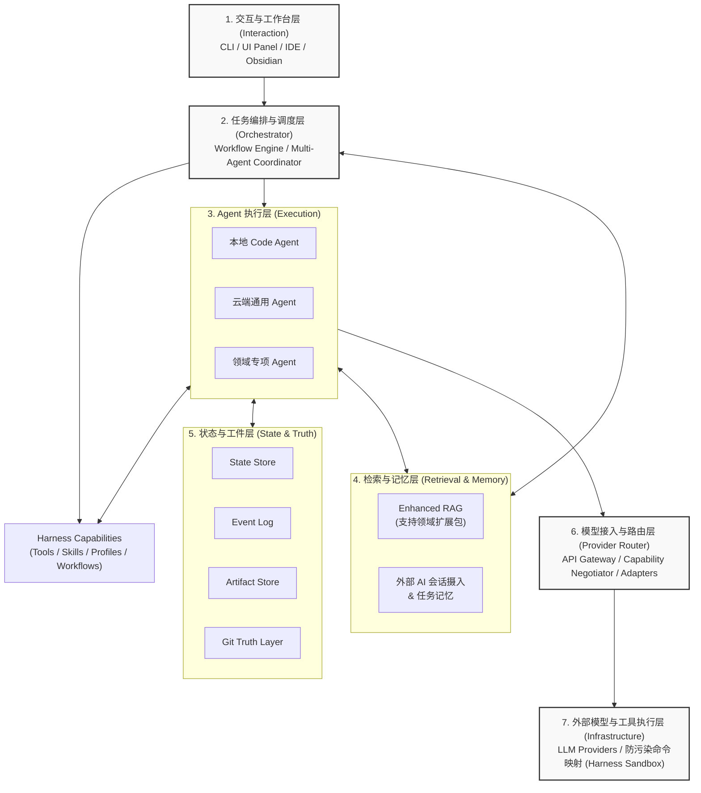

# Swallow Architecture

**Swallow** 是一个面向**高复杂度知识工作者**（如学术研究人员、法律工作者、架构师、咨询策略人员等）的 AI 工作流编排平台。它的核心目标是完成从“单次对话（Chatbot）”到“长周期任务编排、有状态执行、多源知识融合、持续沉淀积累”的跨越。

本文档定义了 Swallow 的核心系统架构，综合了 7 层架构模型、状态与事实层、Harness 能力模型，以及增强 RAG 的演进方向。

---

## 1. 系统愿景与定位

Swallow 的架构遵循 **本地优先，可接中心端 (Local-first with optional remote control plane)** 的原则。
这使得 Swallow 既能作为个人隐私安全的本地工作台（Local Workbench）脱机运行，又能在接入共享服务器后，解锁团队协作、长时后台执行等高负载流能力。

系统专门为以下工作形态设计：
- **资料密集型**：处理多源异构数据（代码仓库、Git 记录、Obsidian 笔记、文献 PDF 等）。
- **任务链条长**：单任务需拆解为检索、提取、对比、综合、产出等多阶段结构化执行。
- **知识资产沉淀与开放生态**：任务执行过程可追踪，中间结论不丢失；同时拥抱外部 AI 生态，允许将外部工具的对话记录无缝导入为核心资产。

---

## 2. 整体 7 层架构模型 (The 7-Layer Model)

Swallow 采用自上而下的分层设计，每一层职责界限清晰：**上层决定“做什么”，中层决定“谁来做”，下层决定“怎么接模型”，侧边决定“如何找历史信息与沉淀成果”。**

### 每一层核心职责简述：

1. **交互与工作台层**：负责任务发起与人工干预接管。
2. **任务编排与调度层**：负责任务拆解、路由与 Agent 协同编排（决定上限）。
3. **Agent 执行层**：处理具体的代码编写、文章总结或专项逻辑任务。
4. **检索与记忆层**：提供插件化的领域 RAG 支持与外部知识摄入（决定下限）。
5. **状态与工件层**：维护系统运行中的事实基础。
6. **模型接入与路由层**：统一的大模型 API 网关，同时承担**能力协商 (Capability Negotiator)** 与模型方言翻译。
7. **外部模型与工具层**：底层大模型供应商，以及**经过安全映射的本地隔离执行环境**。

---

## 3. 核心子系统解析

### 3.1 状态与事实层 (State & Truth Layer)

这是 Swallow 区别于普通 Multi-Agent Demo 的核心关键设计。系统从根本上扬弃了单纯的内存状态，依赖一组持久化的“四件套”来记录行动轨迹：

*   **State Store (状态库)**：保存任务当前“现场”（如进行到哪一步、等待谁确认）。安全中断和恢复的基础。
*   **Event Log (事件流)**：保存“发生过什么”。Append-only 的动作记录，用于审计溯源与过程复盘。
*   **Artifact Store (工件库)**：保存“真正产出了什么”（Diff、报告、JSON），数据库仅做索引。
*   **Git Truth Layer (Git 事实层)**：负责代码及纯文本文件的绝对真相来源。提供版本 checkpoint 与安全回滚防线。

### 3.2 Harness 能力层 (Capabilities)

为支持复杂的科研与工程任务，Swallow 将传统的工具包升级为 **Harness Capabilities**，作为可插拔的业务能力层：

*   **Tools (工具)**：底层的原子操作函数。工具通过标准 JSON Schema 进行**统一语义描述**，以便于底层路由层进行方言翻译或优雅降级。
*   **Skills (技能包)**：一套标准方法论的封装（如科研文献结构化提取、TDD 测试驱动）。
*   **Profiles (角色认知)**：预设的虚拟认知模式（如 `research-assistant`, `reviewer`）。
*   **Workflows (工作流)**：多阶段的声明式操作流水线。

### 3.3 增强 Agentic RAG 与开放知识生态 (Enhanced RAG & Knowledge Ingestion)

Swallow 的检索层不局限于内部数据的分块与向量化，而是构建为一个**开放且可定制的记忆图谱**：

*   **领域专属 RAG 扩展包 (Domain RAG Packages)**：不同领域的语料（如代码 AST、法律长条文、医学文献）需要完全不同的切块策略和 embedding 模型。系统设计了可插拔的扩展机制（Packages），允许针对特定领域挂载单独训练或优化的检索与解析管道。
*   **外部 AI 会话摄入 (External AI Handoff)**：系统不仅依赖自身的交互界面，还允许用户将其他 AI 工具（如 ChatGPT Web、Claude Web 等）中的前期脑暴和发散性聊天记录导入。系统将这些外部记录解析为高质量的“上下文资产”融入知识库，实现“外部发散思考，内部严谨执行”的无缝对接。
*   **混合异构检索**：统一索引代码仓库结构、Git Commit 摘要、个人 Obsidian 笔记等多种形态数据。

### 3.4 工具执行的防污染隔离机制 (Safe Execution Harness)

在底层的“外部工具与执行层”，系统摒弃了让 Agent 直接调用宿主机器原生 Shell 的危险做法，借鉴了 Anthropic Claude Code 的底层 Harness 理念：

*   **终端命令安全映射 (Command Mapping)**：Agent 发出的终端命令不会直接下发，而是经过一层拦截与语义映射。系统预定义了允许的命令白名单和安全范围，拦截具有破坏性的系统级命令。
*   **沙盒与虚拟化隔离 (Sandboxed Execution)**：尽可能在隔离的虚拟环境（Virtualenv, 容器子系统, 临时工作区）中执行代码测试、依赖安装或构建命令。
*   **副作用管控与可溯源**：确保每一次对文件系统或环境的修改都可以被 Git Truth Layer 或 Event Log 捕获。一旦执行产生意外的全局污染，系统可基于隔离快照快速回滚。

### 3.5 模型路由与能力协商 (Provider Router & Capability Negotiation)

系统在第 6 层（模型接入与路由层）设计了区别于普通 API 网关的**能力协商器 (Capability Negotiator)**。由于各类大模型在特定领域的表现、上下文窗口、以及特性支持上存在巨大差异，系统必须通过以下机制弥合这一鸿沟：

*   **统一语义描述，下推差异化执行 (Universal Semantic Description, Differentiated Push-Down Execution)**：在上层的编排层与 Agent 层，所有的 Prompt、工具结构（Tool Schema）和系统级指令都使用统一抽象的“通用语义”进行声明。这些高级声明在下推到层 6 时，由能力协商器负责将其转化为最适合当前底层模型的执行请求。
*   **模型方言适配器 (Model Dialect Translators)**：针对不同模型供应商的最佳实践，路由层配备了专门的翻译器。例如：
    *   **Claude XML 适配器**：将通用的系统 Prompt 和上下文强制转化为 Claude 极度偏好的 `<tags>` 结构，大幅降低该模型的幻觉率。
    *   **Gemini Context Caching 适配器**：针对超长上下文的大型代码库或长文档分析任务，自动接驳 Gemini 的 Context Caching 机制，实现 Token 成本和推理性能的最优化。
    *   **Codex FIM 适配器**：面对代码补全或代码修改等特定任务时，自动转换并装配为 FIM (Fill-In-the-Middle) 等模型原生语言标识。
*   **工具调用的优雅降级 (Graceful Degradation of Tools)**：当任务流量被路由到不支持原生或强制结构化输出（Native Tool Calling）的开源或轻量级模型时，系统不会直接报错阻断任务，而是执行优雅降级机制——将标准工具的 Schema 降级封装为 ReAct (Reasoning and Acting) 风格的纯文本 Prompt 引导，并在回包阶段通过强化正则与输出流解析来还原工具调用意图，确保核心业务流转不断链。

### 3.6 自我进化与记忆沉淀 (Self-Evolution & Memory)

Swallow 强调系统在长期运行中的“自我进化”与工作流记忆的沉淀，从而跨越单次任务的局限性：

*   **显式工作流哲学 (Explicit Workflow Philosophy)**：系统提倡显式的任务拆解与知识沉淀，而非依赖底层模型的黑盒涌现。每一次任务的过程、中间产物、纠错经验都会被结构化提取，作为可复用的系统长期记忆。
*   **沉淀阶段与图书管理员 Agent (Consolidation Phase & Librarian Agent)**：在核心工作流结束后，系统专门引入独立的“图书管理员 Agent (Librarian Agent)”执行“记忆沉淀阶段”。它负责对过程日志 (Event Log)、临时工件进行降噪、摘要提炼与关联打标，将零散执行轨迹转化为高信噪比的结构化图谱资产并归档，确保系统知识库持续生长。
*   **元优化与自我迭代 (Meta-Optimization)**：通过对长周期历史任务轨迹和归档记忆的定期复盘反思，系统能够自动提炼新的经验法则、沉淀出更高效的定制 Skills（技能包）、更新 Workflows 编排策略。这种元优化能力，使得系统从被动执行工具向具备主动进化能力的平台演进。

---

## 4. 落地与演进模式 (Deployment & Evolution)
产品路线图围绕“可伸缩边界”稳步推进：

1. **Phase 1 (MVP Local-First)**：单机本地工作台模式优先，打通核心的 **交互 ↔ 编排 ↔ Agent执行 ↔ 基础状态四件套**，以及**安全的本地沙盒命令执行**和基本的**下推差异化路由**。
2. **Phase 2 (知识融合与扩展包)**：深化 **增强 RAG** 的建设，引入 **领域 RAG 扩展包** 机制与 **外部 AI 聊天摄入** 功能，解决垂直领域知识处理痛点。
3. **Phase 3 (Remote Control Plane 接入)**：开发并支持自托管远程控制台，解锁多设备同步、团队任务协作流、云端异步长时运行以及分布式 Agent 并发调度功能。