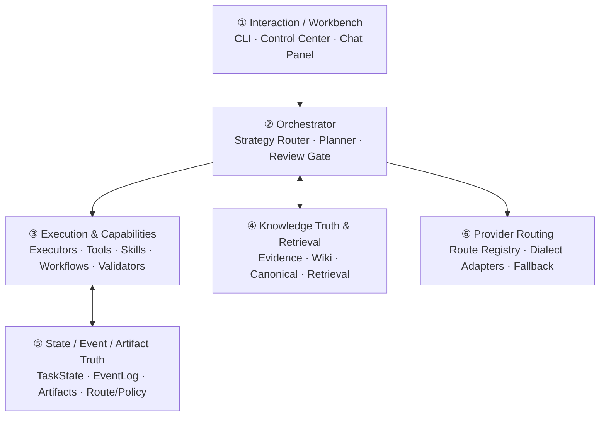
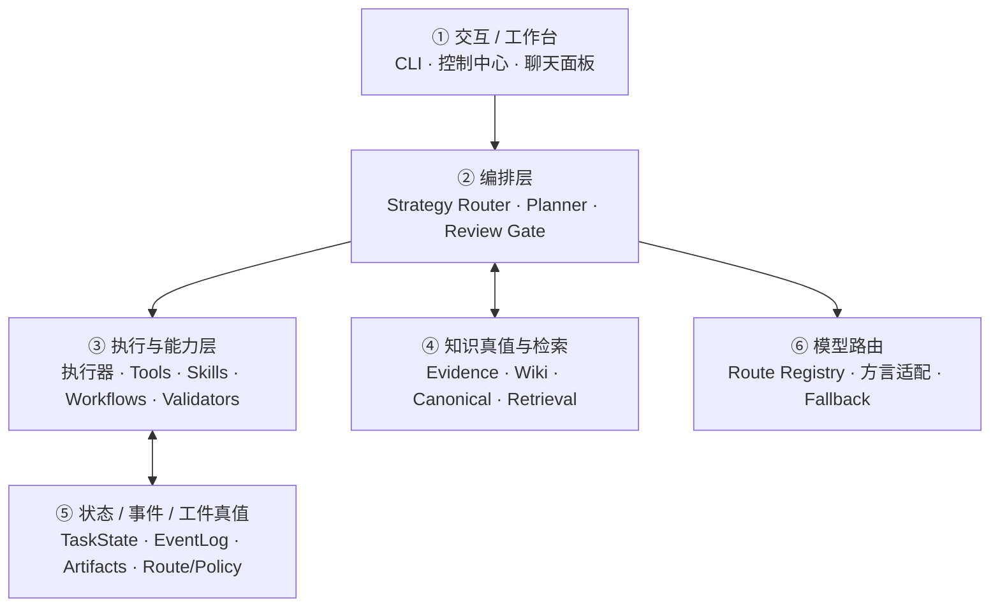

# swallow

[中文](#中文版) | English

A stateful AI workflow system for real project work.

swallow sustains multi-step, multi-session tasks by combining task orchestration, context retrieval, executor integration, state persistence, review/recovery, and knowledge-object management into a single local-first system.

---

## Core Capabilities

- **Stateful task runtime** — tasks persist across steps and sessions with explicit state, events, artifacts, checkpoints, resume, retry, and rerun.
- **Knowledge governance** — SQLite-backed knowledge truth with staged → review → promote workflow, not implicit global memory.
- **Policy & execution loop** — proposal-driven meta-optimization, operator review/apply, automatic consistency audit triggers, complexity-aware routing, and guarded fan-out orchestration.
- **Replaceable executors** — role-first architecture; executors are bound by system role, not brand identity.
- **Multi-model routing** — HTTP routes with dialect adapters, layered fallback matrix, and real token-cost telemetry.
- **Review & recovery** — structured review gates, feedback-driven retry, waiting_human circuit breaking, and operator-facing control surfaces.
- **Read-only web dashboard** — `swl serve` provides inspection, artifact comparison, subtask trees, and execution timelines without mutating state.

---

## Architecture at a Glance



For detailed design, see the [Design Documents](#design-documents) section below.

---

## Default Operating Pattern

The system is role-first — executors are assigned by capability, not brand:

| Role | Default Binding | Best For |
|---|---|---|
| High-value / complex tasks | Claude Code | Architecture changes, complex refactoring, final review |
| High-frequency implementation | Aider | Clear-scope edits, daily implementation loops |
| Parallel terminal tasks | Warp / Oz | Multi-terminal investigation, test matrices, environment prep |

---

## Quick Start

```bash
# Install
python3 -m pip install -e .

# Create a task
swl task create \
  --title "Design orchestrator" \
  --goal "Tighten the harness runtime boundary" \
  --workspace-root .

# Run a task
swl task run <task-id>

# Inspect results
swl task inspect <task-id>
swl task artifacts <task-id>
```

For the full CLI reference (40+ subcommands covering recovery, knowledge management, canonical registry, grounding, and meta-optimization), see `docs/cli_reference.md`.

---

## Design Documents

| Document | Covers |
|---|---|
| [`ARCHITECTURE.md`](./ARCHITECTURE.md) | System overview, global principles, glossary, reading order |
| [`STATE_AND_TRUTH.md`](./STATE_AND_TRUTH_DESIGN.md) | Task state, event log, artifacts, route/policy truth |
| [`KNOWLEDGE.md`](./KNOWLEDGE_AND_RAG_DESIGN.md) | Knowledge truth layer, retrieval & serving, write boundaries |
| [`AGENT_TAXONOMY.md`](./AGENT_TAXONOMY_DESIGN.md) | System roles, execution sites, memory authority |
| [`ORCHESTRATION.md`](./ORCHESTRATION_AND_HANDOFF_DESIGN.md) | Scheduling engine, structured handoff, collaboration topology |
| [`HARNESS.md`](./HARNESS_AND_CAPABILITIES.md) | Execution environment, capability hierarchy (tools → skills → workflows → validators) |
| [`PROVIDER_ROUTER.md`](./PROVIDER_ROUTER_AND_NEGOTIATION.md) | Model routing, dialect adapters, fallback, telemetry |
| [`SELF_EVOLUTION.md`](./SELF_EVOLUTION_AND_MEMORY.md) | Librarian knowledge consolidation, Meta-Optimizer proposals |
| [`INTERACTION.md`](./INTERACTION_AND_WORKBENCH.md) | CLI, Control Center, chat panel, multi-surface matrix |

Recommended reading order: ARCHITECTURE → STATE_AND_TRUTH → KNOWLEDGE → AGENT_TAXONOMY → PROVIDER_ROUTER → ORCHESTRATION → HARNESS → SELF_EVOLUTION → INTERACTION.

---

## Current Version

**Tag: `v0.9.0`** — Execution Era: unified async CLI executor entrypoint, complexity-aware strategy routing, guarded fan-out orchestration, and policy-loop carryover.

Stable baseline: `437 tests passed + 8 eval passed`.

For implementation details, see `CHANGELOG.md` and `docs/active_context.md`.

---

## Non-Goals

Unless a phase explicitly requires them:

- Multi-tenant / distributed worker clusters
- Implicit global memory or automatic knowledge promotion
- Unbounded workbench UI expansion
- Platform complexity introduced only because it may be useful later

Priority: **make the single-user workflow genuinely useful while preserving clean boundaries for later expansion.**

---

## License

TBD

---

<a name="中文版"></a>

# swallow（中文版）

**面向真实项目工作的有状态 AI 工作流系统。**

swallow 把任务编排、上下文检索、执行器接入、状态持久化、审阅/恢复和知识对象管理整合到一个 local-first 的系统中，支撑跨多步、多会话的持续任务推进。

---

## 核心能力

- **有状态任务运行时**——任务跨步骤和会话持久化，支持显式 state / events / artifacts / checkpoint / resume / retry / rerun。
- **知识治理**——SQLite-backed 知识真值层，staged → review → promote 工作流，而不是隐式全局记忆。
- **策略与执行闭环**——proposal-driven 的 meta-optimization、operator review/apply、自动一致性审计触发、complexity-aware 路由与带守卫的 fan-out 编排。
- **可替换执行器**——role-first 架构，执行器按系统角色绑定，而非品牌绑定。
- **多模型路由**——HTTP 路由 + 方言适配器 + 分层降级矩阵 + 真实 token 成本遥测。
- **审查与恢复**——结构化 review gate、feedback-driven retry、waiting_human 熔断与 operator-facing 控制面。
- **只读 Web 仪表盘**——`swl serve` 提供检查、artifact 对比、子任务树与执行时间线，不修改状态。

---

## 架构概览



详细设计见下方[设计文档](#设计文档)。

---

## 默认工作组合

系统坚持 role-first——执行器按能力分配，不按品牌：

| 角色 | 默认绑定 | 适用场景 |
|---|---|---|
| 高价值 / 高复杂度任务 | Claude Code | 架构改动、复杂重构、最终收口 |
| 高频实现 | Aider | 边界清晰的日常编辑 |
| 并行终端任务 | Warp / Oz | 多终端调查、测试矩阵、环境准备 |

---

## 快速开始

```bash
# 安装
python3 -m pip install -e .

# 创建任务
swl task create \
  --title "设计编排器" \
  --goal "收紧 harness runtime 边界" \
  --workspace-root .

# 运行任务
swl task run <task-id>

# 查看结果
swl task inspect <task-id>
swl task artifacts <task-id>
```

完整 CLI 参考（40+ 子命令，覆盖恢复、知识管理、canonical registry、grounding、meta-optimization 等）见 `docs/cli_reference.md`。

---

## <a name="设计文档"></a>设计文档

| 文档 | 内容 |
|---|---|
| [`ARCHITECTURE.md`](./ARCHITECTURE.md) | 系统全景、全局原则、术语表、阅读顺序 |
| [`STATE_AND_TRUTH.md`](./STATE_AND_TRUTH_DESIGN.md) | 任务状态、事件日志、工件、路由/策略真值 |
| [`KNOWLEDGE.md`](./KNOWLEDGE_AND_RAG_DESIGN.md) | 知识真值层、检索服务、写入边界 |
| [`AGENT_TAXONOMY.md`](./AGENT_TAXONOMY_DESIGN.md) | 系统角色、运行站点、记忆权限 |
| [`ORCHESTRATION.md`](./ORCHESTRATION_AND_HANDOFF_DESIGN.md) | 调度引擎、结构化交接、协同拓扑 |
| [`HARNESS.md`](./HARNESS_AND_CAPABILITIES.md) | 执行环境、能力分层（tools → skills → workflows → validators） |
| [`PROVIDER_ROUTER.md`](./PROVIDER_ROUTER_AND_NEGOTIATION.md) | 模型路由、方言适配、降级、遥测 |
| [`SELF_EVOLUTION.md`](./SELF_EVOLUTION_AND_MEMORY.md) | Librarian 知识沉淀、Meta-Optimizer 优化提案 |
| [`INTERACTION.md`](./INTERACTION_AND_WORKBENCH.md) | CLI、控制中心、聊天面板、多入口矩阵 |

推荐阅读顺序：ARCHITECTURE → STATE_AND_TRUTH → KNOWLEDGE → AGENT_TAXONOMY → PROVIDER_ROUTER → ORCHESTRATION → HARNESS → SELF_EVOLUTION → INTERACTION。

---

## 当前版本

**Tag: `v0.9.0`** — Execution Era：统一 async CLI 执行器入口 + complexity-aware 策略路由 + 带守卫的 fan-out 编排 + 延续的策略闭环能力。

稳定基线：`437 tests passed + 8 eval passed`。

实现细节见 `CHANGELOG.md` 和 `docs/active_context.md`。

---

## 非目标

除非某一 phase 明确要求：

- 多租户 / 分布式 worker 集群
- 隐式全局记忆或自动 knowledge promotion
- 无边界 workbench UI 扩张
- 仅因"未来可能需要"而引入的平台型复杂度

首要目标：**单用户场景稳定可用，并为后续扩展保留清晰边界。**

---

## 许可证

待定
