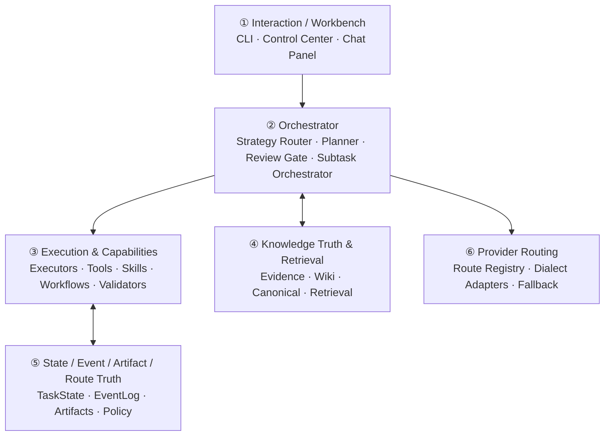
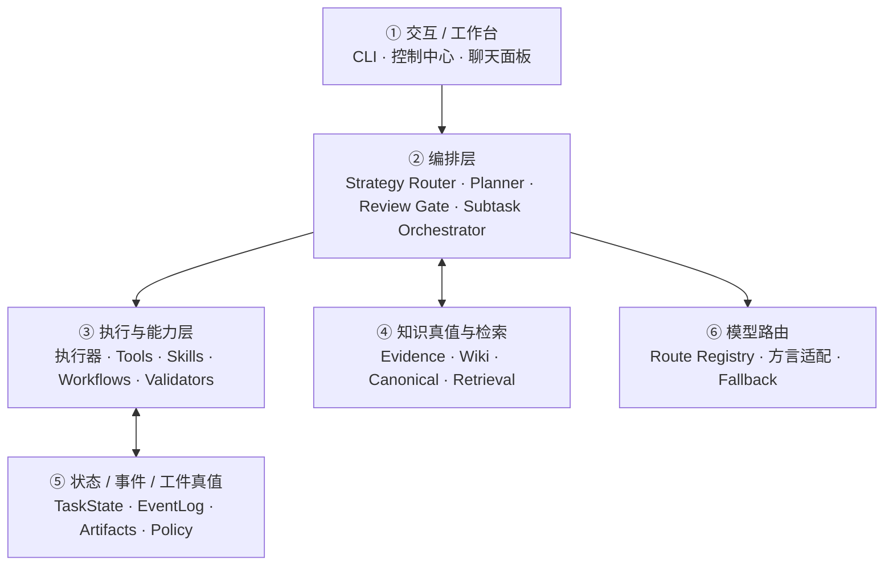

# swallow

[中文](#中文版) | English

A stateful AI workflow system for real project work.

swallow sustains multi-step, multi-session tasks by combining task orchestration, context retrieval, executor integration, state persistence, review/recovery, and knowledge-object management into a single local-first system.

---

## Release Snapshot

Current release: **v1.4.0**.

This snapshot closes the Governance G + G.5 + H sequence after `v1.3.1`:

- `apply_proposal()` governance boundary: canonical knowledge, route metadata, and policy writes converge on one operator-gated entrypoint backed by Repository write boundaries.
- LLM path closure: Path B fallback selection is resolved by the Orchestrator before execution, while Specialist Internal calls go through the Provider Router via `router.invoke_completion(...)`.
- SQLite-primary route and policy truth: route registry, route selection policy, route weights, capability profiles, audit-trigger policy, and MPS policy now persist through SQLite with explicit `BEGIN IMMEDIATE` transactions and append-only route/policy audit logs.
- Migration/status baseline: the initial schema records `schema_version=1` and `swl migrate --status` reports `schema_version: 1, pending: 0`.

---

## Core Capabilities

- **Stateful task runtime** — tasks persist across steps and sessions with explicit state, events, artifacts, checkpoints, resume, retry, rerun, and operator-initiated suspend.
- **Knowledge governance** — SQLite-backed knowledge truth with staged → review → promote workflow, gated by a single `apply_proposal` entrypoint. Not implicit global memory.
- **Policy & execution loop** — proposal-driven self-evolution, operator review/apply, complexity-aware routing, and guarded fan-out orchestration.
- **Multi-perspective synthesis** — Path A participant fan-out plus arbiter synthesis writes structured task artifacts, with staged knowledge entry only through explicit Operator CLI action.
- **Replaceable executors** — role-first architecture; executors are bound by system role (five-tuple), not brand identity.
- **Multi-model routing** — HTTP routes with dialect adapters, layered fallback, capability boundary guard, and real token-cost telemetry.
- **Three explicit LLM call paths** — Path A (controlled HTTP), Path B (agent black-box), Path C (specialist internal). Provider Router governance penetrates A and C; B is governed via task boundaries, skills, and validators.
- **Review & recovery** — separate Validators and Review Gate, feedback-driven retry, `waiting_human` and `suspended` state distinction, operator-facing control surfaces.
- **Capability-equivalent CLI and UI** — `swl` CLI and `swl serve` Web Control Center are equivalent operator entrypoints. Both invoke the same underlying governance functions.

---

## Architecture at a Glance



Three architectural planes:

- **Control Plane** — Orchestrator (sole authority for task advancement) and Operator (via CLI / UI)
- **Execution Plane** — General Executors / Specialists / Validators
- **Truth Plane** — SQLite (task / event / knowledge / route / policy) + Filesystem (artifacts / workspace / git)

For full design, see the [Design Documents](#design-documents) section.

---

## Default Operating Pattern

The system is **role-first** — executors are assigned by system role, not brand. The five-tuple role description (`role / advancement_right / truth_writes / llm_call_path / runtime_site`) is the unit of identity, not the brand name.

| System Role | Best For |
|---|---|
| High-complexity main execution | Architecture changes, complex refactoring, final review |
| Scriptable / batch implementation | Non-interactive tasks, CI scenarios, JSON event streams |
| High-frequency daily implementation | Clear-scope edits, daily implementation loops |
| Controlled cognitive (no tool-loop) | Brainstorm, review, synthesis, classification, extraction |
| Knowledge consolidation | Staged → review pipeline |
| External session ingestion | ChatGPT / Claude Web exports |
| System optimization proposals | Event truth scanning → proposal artifacts |

**Concrete brand bindings** (Claude Code, Codex CLI, Aider, etc.) are documented exclusively in [`EXECUTOR_REGISTRY.md`](./docs/design/EXECUTOR_REGISTRY.md). Adding a new executor only changes that one file plus its adapter implementation — no other design document is touched.

Parallelism is not a separate role — it is provided by the Orchestrator's Subtask Orchestrator via fan-out of multiple executor instances, not by any executor's internal parallel capability.

---

## Quick Start

```bash
# Install
python3 -m pip install -e .

# Create a task
swl task create \
  --title "Design orchestrator" \
  --goal "Tighten the harness runtime boundary" \
  --workspace-root .

# Run a task
swl task run <task-id>

# Inspect results
swl task inspect <task-id>
swl task artifacts <task-id>

# Or launch the Web Control Center for the same operations
swl serve
```

For the full CLI reference, see `docs/cli_reference.md`.

---

## Design Documents

The documentation is organized into three layers:

### Constitutional Layer (Invariants)
| Document | Covers |
|---|---|
| [`INVARIANTS.md`](./docs/design/INVARIANTS.md) | Project constitution: 8 global principles, three architectural planes, five-tuple entity format, three LLM call paths, truth write permission matrix, single-user evolution boundary |
| [`DATA_MODEL.md`](./docs/design/DATA_MODEL.md) | SQLite namespaces, Repository write whitelist, ID/actor conventions, migration policy |
| [`EXECUTOR_REGISTRY.md`](./docs/design/EXECUTOR_REGISTRY.md) | All executor brand bindings: Claude Code, Codex CLI, Aider, HTTP Executor, Specialists, Validators |

### Design Layer
| Document | Covers |
|---|---|
| [`ARCHITECTURE.md`](./docs/design/ARCHITECTURE.md) | System overview, six-layer architecture, glossary, reading order |
| [`STATE_AND_TRUTH.md`](./docs/design/STATE_AND_TRUTH.md) | Five truth domains, task state machine, resume/rerun/retry distinction, archiving, safety fallbacks |
| [`KNOWLEDGE.md`](./docs/design/KNOWLEDGE.md) | Knowledge truth layer, retrieval & serving, source type semantics, misrouting hint mechanism, write boundaries |
| [`AGENT_TAXONOMY.md`](./docs/design/AGENT_TAXONOMY.md) | Five-tuple definitions, role / advancement_right / truth_writes / llm_call_path / runtime_site |
| [`ORCHESTRATION.md`](./docs/design/ORCHESTRATION.md) | Strategy Router, Planner, Subtask Orchestrator, Validator vs Review Gate, structured handoff, multi-perspective synthesis, fan-out & DAG topology |
| [`HARNESS.md`](./docs/design/HARNESS.md) | Execution environment, capability hierarchy (tools → skills → workflows → validators), instruction injection (CLAUDE.md / AGENTS.md fragments) |
| [`PROVIDER_ROUTER.md`](./docs/design/PROVIDER_ROUTER.md) | Logical → physical model routing, dialect adapters, fallback, capability boundary guard, telemetry |
| [`SELF_EVOLUTION.md`](./docs/design/SELF_EVOLUTION.md) | Librarian knowledge consolidation, Meta-Optimizer proposals, `apply_proposal` entrypoint, staged review modes (manual / batch / auto_low_risk) |
| [`INTERACTION.md`](./docs/design/INTERACTION.md) | CLI primary entrypoint, Web Control Center as capability-equivalent UI surface, chat panel as exploration surface |

**Recommended reading order**: INVARIANTS → ARCHITECTURE → DATA_MODEL → STATE_AND_TRUTH → KNOWLEDGE → AGENT_TAXONOMY → PROVIDER_ROUTER → ORCHESTRATION → HARNESS → SELF_EVOLUTION → INTERACTION → EXECUTOR_REGISTRY.

EXECUTOR_REGISTRY is read last because it requires all preceding concepts to be established.

---

## Four Inviolable Rules

From [`INVARIANTS.md`](./docs/design/INVARIANTS.md) §0:

1. **Control resides only with Orchestrator and Operator.** No execution entity may silently advance task state.
2. **Execution never writes to Truth directly.** All writes go through controlled Repository interfaces; no raw SQL.
3. **There are exactly three LLM call paths.** Controlled HTTP, Agent Black-box, Specialist Internal — Provider Router governance penetrates two of them.
4. **The boundary between proposal and mutation is enforced in code by a single `apply_proposal` entrypoint.** Canonical knowledge, route metadata, and policy writes have one and only one entry function.

These rules are enforced by guard tests (see INVARIANTS §9) that no PR may delete or weaken.

---

## Non-Goals

### Current-phase non-goals (architecturally preserved, not implemented now)
- Multi-user concurrent writes, authn/authz, team permission models
- Distributed worker clusters, cross-machine transport
- Cloud truth mirroring, real-time cross-device sync (use git / sync drives instead)
- Unbounded UI expansion

### Permanent non-goals (incompatible with constitutional principles)
- Implicit global memory or automatic knowledge promotion (violates P7 / P8)
- Treating cloud as source-of-truth for tasks/knowledge (violates P1 / P2)
- Adopting external orchestration platforms as executors (violates §INVARIANTS §6)

Priority: **make the single-user workflow genuinely useful while preserving clean boundaries for future expansion**, especially expansion to cross-device personal use and small-team collaboration.

---

## License

TBD

---

<a name="中文版"></a>

# swallow(中文版)

**面向真实项目工作的有状态 AI 工作流系统。**

swallow 把任务编排、上下文检索、执行器接入、状态持久化、审阅/恢复和知识对象管理整合到一个 local-first 的系统中,支撑跨多步、多会话的持续任务推进。

---

## Release Snapshot

当前 release:**v1.4.0**。

这个快照闭合 `v1.3.1` 之后的治理三段(G + G.5 + H):

- `apply_proposal()` governance boundary:canonical knowledge / route metadata / policy 三类写入收敛到单一 operator-gated 入口,并由 Repository 写边界承接。
- LLM path closure:Path B fallback selection 由 Orchestrator 在执行前解析,Specialist Internal 调用通过 `router.invoke_completion(...)` 穿透 Provider Router。
- SQLite-primary route / policy truth:route registry、route selection policy、route weights、capability profiles、audit-trigger policy、MPS policy 现在通过 SQLite 持久化,并由显式 `BEGIN IMMEDIATE` transaction 与 append-only route/policy audit log 保护。
- Migration/status baseline:初始 schema 记录 `schema_version=1`,`swl migrate --status` 输出 `schema_version: 1, pending: 0`。

---

## 核心能力

- **有状态任务运行时**——任务跨步骤和会话持久化,支持显式 state / events / artifacts / checkpoint / resume / retry / rerun / operator 主动 suspend。
- **知识治理**——SQLite-backed 知识真值层,staged → review → promote 工作流,通过单一 `apply_proposal` 入口收口。不是隐式全局记忆。
- **策略与执行闭环**——proposal-driven 的自我演化、operator review/apply、complexity-aware 路由与带守卫的 fan-out 编排。
- **多视角综合**——Path A participant fan-out + arbiter synthesis 产出结构化 task artifact,且只通过显式 Operator CLI 动作进入 staged knowledge。
- **可替换执行器**——role-first 架构,执行器按系统角色五元组绑定,而非品牌绑定。
- **多模型路由**——HTTP 路由 + 方言适配器 + 分层降级 + 能力边界守卫 + 真实 token 成本遥测。
- **显式三条 LLM 调用路径**——Path A(controlled HTTP)、Path B(agent black-box)、Path C(specialist internal)。Provider Router 治理穿透 A 和 C;B 通过任务边界、skills、validators 治理。
- **审查与恢复**——Validator 与 Review Gate 分离设计、feedback-driven retry、`waiting_human` 与 `suspended` 状态区分、operator 控制面。
- **CLI 与 UI 能力对等**——`swl` CLI 与 `swl serve` 启动的 Web Control Center 是能力对等的两个 operator 入口,共享同一套 governance 函数。

---

## 架构概览



三个架构面:

- **Control Plane**——Orchestrator(任务推进的唯一权威)与 Operator(通过 CLI / UI)
- **Execution Plane**——General Executor / Specialist / Validator
- **Truth Plane**——SQLite(task / event / knowledge / route / policy)+ 文件系统(artifacts / workspace / git)

详细设计见下方[设计文档](#设计文档)。

---

## 默认工作组合

系统坚持 **role-first**——执行器按系统角色绑定,不按品牌。五元组角色描述(`role / advancement_right / truth_writes / llm_call_path / runtime_site`)是身份单元,品牌名不是。

| 系统角色 | 适用场景 |
|---|---|
| 高复杂度主执行 | 架构改动、复杂重构、最终收口 |
| 脚本化 / 批量实现 | 非交互任务、CI 场景、JSON 事件流 |
| 高频 daily 实现 | 边界清晰的小步编辑循环 |
| 受控认知任务(无 tool-loop) | brainstorm、review、synthesis、classification、抽取 |
| 知识沉淀 | staged → review 流水线 |
| 外部会话摄入 | ChatGPT / Claude Web 导出物 |
| 系统优化提案 | event truth 扫描 → proposal artifacts |

**具体品牌绑定**(Claude Code、Codex CLI、Aider 等)只在 [`EXECUTOR_REGISTRY.md`](./docs/design/EXECUTOR_REGISTRY.md) 中维护。加入新 executor 只改这一份文档 + 对应 adapter 实现,不动其他设计文档。

并行不是独立角色——并行能力由 Orchestrator 的 Subtask Orchestrator 通过 fan-out 多个 executor 实例提供,不依赖任何 executor 的内部并行能力。

---

## 快速开始

```bash
# 安装
python3 -m pip install -e .

# 创建任务
swl task create \
  --title "设计编排器" \
  --goal "收紧 harness runtime 边界" \
  --workspace-root .

# 运行任务
swl task run <task-id>

# 查看结果
swl task inspect <task-id>
swl task artifacts <task-id>

# 或启动 Web Control Center 进行同样的操作
swl serve
```

完整 CLI 参考见 `docs/cli_reference.md`。

---

## <a name="设计文档"></a>设计文档

文档分为三层:

### 宪法层(Invariants)
| 文档 | 内容 |
|---|---|
| [`INVARIANTS.md`](./docs/design/INVARIANTS.md) | 项目宪法:8 条全局原则、三个架构面、五元组实体格式、三条 LLM 调用路径、truth 写权限矩阵、single-user 演化边界 |
| [`DATA_MODEL.md`](./docs/design/DATA_MODEL.md) | SQLite 命名空间、Repository 写权限白名单、ID/actor 约定、migration 策略 |
| [`EXECUTOR_REGISTRY.md`](./docs/design/EXECUTOR_REGISTRY.md) | 所有 executor 品牌绑定:Claude Code、Codex CLI、Aider、HTTP Executor、Specialists、Validators |

### 设计层
| 文档 | 内容 |
|---|---|
| [`ARCHITECTURE.md`](./docs/design/ARCHITECTURE.md) | 系统全景、六层架构、术语表、阅读顺序 |
| [`STATE_AND_TRUTH.md`](./docs/design/STATE_AND_TRUTH.md) | 五个真值域、任务状态机、resume/rerun/retry 区分、归档、安全兜底 |
| [`KNOWLEDGE.md`](./docs/design/KNOWLEDGE.md) | 知识真值层、检索服务、source type 语义、误路由 hint 机制、写入边界 |
| [`AGENT_TAXONOMY.md`](./docs/design/AGENT_TAXONOMY.md) | 五元组定义,role / advancement_right / truth_writes / llm_call_path / runtime_site |
| [`ORCHESTRATION.md`](./docs/design/ORCHESTRATION.md) | Strategy Router、Planner、Subtask Orchestrator、Validator 与 Review Gate 分离、结构化 handoff、multi-perspective synthesis、fan-out 与 DAG 拓扑 |
| [`HARNESS.md`](./docs/design/HARNESS.md) | 执行环境、能力分层(tools → skills → workflows → validators)、指令注入(CLAUDE.md / AGENTS.md fragments) |
| [`PROVIDER_ROUTER.md`](./docs/design/PROVIDER_ROUTER.md) | 逻辑 → 物理模型路由、方言适配、fallback、能力边界守卫、遥测 |
| [`SELF_EVOLUTION.md`](./docs/design/SELF_EVOLUTION.md) | Librarian 知识沉淀、Meta-Optimizer 优化提案、`apply_proposal` 入口、staged review 模式(manual / batch / auto_low_risk) |
| [`INTERACTION.md`](./docs/design/INTERACTION.md) | CLI 主入口、Web Control Center 作为能力对等 UI、聊天面板作为探索性入口 |

**推荐阅读顺序**:INVARIANTS → ARCHITECTURE → DATA_MODEL → STATE_AND_TRUTH → KNOWLEDGE → AGENT_TAXONOMY → PROVIDER_ROUTER → ORCHESTRATION → HARNESS → SELF_EVOLUTION → INTERACTION → EXECUTOR_REGISTRY。

EXECUTOR_REGISTRY 放在最后,因为它需要前面所有概念都建立后才能正确读懂每个 executor 的五元组含义。

---

## 四条不可违反的规则

来自 [`INVARIANTS.md`](./docs/design/INVARIANTS.md) §0:

1. **Control 只在 Orchestrator 和 Operator 手里。** 任何执行实体不得静默推进 task state。
2. **Execution 永远不直接写 Truth。** 执行实体只能通过受控 Repository 接口写入,不允许裸 SQL。
3. **LLM 调用只有三条路径。** Controlled HTTP、Agent Black-box、Specialist Internal,Provider Router 治理穿透其中两条。
4. **Proposal 与 Mutation 的边界由唯一的 `apply_proposal` 入口在代码里强制。** Canonical knowledge / route metadata / policy 三类对象的写入只有这一个函数入口。

这些规则由守卫测试(见 INVARIANTS §9)从代码层强制,任何 PR 不允许删除或弱化。

---

## 非目标

### 当前 phase 非目标(架构上保留扩展空间,实现上不投入)
- 多用户并发写、authn / authz、团队权限模型
- 分布式 worker 集群、跨机器 transport
- 云端 truth 镜像、跨设备实时同步(用户层面通过 git / 同步盘解决)
- 无边界 UI 扩张

### 永久非目标(与宪法核心原则矛盾)
- 隐式全局记忆或自动 knowledge promotion(违反 P7 / P8)
- 把 task / knowledge truth 上云作为 source of truth(违反 P1 / P2)
- 接入外部 orchestration platform 作为 executor(违反 INVARIANTS §6)

首要目标:**单用户场景稳定可用,并为后续扩展(尤其是个人跨设备使用与小团队协作)保留清晰边界**。

---

## 许可证

待定
