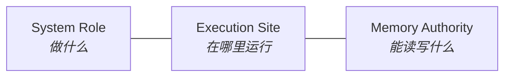

# 智能体分类学 (Agent Taxonomy)

> **Design Statement**
> Swallow 的分类学用三个正交维度——系统角色（System Role）、运行站点（Execution Site）、记忆权限（Memory Authority）——定义每个实体的职责边界，再把具体 provider / CLI / API 实现映射进去。角色先于品牌，治理先于能力。

> 全局原则见 → `ARCHITECTURE.md §1`。术语定义见 → `ARCHITECTURE.md §6`。

---

## 1. 设计动机

仅用品牌名（"Claude Agent"、"Gemini Agent"）标识实体会掩盖三个关键信息：

1. 它在系统中承担什么**职责**，是否有权推动主任务前进。
2. 它的**记忆权限**——能读写哪些真值面。
3. 它的**运行站点**——在哪里执行、延迟与风险特征是什么。

分类学的目的是回答这些问题，而不是给模型起名字。

---

## 2. 三个正交维度



三个维度先于品牌、模型名、CLI 名称或 API 提供商。

---

## 3. 系统角色 (System Role)

| 角色 | 定义 | 核心职责 | 关键约束 |
|---|---|---|---|
| **Orchestrator** | 唯一的任务推进协调层 | 拆分子任务、触发 review gate、决定 waiting_human、组合 retrieval / execution / policy | 任何其他实体不得静默接管全局推进语义 |
| **General Executor** | 承担完整工作切片的执行实体 | 代码修改、文件编辑、计划草案、大跨度总结 | 可产出核心 artifacts、可影响 task-state，但无权重定义路由策略或越过 review 边界 |
| **Specialist Agent** | 拥有单一高价值边界职责的实体 | ingestion、memory curation、retrieval evaluation、failure analysis 等 | 输入输出边界强、写权限窄、风险更容易治理 |
| **Validator / Reviewer** | 评估与审计其他组件产出质量的实体 | schema 校验、质量断言、一致性检查 | 不主导主链路推进，不替 executor 施工 |
| **Human Operator** | 一等公民角色（非 Agent） | 批准方向、决定高风险变更、把关知识晋升、裁决歧义 | — |

### 通用执行者 vs 专项智能体：判断法则

- 如果可以合理要求它"**接管这步任务并产出主要输出**" → General Executor
- 如果它更像"在一个**窄边界内分析、验证、提纯或建议**" → Specialist Agent

---

## 4. 运行站点 (Execution Site)

| 站点 | 特征 | 适用场景 |
|---|---|---|
| **Local** | 低延迟、直接接触 workspace / local state | 与主任务环境同机或同工作区 |
| **Cloud-backed** | 能力更强、内部过程较不透明 | 调用发生在本地，能力由远程 API 提供 |
| **Remote Worker** | 独立机器执行，需要额外处理网络与安全 | 扩展方向，非默认基线 |
| **Hybrid** | 跨多个站点协作 | 边界明确时才适合引入 |

角色不应与部署形态混淆——同一角色可以运行在不同站点。

---

## 5. 记忆权限 (Memory Authority)

从最窄到最宽排列：

`memory_authority` 描述的是实体对 task/canonical 知识面的**突变权限范围**，不限制向 orchestrator 返回 `ExecutorResult` 的基本能力。

| 权限等级 | 含义 | 允许的 side effect | 适用角色 |
|---|---|---|---|
| **Stateless** | 除明确入参外不跨调用保留记忆 | 无 | Validator、单次审查器 |
| **Task-State Access** | 可读写任务执行所依赖的 task truth / event truth | task artifacts、task events、task state updates | General Executor |
| **Task-Memory** | 可在当前任务周期内读写局部记忆（resume note、压缩摘要等） | task artifacts、resume notes、compressed summaries | General Executor、部分 Specialist |
| **Staged-Knowledge** | 有权生成或修改待审查的知识候选对象 | task artifacts、staged candidates、ingestion reports | Ingestion Specialist、Librarian |
| **Canonical-Write-Forbidden** | **默认安全标签**——禁止直接突变 canonical knowledge truth；**仍可**产出 proposal、report、audit artifact 等文件 | task artifacts、reports、audit artifacts、proposal bundles | 大多数实体 |
| **Canonical Promotion Authority** | 最窄最敏感的权限域，通常需要 review / operator gate | task artifacts、change logs、canonical records、knowledge decisions | 少数强约束流程 |

---

## 6. 推荐命名格式

每个实体使用四段显式命名：

```
[system role] / [execution site] / [memory authority] / [domain]
```

示例：

| 命名 | 说明 |
|---|---|
| `general-executor / local / task-state / implementation` | 本地施工执行器 |
| `general-executor / cloud-backed / task-state / planning-and-review` | 云端规划与审查执行器 |
| `specialist / hybrid / staged-knowledge / conversation-ingestion` | 外部会话摄入专项；可本地执行，也可内部调用 LLM |
| `validator / hybrid / stateless / consistency-check` | 一致性校验器；运行站点不改变 validator 权限 |

最后一段表示**功能领域**，而不是品牌或产品名。品牌名 / API 名 / CLI 名只作为 implementation binding 出现，不取代 taxonomy 本体。

`execution_site` 不是 `executor_family` 的同义词。一个 Specialist 可以是本地 Python executor，也可以内部调用 HTTP LLM；这不把它变成 HTTP General Executor。同理，`resolve_executor("cli", "librarian")` 这类兼容解析只代表入口兼容，不改变 Librarian 的 system role。

---

## 7. 默认角色绑定

### 7.1 三类认知领域

| 认知领域 | 偏向 |
|---|---|
| **Implementation** | 稳健施工、代码修改、终端执行、落地实现 |
| **Planning & Review** | 方案判断、任务拆解、风险识别、复杂纠偏 |
| **Knowledge Integration** | 长上下文消化、跨文档整合、一致性维护、知识草稿整理 |

### 7.2 当前默认绑定

| 绑定 | Taxonomy 定位 | 适合 | 不适合 |
|---|---|---|---|
| **Claude Code** | `general-executor / cloud-backed / task-state / planning-and-review` | 高复杂度、高价值、高错误成本任务；复杂变更收口 | 长期承担重复、简单、机械性实现工作 |
| **Aider** | `general-executor / local / task-state / implementation` | 日常高频实现、小到中等复杂度 edit loop | 需求模糊或架构边界不清晰时 |
| **Warp / Oz** | `specialist-or-general-executor / local / task-memory / terminal-parallel-operations` | 多终端管理、可拆分并行任务、中间结果生产 | 在没有清晰边界时接管复杂任务主线 |

升级 / 降级矩阵见 → `ARCHITECTURE.md §3`。

### 7.3 核心专项角色

| 角色 | Taxonomy | 职责 |
|---|---|---|
| **Librarian** | `specialist / hybrid / canonical-promotion / memory-curation` | 知识冲突检测、去重、变更整理、受控写入收口 |
| **Ingestion Specialist** | `specialist / hybrid / staged-knowledge / conversation-ingestion` | 外部会话提纯、结构化候选对象生成 |
| **Literature Specialist** | `specialist / hybrid / task-memory / domain-rag-parsing` | 领域资料深度解析与结构化比较 |
| **Meta-Optimizer** | `specialist / hybrid / canonical-write-forbidden / workflow-optimization` | 扫描 event truth、识别模式、产出优化提案（只读） |
| **Quality Reviewer** | `validator / hybrid / stateless / artifact-validation` | 关键节点独立校验 |
| **Consistency Reviewer** | `validator / hybrid / stateless / consistency-check` | 架构偏离、知识冗余、文档实现不一致识别 |

这里的 `hybrid` 表示专项流程可能由本地 Python executor 承载，同时按需调用远程 LLM；它不等于 `executor_family="api"`，也不改变 system role 或 memory authority。

### 7.4 HTTP / CLI / Specialist 的生态位

HTTP、CLI 与 Specialist 不在同一维度上竞争：

| 类别 | 本质 | 适合 | 不适合 | 默认上下文 |
|---|---|---|---|---|
| **HTTP controlled path** | 无工具循环的模型认知层 | brainstorm、review、synthesis、classification、结构化抽取、specialist 的 LLM backend | 默认代码库问答、代码修改、需要命令验证的任务 | `knowledge + notes` |
| **Autonomous CLI agent path** | workspace 行动层 / 黑盒 tool-loop | 读 repo、改代码、跑测试、追踪调用链、验证结果 | 固定 schema ingestion、canonical promotion、只读审计流水线 | `knowledge`；repo/docs 由 tool-loop 自主读取 |
| **Specialist Agent** | 固定专精流程封装 | ingestion、librarian、literature parsing、meta-optimization、quality / consistency validation | 开放式施工、自由探索、隐藏编排、替代通用 executor | explicit input_context + 任务专属 retrieval |
| **Validator / Reviewer** | 结果质量防线 | schema 校验、artifact 评估、一致性审计、review gate | 替 executor 施工、自动修正主产物 | explicit artifact / result refs |

判断规则：

- 如果任务成功依赖"读 workspace / 跑命令 / 改文件 / 验证结果"，默认交给 autonomous CLI agent。
- 如果任务成功依赖"理解材料 / 形成判断 / 生成结构化报告"，默认交给 HTTP controlled path。
- 如果任务是高频、边界稳定、输入输出 schema 明确的专精流程，应封装为 Specialist Agent。
- Specialist Agent 不是第三种通用 executor family；它可以复用 HTTP 或本地逻辑，但系统角色、输入输出和 memory authority 必须保持窄边界。
- Orchestrator / Oz 负责调度与 gate，不把跨 agent 协同建立在原始聊天记录或 repo chunk 传递上；协同介质是 task truth、artifacts、handoff objects 与 explicit input_context。

---

## 8. 新实体引入的默认安全预设

为系统引入新实体时，默认值为：

| 维度 | 默认值 |
|---|---|
| System Role | `specialist` |
| Execution Site | 运维最简的方式 |
| Memory Authority | `stateless` 或 `task-memory` |
| Canonical Truth Authority | `Canonical-Write-Forbidden` |

只有在工程需求充分明确时，才显式放宽权限。

---

## 9. 与其他层的接口

| 对接层 | 接口关系 |
|---|---|
| **Orchestrator** | Orchestrator 依据 taxonomy 选择 executor 并控制权责边界 |
| **Provider Router** | provider / backend / executor family 映射到角色槽位，不等于角色本身 |
| **Harness** | Harness 根据角色定位提供不同层级的约束与能力支撑 |
| **Knowledge** | memory authority 决定实体对知识层的读写权限 |

---

## 附录 A：Anti-Patterns

| 反模式 | 说明 |
|---|---|
| **Brand-Only Agent** | 只用品牌名标识实体，掩盖其权责边界 |
| **Hidden Orchestrator** | planner / reflection helper 未经授权悄悄接管系统推进走向 |
| **Implicit Global Memory Writer** | 局部 agent 绕过 review/promotion 直接写入 canonical truth |
| **Everything Agent** | 一个实体同时承担计划、执行、审查、路由、记忆提纯和知识晋升 |
| **Brand-Leaking Taxonomy** | 把品牌名直接写进 taxonomy 主体，导致角色设计被品牌能力牵引 |
| **Specialist-as-General-Executor** | 把 Specialist 暴露成可自由接管任意任务的通用执行器 |
| **Executor-Family Taxonomy Collision** | 用 `executor_family=cli/api` 推断 system role，忽略 taxonomy 与 capability guard |
| **HTTP-as-Coding-Default** | 让无 tool-loop 的 HTTP path 默认承担代码库阅读与实施职责 |
