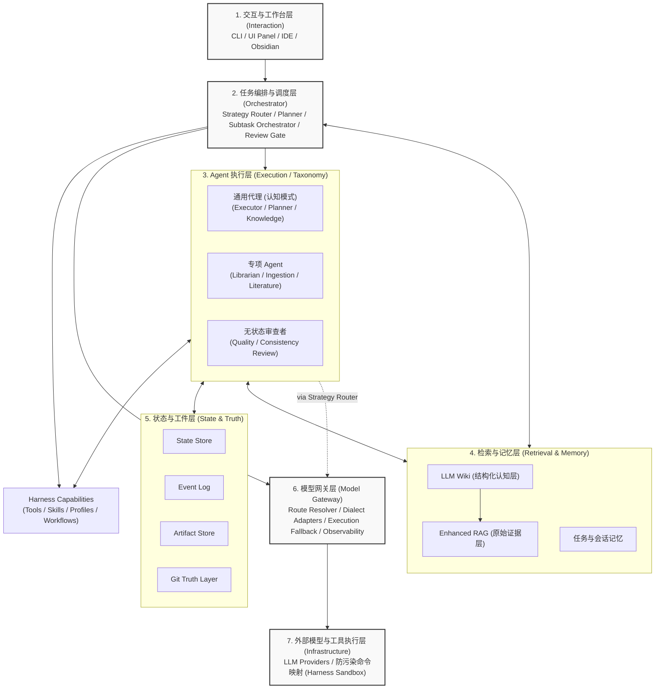

# Swallow Architecture

**Swallow** 是一个面向**高复杂度知识工作者**（如学术研究人员、法律工作者、架构师、咨询策略人员等）的 AI 工作流编排平台。它的核心目标是完成从“单次对话（Chatbot）”到“长周期任务编排、有状态执行、多源知识融合、持续沉淀积累”的跨越。

本文档定义了 Swallow 的核心系统架构，综合了 7 层架构模型、状态与事实层、Harness 能力模型，以及增强 RAG 和 LLM Wiki 的知识分层体系。

---

## 1. 系统愿景与定位

Swallow 的架构遵循 **本地优先，统一调度系统 (Local-first Unified Scheduling System)** 的原则。
这使得 Swallow 不仅仅是一个“多模型聊天器”或外部 Agent 的启动器，而是拥有自己的 Runtime、知识层和编排能力的系统核心。强大的模型和厂商原生 Agent 只作为可路由的**执行资源**。

系统专门为以下工作形态设计：
- **资料密集型**：处理多源异构数据（代码仓库、Git 记录、Obsidian 笔记、文献 PDF 等）。
- **任务链条长**：单任务需拆解为检索、提取、对比、综合、产出等多阶段结构化执行。
- **知识资产沉淀与开放生态**：任务执行过程可追踪，中间结论不丢失；同时拥抱外部 AI 生态，允许将外部工具的对话记录无缝导入为核心资产。

---

## 2. 整体 7 层架构模型 (The 7-Layer Model)

Swallow 采用自上而下的分层设计，每一层职责界限清晰：**上层决定“做什么”，中层决定“谁来做”，下层决定“怎么接模型”，侧边决定“如何找历史信息与沉淀成果”。**

### 每一层核心职责简述：

1. **交互与工作台层**：统一的用户调度入口，拒绝频繁在外部厂商界面间切换。
2. **任务编排与调度层**：负责策略路由（Strategy Router，决定任务所需的能力级别与模型族）、任务分解（Planner）、平台级并行子任务编排（Subtask Orchestrator）及质量门禁（Review Gate）。策略约束（如模型能力下限断言）在此层完成，不下沉到网关层。
3. **Agent 执行层**：处理具体的认知决策、标准化工种执行及审查。通用 Agent 负责高层判断，专项 Agent 负责特定标准输出。
4. **检索与记忆层**：分离为 RAG 证据层与 LLM Wiki 认知层，决定系统的长期记忆质量。
5. **状态与工件层**：维护系统运行中的事实基础与审计日志。
6. **模型网关层**：任务语义与外部供应商波动之间的稳定操作边界。负责逻辑模型到物理路由的映射、方言适配、执行级降级与路由遥测。不做策略判断，只做执行翻译。
7. **外部模型与工具层**：底层大模型供应商，以及经过安全映射的本地隔离执行环境。

---

## 3. 核心子系统解析

### 3.1 状态与事实层 (State & Truth Layer)

这是 Swallow 区别于普通 Multi-Agent Demo 的核心关键设计。系统从根本上扬弃了单纯的内存状态，依赖一组持久化的“四件套”来记录行动轨迹：

*   **State Store (状态库)**：保存任务当前“现场”（如进行到哪一步、等待谁确认）。安全中断和恢复的基础。
*   **Event Log (事件流)**：保存“发生过什么”。Append-only 的动作记录，用于审计溯源与过程复盘。
*   **Artifact Store (工件库)**：保存“真正产出了什么”（Diff、报告、JSON），数据库仅做索引。
*   **Git Truth Layer (Git Truth)**：负责代码及纯文本文件的绝对真相来源。提供版本 checkpoint 与安全回滚防线。

### 3.2 增强 Agentic RAG 与 LLM Wiki 知识双层架构

Swallow 认为单纯的 RAG 只能解决“找得到资料”的问题，为了沉淀长期认知，系统将检索层拆分为两层：

*   **原始资料与 RAG 证据层 (Raw Evidence & RAG)**：包含代码、Issue、外部文档及其向量索引。负责提供客观的底层证据，支持领域专属 RAG 扩展包（如 PDF 解析切块）。
*   **LLM Wiki 认知层 (Cognitive Layer)**：建立在 RAG 之上的高层结构化知识层。负责沉淀系统的核心术语、职责边界、决策记录（ADR）与工作流规则。**知识写回原则极严**：仅允许高价值、经过复核的相对稳定信息带着来源指针进入 Wiki，禁止通用 Agent 自由发散改写。
*   **外部 AI 会话摄入 (Ingestion)**：允许导入外部 AI 工具的对话记录，通过专项摄入 Agent 解析提取有效结论，融入知识库暂存区。

### 3.3 智能体分类学与认知视野 (Agent Taxonomy & Cognitive Roles)

系统中的 Agent 不按模型品牌直接划分能力，而是被定义为具体的系统角色，随后才绑定合适的 Runtime 与模型。

*   **通用代理的三阶认知模式**：不应理解为谁最强，而是代表不同的不可替代功能：
    *   **执行与施工 (Executor - e.g. Codex)**：稳健施工、补测试、代码修改、终端执行。
    *   **规划与审查 (Planner/Reviewer - e.g. Claude)**：任务拆解、风险识别、利弊分析、复杂纠偏。
    *   **知识与上下文整合 (Knowledge/Integration - e.g. Gemini)**：大仓库理解、长上下文消化、Wiki 草稿生成、一致性核对。
*   **专项 Agent (Specialist)**：使用低成本/本地模型，边界极清晰（如 OCR 提取、文献拆解比对、外部会话梳理）。专门干脏活累活，**绝不允许接管整个任务或干涉路由**。
*   **审查与门禁 (Validators)**：无状态、无修复能力的独立评估者，专门在关键节点做断言。

### 3.4 工具执行的防污染隔离机制 (Safe Execution Harness)

*   **终端命令安全映射 (Command Mapping)**：Agent 发出的终端命令不会直接下发，而是经过一层拦截与语义映射。拦截具有破坏性的系统级命令。
*   **沙盒与虚拟化隔离 (Sandboxed Execution)**：尽可能在隔离的虚拟环境中执行代码测试、依赖安装。
*   **任务卡制度 (Task Card)**：每个任务的执行严格遵循声明式的约束、置信度阈值和权限边界，出现越界或低置信度时自动向上级（强模型或人工）抛出升级请求。

### 3.5 模型网关与执行通道 (Model Gateway & Execution Channels)

#### 设计定位

模型网关层是 Swallow 系统中**任务策略与外部供应商波动之间的稳定操作边界**。

其核心职责不是”选择最好的模型”——那是编排层 Strategy Router 的工作。网关层的职责是：在编排层已经决定”需要什么级别的能力”之后，将该请求**翻译为可执行的物理路由调用**，并在执行过程中吸收供应商侧的不稳定性（价格变动、通道故障、区域限制、API 变更）。

三条核心原则：

1. **业务语义留在上游，供应商复杂度留在下游**——上层系统用任务语言（planning / review / extraction）描述意图，网关层翻译为具体的 endpoint 调用
2. **逻辑模型 ≠ 物理路由**——同一个逻辑能力（如”强推理模型”）可以经由多条物理通道到达，网关负责在这些通道间做健康探测和切换
3. **可观测性对齐任务语义**——路由遥测不仅记录原始流量指标，还关联任务族和路由类别，供 Meta-Optimizer 消费

#### 网关核心组件

*   **Route Resolver (路由解析器)**：将编排层下发的逻辑模型标识映射为当前可用的最优物理通道。维护通道健康状态、延迟基线和成本权重。
*   **Dialect Adapters (方言适配器)**：在发包前将统一语义请求转化为目标模型的原生最优形态（Claude XML 标签体系、Gemini Context Caching、Code Model FIM 等）。详见 `docs/design/PROVIDER_ROUTER_AND_NEGOTIATION.md` §3。
*   **Execution Fallback (执行级降级)**：当首选物理通道不可用时，切换到备选通道。注意：执行级降级只处理”通道不通”，不处理”能力不足”——后者由编排层的 Strategy Router 在任务分派时预判。
*   **双轨执行器 (Dual-Track Executors)**：
    *   模型执行器 (Model Executors)：标准 API 调用
    *   Agent 执行器 (Agent Executors)：将厂商原生 CLI/Agent 视为高级黑盒执行工具，不赋予系统总控权限
*   **路由遥测 (Route Telemetry)**：记录每次路由的延迟、成本、错误率、降级事件，标注任务族标签，写入 Event Log 供 Meta-Optimizer 周期性扫描。

#### 与编排层的职责边界

| 关注点 | 编排层 (Strategy Router) | 网关层 (Gateway) |
|---|---|---|
| 这个任务需要什么级别的能力？ | **是** | 否 |
| 弱模型能否承担此任务？ | **是**（能力下限断言） | 否 |
| 哪条物理通道当前最健康？ | 否 | **是** |
| 通道故障时切换到哪？ | 否 | **是**（执行级降级） |
| 降级后是否需要提升置信度阈值？ | **是**（Review Gate 联动） | 否 |

### 3.6 自我进化与记忆沉淀 (Self-Evolution & Memory)

Swallow 强调系统在长期运行中的“自我进化”与工作流记忆的沉淀：

*   **图书管理员 Agent (Librarian Agent)**：系统记忆质量的守门人。负责任务结束后的降噪摘要提炼、知识库冲突检测与合并仲裁，以及周期性的记忆衰减控制。
*   **编排策略顾问 Agent (Meta-Optimizer)**：定期的观察者。扫描 Event Log 与历史工件，识别模式以提议新的 Workflow 模板、优化 Skill 或调整路由策略。
*   **严格的知识晋升防线**：默认新 Agent 被标记为 `Canonical-Write-Forbidden`，防范隐式记忆污染。

---

## 4. 落地与演进模式 (Deployment & Evolution)
产品路线图围绕“可伸缩边界”稳步推进：

1. **Phase 1 (自建 Runtime v0 与核心验证)**：打通统一调度的 Router / Planner / Review Gate，搭建双层执行器接口，引入无状态的质量审查 Agent。
2. **Phase 2 (知识层构建与专项 Agent)**：引入 LLM Wiki、图书管理员 Agent、文献解析与外部会话摄入 Agent。确立严格的知识写回机制。
3. **Phase 3 (长线优化与控制面)**：引入编排策略顾问 (Meta-Optimizer)，自托管远程控制台，解锁高并发 Subagents 平台级调度。