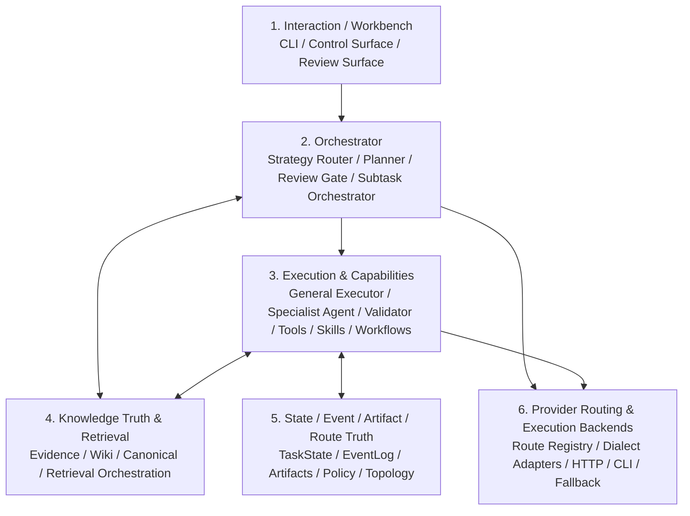

# Swallow Architecture

**Swallow** 是一个面向真实项目工作的、**local-first 的有状态 AI workflow system**。

它不是单次对话聊天器，也不是某个厂商 Agent 的外壳，而是一个围绕以下目标构建的系统：

- 让任务能跨多轮、多阶段和多会话持续推进
- 让代码工作与知识工作进入同一条任务链路
- 让执行过程留下可恢复、可审计、可复用的状态与工件
- 让外部 AI 工具产生的结论进入系统，但不污染长期知识真值
- 让执行器保持可替换，而不是和某个模型品牌绑定

---

## 0. 阅读约定

本文档**优先描述当前主分支 (`main`) 的架构基线**，仅在单独小节中讨论方向性演进。

- **Current Baseline**：已经在 `main` 上成立，或者已经被 README / active context 视为当前稳定基线的部分
- **Directional / Future**：仍属于后续 phase 的方向，不应被当作已实现能力

如果本文档与 phase 历史设计材料存在表述差异，应以当前基线和最近 tag 对齐理解，而不是回退到旧的概念框架。

---

## 1. 当前系统定位

Swallow 当前应被理解为：

- 一个 **任务工作台 / 工作流系统**
- 一个 **有状态 runtime**
- 一个 **知识对象治理系统**
- 一个 **可替换执行器编排系统**

它当前**不是**：

- 纯聊天产品
- 纯 RAG 项目
- 单一代码 Agent 的包装层
- 默认走 hosted / distributed worker 的平台系统

当前基线坚持三条原则：

1. **Local-first**：单用户、本地工作区与本地状态真值优先
2. **Truth before retrieval**：先定义任务真值与知识真值，再提供检索与召回
3. **Taxonomy before brand**：先定义系统角色，再绑定具体执行器或模型品牌

---

## 2. 当前架构总览

从当前 `main` 的实现出发，Swallow 最适合用下面五个长期层来理解：

上图比早期的“RAG 层 + Wiki 层”说法更贴近当前基线，因为现在系统中真正居中的并不是向量检索，而是：

- 任务真值
- 知识真值
- 受控检索与受控写入

---

## 3. 各层当前职责

### 3.1 Interaction / Workbench

当前交互层以 CLI 和 operator-facing inspection / review / control surfaces 为主。

它的职责不是“和模型聊天”，而是：

- 创建任务
- 运行任务
- 检查状态、工件、路由、拓扑、策略和 grounding
- 进行 retry / rerun / resume / review / control

这一层应被理解为 **task workbench**，而不是 chatbot shell。

### 3.2 Orchestrator

编排层决定：

- 当前任务要做什么
- 哪些子任务需要拆分
- 何时触发审查
- 何时进入等待人工
- 哪种能力级别适合当前任务

编排层负责策略判断，但**不直接承担供应商路由的物理细节**。

当前与编排层紧密相关的核心构件包括：

- Strategy Router
- Planner / TaskCard planning
- Review Gate / consensus policy
- DAG-based subtask orchestration
- waiting_human / retry / rerun / resume semantics

### 3.3 Execution & Capabilities

执行层的核心不是某个品牌，而是系统角色。

当前应按以下 taxonomy 理解：

- **General Executor**：承担广义任务推进与状态变更
- **Specialist Agent**：承担边界清晰的专项子系统工作
- **Validator / Reviewer**：只做审查与断言，不负责主链路推进

角色先于品牌，品牌只是当前可用实现的例子，而不是架构本体。

同样，执行层不只包含模型调用，还包含：

- tools
- skills
- profiles
- workflows
- validators

也就是说，Swallow 的执行层是 **executor + capability runtime**，而不仅仅是“谁来生成一句回答”。

---

## 4. 当前真值层：State / Event / Artifact / Route Truth

这是 Swallow 与普通 agent demo 的核心区别之一。

系统当前不是依赖单次 prompt 内存推进，而是依赖一组持久化真值：

- **TaskState**：当前任务现场与推进位置
- **EventLog**：过程事件与审计线索
- **Artifacts**：报告、diff、summary、grounding outputs 等显式产物
- **Route / Policy / Topology records**：路由、执行位点、拓扑与策略边界
- **Git truth / workspace truth**：对代码与工作区内容的外部真值约束

这里需要特别区分两件事：

1. **truth records**：系统必须可靠恢复和解释的结构化状态
2. **file outputs / large artifacts**：给人查看、比较、导出的文件产物

在当前基线下，task truth 和 knowledge truth 已经是 **SQLite-primary**；文件镜像、导出文件和 artifact 文件视图仍然保留，但它们不再天然等于 authoritative truth。

---

## 5. 当前知识架构：Knowledge Truth Layer + Retrieval & Serving Layer

这是当前最需要与旧设计语言区分开的部分。

### 5.1 为什么要修正旧叙事

早期可以把知识层粗略理解为：

- Raw Evidence / RAG
- LLM Wiki / Cognitive Layer

但在当前基线下，这种说法已经不够精确，因为系统中真正的中心不再是“向量先召回”，而是 **先知识真值归一，再检索服务**。

### 5.2 Knowledge Truth Layer

当前知识真值层回答的问题是：

- 什么是有效知识对象
- 这些知识从哪里来
- 处于什么阶段
- 是否允许复用
- 是否已被 supersede
- 谁拥有写权限

这一层当前包含的核心对象与边界包括：

- Evidence
- WikiEntry
- canonical records / canonical registry
- staged / task-linked / reusable knowledge
- promote / reject / dedupe / supersede decisions
- source traceability / grounding refs
- Librarian-controlled canonical write authority

当前基线中，知识真值层的 authoritative state 应被理解为 **SQLite-backed knowledge truth**。

### 5.3 Retrieval & Serving Layer

检索层的职责不是取代真值层，而是围绕已治理知识对象提供可用召回。

它负责：

- exact / symbolic retrieval
- metadata / policy-aware filtering
- relation expansion
- vector semantic recall
- text fallback
- evidence pack assembly

因此，向量检索在当前系统中的定位应当是：

> **semantic retrieval augmentation, not authoritative truth**

embedding 和向量索引不是知识源头，也不应成为系统默认入口；它们只是对已治理知识对象进行补充召回的能力。

### 5.4 Wiki 在当前系统中的定位

Wiki 不应再被理解为“RAG 之上的总结页”。

在当前基线中，Wiki 更适合被理解为：

- 项目级知识编译对象
- 稳定语义入口
- 面向人和模型共享的知识组织节点

Wiki 属于知识真值层的一部分，而不是一个飘在向量检索之上的展示壳。

### 5.5 当前推荐的检索顺序

当前设计上更合理的默认顺序应是：

1. task-local / canonical / wiki exact match
2. metadata + policy filtering
3. relation expansion
4. vector semantic recall
5. text fallback

也就是说，Swallow 当前更适合坚持：

> **object-first retrieval, vector-assisted recall**

而不是 vector-first retrieval。

---

## 6. 当前知识写入边界

Swallow 当前知识系统的另一个关键点，是**写入权力被显式收束**。

原则上：

- 并不是所有执行器都能直接写 canonical knowledge
- 高价值、可复用、相对稳定的信息才允许晋升
- 写入需要来源、阶段与复核边界
- Librarian / review 机制负责知识污染控制

这意味着系统追求的不是“记住越多越好”，而是：

- 明确来源
- 明确阶段
- 明确复用边界
- 明确写权限

因此，Swallow 的知识层更接近 **knowledge governance system**，而不是松散的记忆池。

---

## 7. Provider Routing & Execution Backends

### 7.1 当前定位

Provider Routing 层的职责，是把上游已经决定好的任务能力需求，翻译成可执行的物理调用路径。

它当前主要负责：

- route registry / route metadata
- logical model → physical route mapping
- dialect adaptation
- backend selection
- fallback execution path
- route telemetry

### 7.2 当前职责边界

当前需要明确区分两层决策：

| 问题 | 编排层 | Provider Routing |
|---|---|---|
| 任务需要什么级别的能力 | 是 | 否 |
| 任务是否需要 review / waiting_human | 是 | 否 |
| 当前哪条物理路由可用 | 否 | 是 |
| 这次请求如何适配为目标方言 | 否 | 是 |
| 通道异常后切到哪条 fallback | 否 | 是 |

### 7.3 当前执行后端

当前系统已经拥有多种执行后端，而不是单一路径：

- HTTP executor path
- CLI executor path
- route-level fallback
- dialect-aware request formatting

因此，Provider Routing 层已经是现实中的系统边界，而不是抽象概念。

### 7.4 关于旧文档引用

早期某些 provider routing 设计文档已经在后续文档整理中被合并进 phase materials、README 和当前实现语义中。今后若引用 provider routing 设计，应以当前 `main` 上存在的文档与实现为准，而不再依赖已合并移除的旧文件名。

---

## 8. 当前对对象存储 / 远程执行的立场

Swallow 当前仍然应被理解为：

- local-first
- single-user-first
- non-hosted-by-default

因此，当前不应把对象存储或远程 worker 当作知识主真值层。

更合理的分层是：

- **本地文件系统**：原始材料、导出文件、大型 artifact、镜像视图
- **SQLite**：task truth、event truth、knowledge truth、治理状态
- **可选 blob backend（未来）**：S3 / OSS / MinIO 等，仅作为附件 / artifact / archive 的后续扩展

也就是说，未来即使引入对象存储，它也应是 **blob backend**，而不是知识 authoritative store。

---

## 9. 当前与未来：哪些已经成立，哪些仍属方向

### 已经成立（Current Baseline）

- local-first task runtime
- SQLite-primary task truth
- SQLite-primary knowledge truth
- Librarian-governed knowledge boundaries
- optional vector retrieval with fallback semantics
- route / topology / policy visibility
- HTTP + CLI execution backends
- taxonomy-first executor understanding

### 仍属方向（Directional / Future）

- real remote execution / multi-machine transport
- object-storage-backed blob layer as a first-class extension
- broader hosted control plane
- larger-scale distributed worker model
- more advanced provider negotiation layers beyond current route registry + fallback model

方向性的东西可以继续设计，但不应倒过来定义当前系统是什么。

---

## 10. 对实现者的约束性理解

如果要继续推进 Swallow，当前最重要的几条理解是：

1. **不要把系统重新拉回纯 RAG 叙事**
2. **不要把向量层误写成知识真值层**
3. **不要让品牌映射重新污染 taxonomy**
4. **不要让未来 hosted / remote 设想反向支配当前 local-first 边界**
5. **不要把“文件仍然存在”误解为“文件永远是唯一真值”**

当前更稳的推进方式是：

- 先巩固 truth layer
- 再扩展 retrieval orchestration
- 再扩展 provider routing / evaluation / audit
- 最后才考虑 blob backend、remote worker、hosted control plane 等扩张议题

---

## 11. 一句话总结

Swallow 当前的正确理解不是：

> 一个建立在向量 RAG 之上的多 Agent 平台

而是：

> 一个 local-first、以任务真值和知识真值为中心、通过受控检索与可替换执行器推进真实项目工作的有状态 AI workflow system
