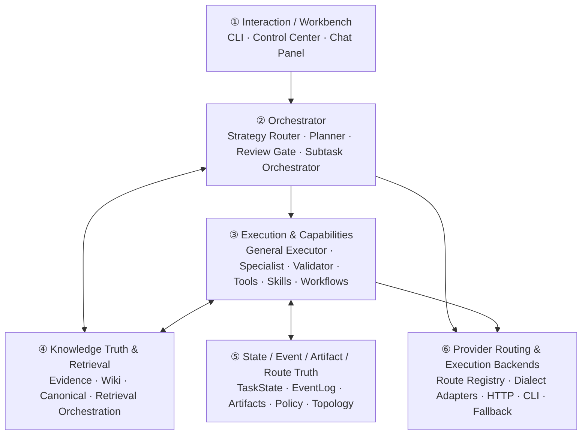
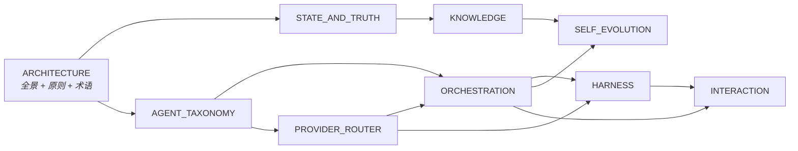

# Swallow Architecture

> **Design Statement**
> Swallow 是一个 local-first、有状态的 AI 工作流系统。它以任务真值和知识真值为中心，通过受控检索与可替换执行器推进真实项目工作——而不是单次对话或某个厂商 Agent 的外壳。

---

## 1. 全局原则 (Principles)

以下原则贯穿所有设计文档。各子文档不再重复声明，仅在本处作为权威定义。

| 编号 | 原则 | 含义 |
|---|---|---|
| P1 | **Local-first** | 单用户、本地工作区与本地状态真值优先 |
| P2 | **SQLite-primary truth** | 任务状态与知识治理状态以 SQLite 为权威存储 |
| P3 | **Truth before retrieval** | 先定义知识真值对象，再提供检索与召回 |
| P4 | **Taxonomy before brand** | 先定义系统角色，再绑定具体执行器或模型品牌 |
| P5 | **Explicit state over implicit memory** | 任务推进依赖外部可验证状态，不依赖模型对话记忆 |
| P6 | **Controlled vs black-box path** | 受控 HTTP 调用路径与黑盒 agent 调用路径必须显式区分 |
| P7 | **Proposal over mutation** | 系统自我改进以提案为主，不自动突变运行时策略 |
| P8 | **Canonical-write-forbidden by default** | 大多数实体默认禁止直接写入长期知识真值 |

---

## 2. 六层架构总览



各层职责概要：

| 层 | 一句话职责 | 详细设计 |
|---|---|---|
| ① Interaction | 任务创建、运行、检查、审阅、恢复的工作台入口 | → `INTERACTION.md` |
| ② Orchestrator | 唯一的任务推进协调层：拆分、路由、审查、等待人工 | → `ORCHESTRATION.md` |
| ③ Execution | 受控运行时 + 可复用能力体系（tools / skills / workflows / validators） | → `HARNESS.md` |
| ④ Knowledge | 知识真值治理 + 检索服务（exact → filter → expand → vector → text） | → `KNOWLEDGE.md` |
| ⑤ State & Truth | 任务推进、过程轨迹、产出文件、执行边界的持久化底座 | → `STATE_AND_TRUTH.md` |
| ⑥ Provider Routing | 逻辑能力需求 → 物理模型路由映射、方言适配、降级 | → `PROVIDER_ROUTER.md` |

跨层关注点：

| 关注点 | 详细设计 |
|---|---|
| 角色分类与权限模型 | → `AGENT_TAXONOMY.md` |
| 记忆沉淀与系统优化提案 | → `SELF_EVOLUTION.md` |

---

## 3. 默认工作组合 (Default Operating Pattern)

系统不预设固定品牌阵容。架构上坚持 role-first，具体执行器绑定由 operator 根据实际工作流选择。

当前默认绑定：

| 系统角色 | 默认绑定 | 适用场景 |
|---|---|---|
| 高价值 / 高复杂度主执行 | Claude Code | 架构改动、复杂重构、方案取舍、最终收口 |
| 高频实现施工 | Aider | 边界清晰的日常编辑、明确目标的 edit loop |
| 并行终端型中间任务 | Warp / Oz | 多终端调查、测试矩阵、环境准备、中间结果生产 |

升级 / 降级判断原则：

| 方向 | 触发条件 |
|---|---|
| Aider → Claude Code | 改动扩散、需求模糊、两轮不收敛、涉及架构边界 |
| Warp/Oz → Claude Code | 并行结果冲突、子任务不再独立、需要全局裁决 |
| Claude Code → Aider | 方案定型、后续为机械实现、可拆为低风险子修改 |

并行不是默认常态——一个主执行者负责主叙事，辅助 worker 只在边界清晰时并行提供中间结果。

---

## 4. 两条模型调用路径

这是贯穿多份设计文档的关键区分，在此统一定义。

### A. Swallow-controlled HTTP path

```
TaskState + RetrievalItems → Router → route_model_hint / dialect_hint → HTTPExecutor → HTTP API
```

Swallow 精细控制 prompt 生成、retrieval assembly、dialect、fallback 与 telemetry。方言适配器在此路径上是主控制手段。

### B. Agent black-box path

```
TaskState → CLIAgentExecutor / external agent → agent 内部模型处理 → model/provider
```

Agent 内部的模型选择、prompt 拼接、子代理行为不受 Swallow 直接控制。Swallow 转向治理任务边界、skills/rules、input/output contract、升级/降级策略与行为观测。

| 控制维度 | HTTP path | Black-box path |
|---|---|---|
| Prompt / dialect | ✅ 强控制 | ❌ 无直接控制 |
| Route / fallback | ✅ 强控制 | ❌ agent 内部决定 |
| Task boundary | ✅ | ✅ |
| Skills / rules / subagents | 部分 | ✅ 主要治理手段 |
| Review / telemetry | ✅ | ✅ |

### 4.1 执行生态位

HTTP / CLI / Specialist 是不同维度的设计对象，不应互相替代：

| 生态位 | 系统定位 | 主要价值 | 默认不承担 |
|---|---|---|---|
| **Orchestrator / Oz** | 调度与协同层 | 分派、并行、gate、handoff、状态推进 | 直接替 executor 施工或隐藏推进主线 |
| **HTTP Executor** | 受控模型认知层 | brainstorm、review、synthesis、classification、结构化抽取、多模型 fan-out | 默认代码库阅读、代码修改、命令验证 |
| **Autonomous CLI Agent** | workspace 行动层 | 读 repo、改文件、跑测试、追踪调用链、验证实现 | 知识晋升、固定 ingestion pipeline、无边界 brainstorm |
| **Specialist Agent** | 固定专精流程封装 | ingestion、librarian、literature parsing、meta-optimizer、quality / consistency validation | 开放式施工、隐藏编排、替代通用 executor |
| **Knowledge Layer** | 长期知识治理层 | verified/canonical knowledge、staged review、relation-aware retrieval | 原始聊天记忆池或纯 RAG chunk store |

默认上下文原则：

- 代码库问答 / 实施任务优先走 autonomous CLI agent，repo/docs 由 tool-loop 自主读取或由 explicit file paths 提供。
- HTTP executor 默认消费 `knowledge + notes`，用于长期原则 + 当前文档现场；若必须读取源码 chunk，必须通过显式 retrieval source override。
- Specialist agent 默认消费 explicit input_context 和专属 artifacts；不通过泛化 repo / notes 检索替代自身 schema。

---

## 5. 当前基线 vs 未来方向

| 状态 | 内容 |
|---|---|
| **已成立** | local-first task runtime · SQLite-primary truth · Librarian-governed knowledge · optional vector retrieval + fallback · route/topology/policy visibility · HTTP + CLI backends · taxonomy-first executor · Claude Code + Aider + Warp/Oz 默认组合 · controlled vs black-box path 显式区分 |
| **未来方向** | 真实远程执行 / 跨机器 transport · 对象存储 blob 扩展 · hosted control plane · 大规模分布式 worker · 更高级的 provider negotiation |

方向性设计可以提前规划，但不反向定义系统当前是什么。

---

## 6. 术语表 (Glossary)

| 术语 | 定义 |
|---|---|
| **Task Truth** | 任务推进位置、阶段、review/retry/resume/waiting_human 语义的持久化状态 |
| **Event Truth** | 以 append-oriented 方式记录的系统过程事件与遥测数据 |
| **Artifact** | 系统显式产出的文件产物（报告、diff、summary、grounding outputs） |
| **Knowledge Truth** | 知识对象的权威治理状态：阶段、来源、复用边界、写权限 |
| **Canonical Knowledge** | 经 review/promotion 流程确认的长期有效知识对象 |
| **Staged Knowledge** | 尚未经过审查的知识候选对象 |
| **Handoff Object** | 任务推进链上的结构化延续对象（goal / done / next_steps / context_pointers / constraints） |
| **Controlled HTTP Path** | Swallow 精细控制 prompt/dialect/fallback 的模型调用路径 |
| **Black-box Agent Path** | Agent 内部自主决定模型调用方式的执行路径 |
| **General Executor** | 承担完整工作切片、可影响 task-state 的执行实体 |
| **Specialist Agent** | 拥有单一高价值边界职责、写权限窄的执行实体 |
| **Validator / Reviewer** | 只做审查与断言、不推进主链路的实体 |
| **Librarian** | 负责知识冲突检测、去重、受控写入收口的专项角色 |
| **Meta-Optimizer** | 只读扫描 event truth 并产出优化提案的专项角色 |
| **Review Gate** | 在结果进入下一阶段前执行结构化审查的机制 |
| **waiting_human** | 系统显式停止自动推进、等待人类裁决的状态 |
| **Dialect Adapter** | 把统一语义请求翻译成特定模型最优输入格式的翻译层 |
| **Route** | 逻辑能力需求到物理模型通道的映射记录 |
| **repo source** | 当前工作区代码 / 配置 / 非 Markdown 文本 chunk，属于显式源码辅助，不代表完整代码库理解 |
| **notes source** | 工作区 Markdown / 文档现场召回，通常服务于 active context、roadmap、phase plans、review notes，不等于 staged raw knowledge |
| **knowledge source** | 已治理或可复用的知识对象召回，包括 verified / Wiki / Canonical / retrieval-candidate knowledge |

---

## 7. 文档依赖与推荐阅读顺序



推荐阅读顺序：ARCHITECTURE → STATE_AND_TRUTH → KNOWLEDGE → AGENT_TAXONOMY → PROVIDER_ROUTER → ORCHESTRATION → HARNESS → SELF_EVOLUTION → INTERACTION

---

## 8. 对实现者的约束

1. 不要把系统拉回纯 RAG 叙事——向量层是检索增强，不是知识真值。
2. 不要让品牌映射污染 taxonomy——角色先于品牌。
3. 不要让未来 hosted/remote 设想反向支配 local-first 边界。
4. 不要把黑盒 agent 的内部 prompt 控制能力等同于 HTTP path 的受控能力。
5. 不要让任何并行 worker surface 演化为隐藏编排器。
6. 不要让高阶执行器被低价值重复工作长期稀释。
7. 不要把 repo chunk 当成 HTTP 默认代码库理解路径；代码库阅读和实施默认由 CLI tool-loop 承担。
8. 不要把 Specialist Agent 设计成第三种通用执行器；它是窄职责、窄权限、固定输入输出的能力封装。
