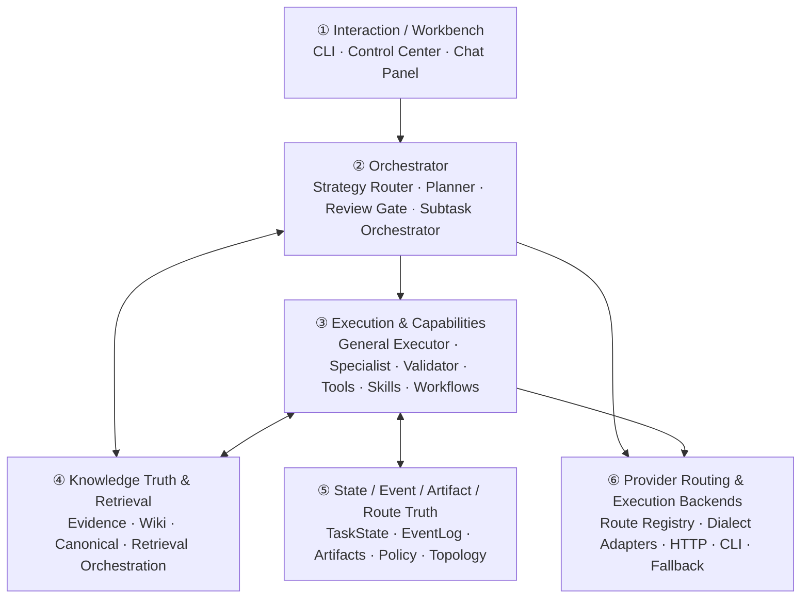
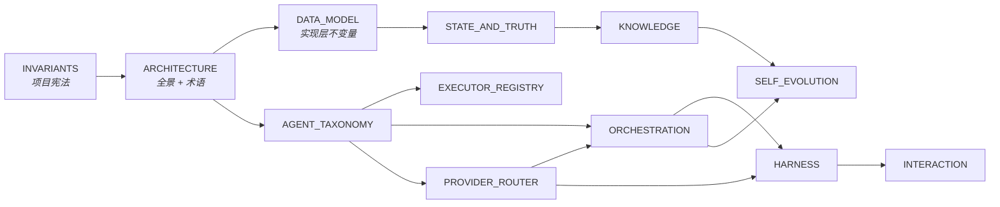

# Swallow Architecture

> **Design Statement**
> Swallow 是一个 local-first、有状态的 AI 工作流系统。它以任务真值和知识真值为中心,通过受控检索与可替换执行器推进真实项目工作——而不是单次对话或某个厂商 Agent 的外壳。

> 项目不变量见 → `INVARIANTS.md`(权威)。本文档不再持有原则、矩阵或不变量的副本,只展示全景与术语。

---

## 1. 三个约束面与六层架构

Swallow 的所有边界落在三个约束面之间:Control Plane(谁决定下一步)、Execution Plane(谁动手做事)、Truth Plane(事实存哪里)。详细规则见 `INVARIANTS.md §2`。

在三个约束面之上,系统组织为六层架构:

各层职责概要:

| 层 | 一句话职责 | 详细设计 |
|---|---|---|
| ① Interaction | 任务创建、运行、检查、审阅、恢复的工作台入口 | → `INTERACTION.md` |
| ② Orchestrator | 唯一的任务推进协调层:拆分、路由、审查、等待人工 | → `ORCHESTRATION.md` |
| ③ Execution | 受控运行时 + 可复用能力体系(tools / skills / workflows / validators) | → `HARNESS.md` |
| ④ Knowledge | 知识真值治理 + 检索服务 | → `KNOWLEDGE.md` |
| ⑤ State & Truth | 任务推进、过程轨迹、产出文件、执行边界的持久化底座 | → `STATE_AND_TRUTH.md` |
| ⑥ Provider Routing | 逻辑能力需求 → 物理模型路由映射、方言适配、降级 | → `PROVIDER_ROUTER.md` |

跨层关注点:

| 关注点 | 详细设计 |
|---|---|
| 角色分类与权限模型 | → `AGENT_TAXONOMY.md` |
| 实体到品牌的具体绑定 | → `EXECUTOR_REGISTRY.md` |
| 数据模型与存储布局 | → `DATA_MODEL.md` |
| 记忆沉淀与系统优化提案 | → `SELF_EVOLUTION.md` |

---

## 2. 默认工作组合

系统坚持 role-first——执行器按系统角色绑定,不按品牌。

具体的执行器绑定、五元组定型、升降级判据**完全归 `EXECUTOR_REGISTRY.md` 持有**,本文档不重复列出品牌名,以避免品牌信息在多处漂移。

并行不是默认常态——一个主执行者负责主叙事,辅助 worker 只在边界清晰时并行提供中间结果。并行能力由 Orchestrator 的 Subtask Orchestrator 提供(详见 `ORCHESTRATION.md §2.3`),不依赖任何 executor 的内部并行能力。

---

## 3. 三条 LLM 调用路径

`INVARIANTS.md §4` 已定义三条路径:

- **Path A — Controlled HTTP**:Orchestrator 组装 prompt,经 Provider Router,调用 HTTP API
- **Path B — Agent Black-box**:Agent 自己组装 prompt,内部决定模型,Swallow 不直接控制
- **Path C — Specialist Internal**:Specialist 内部 pipeline 多次调用 Path A,穿透到底层 Provider Router

各路径的控制能力差异:

| 控制维度 | Path A | Path B | Path C |
|---|---|---|---|
| Prompt / dialect | ✅ 强控制 | ❌ 无直接控制 | ✅(经 Path A) |
| Route / fallback | ✅ 强控制 | ❌ agent 内部决定 | ✅(经 Path A) |
| Task boundary | ✅ | ✅ | ✅ |
| Skills / rules / subagents | 部分 | ✅ 主要治理手段 | 部分 |
| Review / telemetry | ✅ | ✅ | ✅ |

### 3.1 执行生态位

Path A、Path B、Path C 是不同维度的设计对象,不应互相替代:

| 生态位 | 系统定位 | 主要价值 | 默认不承担 |
|---|---|---|---|
| **Orchestrator** | 调度与协同层 | 分派、并行、gate、handoff、状态推进 | 直接替 executor 施工或隐藏推进主线 |
| **HTTP Executor (Path A)** | 受控模型认知层 | brainstorm、review、synthesis、classification、结构化抽取、多模型 fan-out | 默认代码库阅读、代码修改、命令验证 |
| **Autonomous CLI Agent (Path B)** | workspace 行动层 | 读 repo、改文件、跑测试、追踪调用链、验证实现 | 知识晋升、固定 ingestion pipeline、无边界 brainstorm |
| **Specialist Agent (Path C)** | 固定专精流程封装 | ingestion、librarian、literature parsing、meta-optimizer、quality / consistency validation | 开放式施工、隐藏编排、替代通用 executor |
| **Knowledge Layer** | 长期知识治理层 | verified / canonical knowledge、staged review、relation-aware retrieval | 原始聊天记忆池或纯 RAG chunk store |

默认上下文原则:

- 代码库问答 / 实施任务优先走 Path B,repo / docs 由 tool-loop 自主读取或由 explicit file paths 提供。
- Path A 默认消费 `knowledge + notes`,用于长期原则 + 当前文档现场;若必须读取源码 chunk,需要通过显式 retrieval source override。
- Path C 默认消费 explicit input_context 和专属 artifacts;不通过泛化 repo / notes 检索替代自身 schema。

---

## 4. 当前基线 vs 未来方向

| 状态 | 内容 |
|---|---|
| **已成立** | local-first task runtime · SQLite-primary truth · Librarian-governed knowledge · optional vector retrieval + fallback · route / topology / policy visibility · Path A + Path B + Path C 三条调用路径 · taxonomy-first executor · 受控 vs 黑盒路径显式区分 |
| **远期方向** | 跨设备同步(基于 git / 同步盘,非云端 truth) · 团队协作扩展(基于 §INVARIANTS §7 埋点) · 真实远程执行 / 跨机器 transport · 对象存储 blob 扩展 · 更高级的 provider negotiation · agentic retrieval(动态工具选择 / 多跳推理 / 召回质量反思,服务于已治理知识对象) |

非目标见 → `INVARIANTS.md §8`。

方向性设计可以提前规划,但不反向定义系统当前是什么。

---

## 5. 术语表 (Glossary)

> **本表是 Swallow 全局术语的权威定义。** 其他文档引用术语时不应在本地重复定义,如有歧义以本表为准。

| 术语 | 定义 |
|---|---|
| **Task Truth** | 任务推进位置、阶段、review / retry / resume / waiting_human 语义的持久化状态 |
| **Event Truth** | 以 append-oriented 方式记录的系统过程事件与遥测数据 |
| **Artifact** | 系统显式产出的文件产物(报告、diff、summary、grounding outputs) |
| **Knowledge Truth** | 知识对象的权威治理状态:阶段、来源、复用边界、写权限 |
| **Canonical Knowledge** | 经 review / promotion 流程确认的长期有效知识对象 |
| **Staged Knowledge** | 尚未经过审查的知识候选对象 |
| **Handoff Object** | 任务推进链上的结构化延续对象(goal / done / next_steps / context_pointers / constraints) |
| **Path A / Controlled HTTP** | Orchestrator 组装 prompt、经 Provider Router 的模型调用路径 |
| **Path B / Agent Black-box** | Agent 内部自主决定模型调用方式的执行路径 |
| **Path C / Specialist Internal** | Specialist 固定 pipeline 内多次调用 Path A 的封装路径 |
| **General Executor** | 承担完整工作切片、可影响 task-state(经 Orchestrator)的执行实体 |
| **Specialist Agent** | 拥有单一高价值边界职责、写权限窄的执行实体 |
| **Validator / Reviewer** | 只产出 verdict、不推进主链路的实体 |
| **Review Gate** | Orchestrator 内部组件,读取 Validator verdict 后做推进决策 |
| **Librarian** | 负责知识冲突检测、去重、staged 写入收口的专项角色(canonical 写入仍归 Operator) |
| **Meta-Optimizer** | 只读扫描 event truth 并产出优化提案的专项角色 |
| **waiting_human** | 系统显式停止自动推进、等待人类裁决的状态 |
| **Dialect Adapter** | 把统一语义请求翻译成特定模型最优输入格式的翻译层 |
| **Route** | 逻辑能力需求到物理模型通道的映射记录 |
| **`apply_proposal`** | canonical knowledge / route metadata / policy 三类对象的唯一写入入口函数 |
| **Actor** | Truth 写入的发起方标识。当前 phase 默认 `"local"`,远期扩展为 multi-actor |
| **repo source** | 当前工作区代码 / 配置 / 非 Markdown 文本 chunk(显式源码辅助,不代表完整代码库理解) |
| **notes source** | 工作区 Markdown / 文档现场召回(active context、roadmap、phase plans、review notes) |
| **knowledge source** | 已治理或可复用的知识对象召回(verified / Wiki / Canonical / retrieval-candidate) |

---

## 6. 文档依赖与推荐阅读顺序

推荐阅读顺序:**INVARIANTS → ARCHITECTURE → DATA_MODEL → STATE_AND_TRUTH → KNOWLEDGE → AGENT_TAXONOMY → PROVIDER_ROUTER → ORCHESTRATION → HARNESS → SELF_EVOLUTION → INTERACTION → EXECUTOR_REGISTRY**

EXECUTOR_REGISTRY 放在最后,因为它需要前面所有概念都建立后,才能正确读懂每个 executor 的五元组含义。
