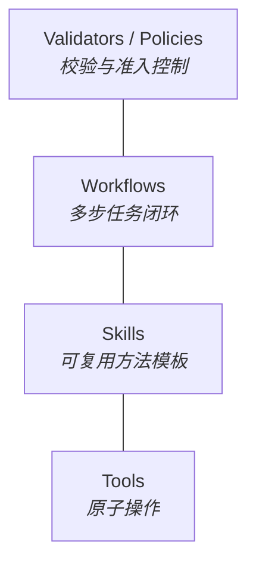

# Harness 与能力分层 (Harness & Capabilities)

> **Design Statement**
> Harness 是执行器的受控运行面——把执行环境、工具能力、skills/workflows、validators、任务边界和结果回收组织起来的运行时。在受控 HTTP 路径中它偏向 prompt/control plane，在黑盒 agent 路径中它偏向 executor governance plane。

> 全局原则见 → `ARCHITECTURE.md §1`。两条调用路径定义见 → `ARCHITECTURE.md §4`。

---

## 1. Harness 是什么

Harness 不是工具列表，也不是 prompt 包装器。它关心的不是"模型有多聪明"，而是：

| 关心的问题 | 说明 |
|---|---|
| 执行能否被约束 | 工作区边界、副作用控制、状态快照 |
| 能力能否被复用 | tools / skills / workflows / validators 的分层体系 |
| 结果能否被恢复、验证与审计 | artifact 回收、review gate、event truth 记录 |

### Harness ≠ Executor

| 层 | 回答的问题 |
|---|---|
| Task / Orchestration | 做什么 |
| Executor | 谁来做 |
| Harness / Capabilities | 在什么受控环境下做、可调用哪些能力、结果如何回收 |

---

## 2. 安全执行与工作区边界

核心准则：**自主执行不能破坏宿主环境，也不能绕过任务边界静默修改主真值。**

### 2.1 四层安全机制

| 层 | 职责 |
|---|---|
| **工作区边界** | 明确 workspace root，控制文件读写与 artifact 输出位置，将结果回收到 task truth / event truth |
| **运行环境隔离** | 项目级 virtualenv、受控 shell 执行、必要时容器化——确保不污染宿主环境 |
| **状态快照与恢复** | 关键节点保留可恢复痕迹，失败/熔断/接管时留下 resume 入口 |
| **审查防线** | 与 Review Gate、feedback-driven retry、waiting_human、consistency audit 协同兜底 |

---

## 3. 对不同执行器的差异化支撑

Harness 不只是统一提供能力，还根据 executor 角色定位提供不同层级的约束与支撑：

| 执行器 | 定位 | Harness 支撑重点 |
|---|---|---|
| **Claude Code** | 高价值、高复杂度主执行者 | 高质量 task context 组织、明确 workspace/artifact 边界、review/validator/waiting_human 链路、handoff 与 recovery 支点 |
| **Aider** | 高频实现默认 executor | 清晰文件边界、高频 edit loop 支撑、快速验证（lint/test/build）、边界扩散时升级机制 |
| **Warp / Oz** | 并行 worker surface | 多任务/多终端边界管理、中间结果与 artifact 回收、并行任务模板、防止演化为 hidden orchestrator |

---

## 4. 能力分层架构

### 4.1 Tools — 原子操作

最小化、可组合的原子能力。输入输出清晰、副作用边界明确、易于记录审计、不自带任务级业务状态。

典型示例：`read_file`、`write_file`、`glob_search`、`ast_parse`、`find_references`、`run_isolated_shell`。

### 4.2 Skills — 可复用方法模板

围绕常见问题模式，把工具组合、输入输出约束、方法提示和执行顺序打包起来的可复用模板。

典型示例：`test_driven_development`、`literature_review`、`failure_analysis`、`conversation_ingestion`、`consistency_check`。

价值：减少每次从零组织工具链；让黑盒 agent 也能被更稳定地引导；让 HTTP 受控路径的 prompt 结构更可重复。

### 4.3 Workflows — 多步任务闭环

比 skill 更高一层，对应完整的多步闭环流程。

典型示例：`planning → execution → review`、`ingest → stage → review → promote`、`implement → verify → audit → handoff`。

价值：把成功标准和熔断条件前置，减少执行器自由发挥带来的漂移。

### 4.4 Validators / Policies — 校验与准入控制

一等能力，不是附属品。负责结果检查、质量断言、schema / consistency / safety 验证、触发 feedback / retry / waiting_human。

Harness 不只是"让执行器做事"，还负责决定"什么结果算有效"。

---

## 5. 两条路径下的 Harness 角色

| 维度 | HTTP Controlled Path | Black-box Agent Path |
|---|---|---|
| **Harness 角色** | Prompt / control plane | Executor governance plane |
| **直接控制** | prompt 生成、retrieval assembly、dialect、fallback、输出结构约束 | — |
| **治理控制** | — | task boundary、skills / workflows / rules、input/output contract、escalation / fallback、telemetry |
| **共同提供** | workspace 边界、artifact 回收、validator / review 链路 | workspace 边界、artifact 回收、validator / review 链路 |

后续接入新 agent 工具时，默认先按"黑盒执行器"理解，除非它提供足够稳定的可控中间协议。

---

## 6. Skills / Subagents 在黑盒路径中的特殊价值

当无法精细控制 agent 内部 prompt 时，最有效的控制手段是：

- 子任务拆分与子代理边界
- 方法模板复用（skills / workflows）
- 输入输出格式要求
- review / retry / waiting_human 条件

因此 Harness 对黑盒 agent 的治理不只是"成本监控"，而是**通过 skills、subagents、rules、validators 和 artifacts 管理执行器行为的治理层**。

---

## 7. Harness 与 Provider Routing 的关系

| 层 | 关心什么 |
|---|---|
| **Harness** | 任务在受控环境中如何执行、有哪些能力可用、结果如何沉淀 |
| **Provider Routing** | 模型调用走哪条物理路径、方言格式、fallback 触发、route telemetry |

两者通过 executor / runtime 接口协作，但不混成一个层。

---

## 8. 与其他层的接口

| 对接层 | 接口关系 |
|---|---|
| **Orchestrator** | 编排层决定"做什么"，Harness 提供"在什么受控环境下做" |
| **Provider Router** | Harness 提供执行环境，Provider Router 提供物理路径选择 |
| **State & Truth** | 执行结果沉淀为 artifacts / event truth / task truth |
| **Knowledge** | 执行产出可成为知识候选来源 |
| **Agent Taxonomy** | 不同角色获得不同层级的 Harness 约束与能力支撑 |

---

## 附录 A：Anti-Patterns

| 反模式 | 说明 |
|---|---|
| **Harness = 工具列表** | 把 Harness 简化为一组可调用函数的集合 |
| **Persona 叙事** | 用抽象人设标签替代 task semantics / workflow / policy / validator 驱动的行为边界 |
| **路径不分** | 把黑盒 agent 路径误写成与 HTTP path 同等级的 prompt 可控路径 |
| **自由漂移** | 让 executor 在没有 validator / review / state 回收的情况下无约束执行 |
| **成本 = 唯一治理** | 把成本监控误当作对黑盒 agent 唯一的控制方式 |
| **Harness ∪ Provider Router** | 把 Provider Routing 和 Harness 混成一个层 |
