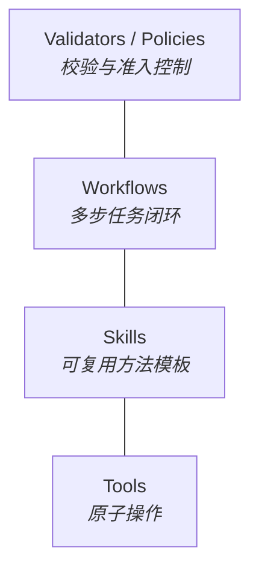

# Harness & Capabilities

> **Design Statement**
> Harness 是执行器的**受控运行面**——把执行环境、工具能力、skills/workflows、validators、任务边界和结果回收组织起来的运行时。
>
> Path A 中它偏向 prompt / control plane;Path B 中它偏向 executor governance plane;Path C 中它复用 Path A 的能力但封装在固定 pipeline 内。

> 项目不变量见 → `INVARIANTS.md`(权威)。三条调用路径定义见 `INVARIANTS.md §4`。

---

## 1. Harness 是什么

Harness 不是工具列表,也不是 prompt 包装器。它关心的不是"模型有多聪明",而是:

| 关心的问题 | 说明 |
|---|---|
| 执行能否被约束 | 工作区边界、副作用控制、状态快照 |
| 能力能否被复用 | tools / skills / workflows / validators 的分层体系 |
| 结果能否被恢复、验证与审计 | artifact 回收、verdict 产出、event truth 记录 |

### 1.1 Harness ≠ Executor

| 层 | 回答的问题 |
|---|---|
| Task / Orchestration | 做什么 |
| Executor | 谁来做 |
| **Harness / Capabilities** | 在什么受控环境下做、可调用哪些能力、结果如何回收 |

---

## 2. 安全执行与工作区边界

核心准则:**自主执行不能破坏宿主环境,也不能绕过任务边界静默修改主真值**。

### 2.1 四层安全机制

| 层 | 职责 |
|---|---|
| **工作区边界** | 明确 workspace root,控制文件读写与 artifact 输出位置,将结果回收到 task truth / event truth |
| **运行环境隔离** | 项目级 virtualenv、受控 shell 执行、必要时容器化——确保不污染宿主环境 |
| **状态快照与恢复** | 关键节点保留可恢复痕迹,失败 / 熔断 / 接管时留下 resume 入口 |
| **审查防线** | 与 Validator、Review Gate、feedback-driven retry、waiting_human、consistency audit 协同兜底 |

### 2.2 路径解析集中化

任何 Harness 内的路径解析(相对 → 绝对)只能通过 `swallow.workspace.resolve_path()` 完成(见 INVARIANTS §7)。Executor adapter 不允许自行实现路径解析逻辑。

---

## 3. 三条路径下的 Harness 角色

| 维度 | Path A | Path B | Path C |
|---|---|---|---|
| **Harness 角色** | Prompt / control plane | Executor governance plane | Specialist pipeline orchestration |
| **直接控制** | prompt 生成、retrieval assembly、dialect、fallback、输出结构约束 | — | 内部 step 序列、各 step 间的 artifact 串联 |
| **治理控制** | — | task boundary、skills / workflows / rules、input/output contract、escalation / fallback、telemetry | step 间的 schema 校验 |
| **共同提供** | workspace 边界、artifact 回收、validator / review 链路、event 写入 | 同左 | 同左 |

接入新 agent 工具时,默认先按"黑盒执行器"理解(Path B),除非它提供足够稳定的可控中间协议——例如 NDJSON 事件流(见 EXECUTOR_REGISTRY Codex 条目)。

---

## 4. 能力分层架构



### 4.1 Tools — 原子操作

最小化、可组合的原子能力。输入输出清晰、副作用边界明确、易于记录审计、不自带任务级业务状态。

典型示例:`read_file` / `write_file` / `glob_search` / `ast_parse` / `find_references` / `run_isolated_shell`。

### 4.2 Skills — 可复用方法模板

围绕常见问题模式,把工具组合、输入输出约束、方法提示和执行顺序打包起来的可复用模板。

典型示例:`test_driven_development` / `literature_review` / `failure_analysis` / `conversation_ingestion` / `consistency_check`。

价值:减少每次从零组织工具链;让 Path B 黑盒 agent 也能被更稳定地引导;让 Path A 受控路径的 prompt 结构更可重复。

### 4.3 Workflows — 多步任务闭环

比 skill 更高一层,对应完整的多步闭环流程。

典型示例:`planning → execution → review` / `ingest → stage → review → promote` / `implement → verify → audit → handoff`。

价值:把成功标准和熔断条件前置,减少执行器自由发挥带来的漂移。

### 4.4 Validators / Policies — 校验与准入控制

一等能力,不是附属品。

| 维度 | 说明 |
|---|---|
| 角色 | Validator(见 AGENT_TAXONOMY §3.3) |
| 输出 | `VerdictReport`(见 ORCHESTRATION §2.5) |
| 边界 | 不接触 task state(由 Review Gate 在 Orchestrator 内消费 verdict) |

Harness 不只是"让执行器做事",还负责决定"什么结果算有效"。但 Harness **不**自行决定推进——决定推进的是 Orchestrator 内部的 Review Gate。

---

## 5. 项目级指令注入(Instruction Injection)

这是 Path B 黑盒 agent 治理的核心手段。每个 executor 都有自己的指令注入文件(见 EXECUTOR_REGISTRY §4):

| Executor | 指令注入文件 |
|---|---|
| Claude Code | `CLAUDE.md` |
| Codex CLI | `AGENTS.md` |
| Aider | `.aider.conf.yml` + 命令行 |

### 5.1 实现策略:fragment + include,不直接覆盖用户文件

Swallow **不**直接写 `<workspace_root>/CLAUDE.md` 或 `<workspace_root>/AGENTS.md`,因为:

- 用户可能已经手写了这些文件
- 这些文件如果 commit 到 git 会有 noise
- task 间 instruction 内容差异大,频繁覆盖容易出错

正确做法:

```
<workspace_root>/
├── CLAUDE.md                     用户自己的(可选,Swallow 不动)
├── AGENTS.md                     用户自己的(可选,Swallow 不动)
└── .swl/
    └── instructions/
        ├── <task_id>/
        │   ├── CLAUDE.md         Swallow 为本次 task 生成的 fragment
        │   ├── AGENTS.md         Swallow 为本次 task 生成的 fragment
        │   └── manifest.json     描述本次 task 的 instruction 结构
        └── shared/
            └── ...               跨 task 复用的 instruction 片段
```

执行时(具体注入机制因 executor 而异,实现时需根据各 executor 实际行为确定):

- **Claude Code**:候选机制——`--system-prompt-append` 参数、环境变量、或读取 fragment 路径的自定义命令
- **Codex CLI**:候选机制——AGENTS.md 嵌套目录优先级、stub 文件 include、symlink、运行时切换 cwd 等。具体方案需在实现时根据 Codex 当前版本的行为实测确定
- **Aider**:命令行参数 `--read .swl/instructions/<task_id>/aider.conf.yml` 或类似的显式 include 机制

每个 executor 的具体 inject 机制由 `<Executor>InstructionAdapter` 封装,Harness 上层只调用统一的 `InstructionInjector.inject()` 接口(见 §5.2)。

### 5.2 InstructionInjector 抽象

```python
class InstructionInjector:
    def inject(self, executor_id: str, task_semantics: TaskSemantics) -> InjectionContext:
        """
        为 task 生成 fragment 文件,返回执行时需要的注入上下文。
        - 不修改 workspace 根目录的用户文件
        - fragment 写入 .swl/instructions/<task_id>/
        - 返回的 InjectionContext 描述 executor 启动时需要的环境变量 / 命令行参数
        """

    def cleanup(self, task_id: str) -> None:
        """
        清理 fragment。
        - 触发时机:task 进入归档状态时(archived_at 被设置时)
        - 终态(completed/failed/cancelled)但未归档:fragment 保留,供 audit
        - 归档动作触发清理,确保 .swl/instructions/ 不无限膨胀
        - 实现位置:Repository 层在写入 archived_at 后调用 cleanup
        """
```

### 5.3 注入内容

每次 task 注入包含:

- 本次 task 的 constraints 与 acceptance criteria
- 可调用的 skills 列表(白名单)
- artifact 输出位置与命名约定
- review / handoff 触发条件
- 不允许的操作(black list)

具体的 inject 机制因 executor 而异——例如 Claude Code 通过 `CLAUDE.md` fragment 列出可用 skill 名、Codex 通过 AGENTS.md 列出、Aider 不支持 skills 时退化为命令行 prompt 提示。每个 executor 的实际 inject 行为由其专属 adapter 实现,详见 EXECUTOR_REGISTRY 各条目说明。

---

## 6. Skills / Subagents 在 Path B 中的特殊价值

当无法精细控制 agent 内部 prompt 时,最有效的控制手段是:

- 子任务拆分与子代理边界
- 方法模板复用(skills / workflows)
- 输入输出格式要求
- review / retry / waiting_human 条件

因此 Harness 对 Path B 的治理不只是"成本监控",而是**通过 skills、subagents、rules、validators 和 artifacts 管理执行器行为的治理层**。

---

## 7. Harness 与 Provider Router 的分工

| 层 | 关心什么 |
|---|---|
| **Harness** | 任务在受控环境中如何执行、有哪些能力可用、结果如何沉淀 |
| **Provider Router** | 模型调用走哪条物理路径、方言格式、fallback 触发、route telemetry |

两者通过 executor / runtime 接口协作,但**不混成一个层**。

具体边界:

- Path A 的 prompt 组装由 Orchestrator 驱动,Provider Router 处理物理路由,Harness 提供执行环境与 artifact 回收——三者分工
- Path B 完全不经过 Provider Router,Harness 是唯一治理层
- Path C 内部多次走 Path A 流程,Harness 提供 specialist pipeline 的 step 编排

---

## 8. 与其他文档的接口

| 对接文档 | 接口关系 |
|---|---|
| `INVARIANTS.md` | 三条路径、写权限矩阵、路径解析集中化的权威 |
| `AGENT_TAXONOMY.md` | Validator / role 的语义 |
| `EXECUTOR_REGISTRY.md` | 各 executor 的指令注入文件类型 |
| `ORCHESTRATION.md` | Harness 提供环境,Orchestrator 决定"做什么";Validator 输出 verdict 由 Review Gate 消费 |
| `PROVIDER_ROUTER.md` | Path A / C 的物理路径选择,与 Harness 分工 |
| `STATE_AND_TRUTH.md` | Artifact 回收、event 写入的语义 |
| `KNOWLEDGE.md` | retrieval source 的默认规则与 specialist 的 default_retrieval_sources |

---

## 附录 A:Anti-Patterns

| 反模式 | 说明 |
|---|---|
| **Harness = 工具列表** | 把 Harness 简化为一组可调用函数的集合 |
| **Persona 叙事** | 用抽象人设标签替代 task semantics / workflow / policy / validator 驱动的行为边界 |
| **路径不分** | 把 Path B 误写成与 Path A 同等级的 prompt 可控路径 |
| **自由漂移** | 让 executor 在没有 validator / review / state 回收的情况下无约束执行 |
| **成本 = 唯一治理** | 把成本监控误当作对 Path B 唯一的控制方式 |
| **Harness ∪ Provider Router** | 把 Provider Router 和 Harness 混成一个层 |
| **覆盖用户 instruction 文件** | Swallow 直接写 `CLAUDE.md` / `AGENTS.md` 到 workspace 根,污染用户的版本 |
| **路径解析散落** | Executor adapter 各自实现路径解析,不集中到 `resolve_path()` |
| **Validator 接管 state** | Validator 直接修改 task state(违反 ORCHESTRATION §2.5) |
