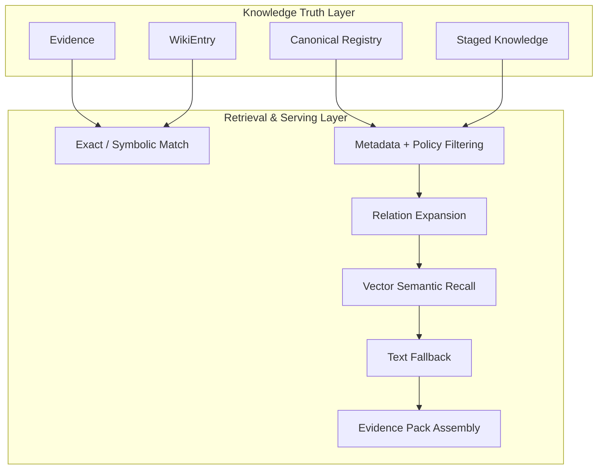

# 知识架构设计 (Knowledge Truth & Retrieval)

> **Design Statement**
> Swallow 的知识层是一个 truth-first 的知识治理系统：先将知识归一为受治理的 truth objects（Evidence / Wiki / Canonical），再通过精确检索、策略过滤、关系扩展、向量召回与文本回退提供证据服务。向量检索是辅助召回手段，不是知识真值本身。

> 全局原则见 → `ARCHITECTURE.md §1`。术语定义见 → `ARCHITECTURE.md §6`。

---

## 1. 设计动机

标准的"切块与嵌入"（Chunk & Embed）RAG 在长期知识工作中会碰到四个边界：

1. 能找到相似片段，但找不到**当前有效**的知识对象。
2. 召回了文本，但不清楚它的**阶段、来源和复用边界**。
3. 召回了相似语义，但无法稳定回答"哪个结论是**规范版本**"。
4. 回答层反复重新做知识编译，造成 token 浪费和结果漂移。

因此 Swallow 采用的不是 vector-first retrieval，而是 **truth-first knowledge system with retrieval augmentation**。

---

## 2. 双层架构



### 2.1 Knowledge Truth Layer

回答的核心问题：这个知识对象是否有效、来自哪里、处于什么阶段、是否允许复用、是否已被 supersede、谁有写权限。

核心对象：

| 对象 | 职责 |
|---|---|
| **Evidence** | 带来源的原始证据记录 |
| **WikiEntry** | 项目级知识编译对象，稳定语义入口 |
| **Canonical Registry** | 经 review/promotion 确认的长期规范知识 |
| **Staged Knowledge** | 尚未审查的候选知识对象 |

治理机制：promote / reject / dedupe / supersede 决策、source traceability、Librarian-controlled canonical write boundary。

权威存储：**SQLite-backed knowledge truth**。文件镜像与索引视图是辅助产物，不是真值。

### 2.2 Retrieval & Serving Layer

围绕已治理知识对象提供召回服务，不替代真值层。

默认检索顺序（优先级从高到低）：

| 优先级 | 检索方式 | 说明 |
|---|---|---|
| 1 | Exact / symbolic match | task-local、canonical、wiki 精确命中 |
| 2 | Metadata + policy filtering | 按阶段、来源、策略过滤候选集 |
| 3 | Relation expansion | 沿知识对象间关系扩展召回 |
| 4 | Vector semantic recall | sqlite-vec 向量相似度补充召回 |
| 5 | Text fallback | 全文本匹配兜底 |

核心定位：**object-first retrieval, vector-assisted recall**。

### 2.3 Retrieval Source Types 的职责边界

`RetrievalRequest.source_types` 是上下文来源的**语义选择**，不是简单的文件后缀过滤开关。每个 source type 的权威性、生命周期和默认适用路径不同：

| Source Type | 当前语义 | 典型来源 | 权威性 | 默认用途 |
|---|---|---|---|---|
| `knowledge` | 已治理或可复用的知识对象召回 | verified knowledge、Wiki、Canonical、retrieval-candidate objects | 高 | 长期原则、已确认约束、跨任务复用结论 |
| `notes` | 工作区 Markdown / 文档现场召回 | `docs/`、phase plans、roadmap、active context、review notes | 中 | 当前 phase 现场、设计材料、roadmap / closeout 背景 |
| `repo` | 当前工作区代码 / 配置 / 非 Markdown 文本 chunk | 源码、配置、脚本、非 `.md` 文本 | 局部事实，但 chunk 视野有限 | 显式源码辅助、legacy fallback、无 tool-loop 的受控场景 |
| `artifacts` | 任务产物上下文 | reports、summaries、review outputs、generated artifacts | 取决于产物类型 | 显式任务交接、review / audit 输入 |

稳定边界：

- `knowledge` 不等于所有文本资料。它指经过治理、可复用、可追踪的知识对象；未 review 的 staged raw 不应通过 `knowledge` 默认进入主链。
- `notes` 不等于 staged knowledge raw。它当前由 Markdown/document retrieval 提供，表示工作区文档现场，可能是 draft、phase-local 或历史材料。
- `repo` 不等于完整代码库理解。repo chunk 是局部片段召回，不能替代能自主读文件、跑命令、追踪调用链的 CLI tool-loop。
- `artifacts` 应通过明确 task / artifact pointer 消费；不应作为隐式全局记忆池。

默认使用规则：

| 执行场景 | 默认 source_types | 理由 |
|---|---|---|
| Autonomous CLI coding route | `["knowledge"]` | 长期约束由知识层提供；当前 repo/docs 由 CLI agent 自主读取或由显式文件路径提供 |
| HTTP planning / review / synthesis / extraction | `["knowledge", "notes"]` | HTTP 是无 tool-loop 的模型思考层，需要长期原则 + 当前文档现场 |
| HTTP codebase Q&A / source analysis | 不作为默认路径 | 应优先路由到 autonomous CLI route；若必须走 HTTP，需 explicit override 请求 `repo` |
| Specialist Agent | 由专项目标和 explicit input_context 决定 | Specialist 是窄工作流封装，默认不应泛扫 repo/notes |
| Legacy deterministic fallback | 可暂保留 `["repo", "notes", "knowledge"]` | 兼容无 tool-loop 的旧路径；不代表长期主策略 |

若 operator 明确需要源码 chunk，可通过 `task_semantics["retrieval_source_types"]` 显式指定，例如 `["repo", "notes", "knowledge"]`。显式 override 是能力出口，不是默认设计目标。

---

## 3. Wiki 的定位

Wiki 不是"RAG 之上的摘要页"，而是知识真值层内部的一类重要对象：

- **项目级知识编译对象**——把高价值、相对稳定、可复用的知识组织成可治理单元。
- **稳定语义入口**——为 exact match、canonical lookup、relation expansion 提供更稳定的检索锚点。
- **减少重复编译成本**——避免每次回答都从底层文本重新拼装全局认知。

---

## 4. 知识写入原则

知识层是受治理的真值系统，不是随手写入的记忆池。

| 原则 | 说明 |
|---|---|
| 晋升有门槛 | 只有高价值、可复用、相对稳定的信息才有晋升资格 |
| 来源可追溯 | 所有高阶知识对象尽可能带 source pointer |
| 写权限受控 | 大多数执行器默认 Canonical-Write-Forbidden（→ `AGENT_TAXONOMY.md §6`） |
| 显式晋升流程 | staged → review → promote/reject，不允许绕过 |
| Librarian 收口 | 冲突合并、去重和污染控制由 Librarian 专项角色负责 |

---

## 5. 外部 AI 会话摄入

用户在 ChatGPT、Claude Web 等外部工具中完成的前期探索，可以作为原始输入进入系统，但不能直接成为长期知识真值。

正确路径：

```
外部会话 → ingestion / extraction / staging → knowledge review → promotion / rejection
```

摄入流程负责：导入对话记录 → 过滤无效发散 → 保留有效结论与被否决路径 → 转换为结构化候选对象 → 进入 staged knowledge。

### 5.1 外部输入格式边界

外部对话摄入必须同时区分三个维度，避免把输入来源、传输方式和内容语义混成一个概念：

| 维度 | 示例 | 设计含义 |
|---|---|---|
| **内容语义** | 完整对话、对话片段、已整理结论、知识文件 | 决定是否需要 conversation filtering，还是直接进入 staged candidate |
| **输入载体** | 本地文件、剪贴板、未来可能的受控 URL | 只决定 bytes 从哪里来，不决定知识真值语义 |
| **内容格式** | provider JSON、generic chat JSON、Markdown、text | 决定 parser 如何归一为 `ConversationTurn` 或 staged candidate |

稳定规则：

- **完整官方/平台导出**优先走 provider-specific JSON parser，例如 `chatgpt_json`、`claude_json`、`open_webui_json`。这类 parser 可以保留 provider 特有语义，例如 ChatGPT `mapping` 树、分支路径、conversation metadata。
- **其他 chatbot 的普通聊天记录 JSON**走 `generic_chat_json`，但该格式只覆盖 flat message-list：`[{...}]` 或 `{ "messages": [...] }`。它只做 role/content 归一，不恢复 provider-specific branch semantics。
- **非完整对话片段或复制出的 transcript**走 Markdown/document parser；输入载体可以是文件或剪贴板。
- **已整理成结论、决策或灵感的内容**不应伪装成外部会话；应走 `swl note` 或本地文件 staged ingestion，绕过 conversation filtering。
- **本地文件路径仍是稳定核心载体**；clipboard 是低摩擦补充载体，不替代文件路径，也不改变 parser / staged review 语义。
- **URL / shared link 摄入不是默认知识能力**。抓取 `chatgpt.com/share/...`、网页分享链接或需要登录态的 remote URL 会引入网络、权限、隐私、可重复性和 HTML schema 稳定性问题；必须作为独立设计 slice 引入，不能隐式并入 external session ingestion。

推荐命令语义：

```bash
# provider-specific 完整导出
swl ingest conversations.json --format chatgpt_json
swl ingest claude-export.json --format claude_json
swl ingest open-webui.json --format open_webui_json

# 其他 chatbot 的扁平消息列表 JSON
swl ingest chat.json --format generic_chat_json
swl ingest --from-clipboard --format generic_chat_json

# Markdown / transcript 片段
swl ingest transcript.md --format markdown
swl ingest --from-clipboard --format markdown

# 已整理结论或本地知识文件
swl note "retrieval policy 应按 execution family 分流" --tag retrieval
swl knowledge ingest-file notes.md
swl knowledge ingest-file notes.txt
```

这条边界的核心原则是：`swl ingest` 负责 conversation-like raw material 的解析、过滤和 staging；`swl note` / `swl knowledge ingest-file` 负责已经由 operator 整理过的知识输入；所有路径最终都必须进入 staged → review → promote/reject 管线，不允许外部材料绕过治理边界直接写入 canonical memory。

### Schema Alignment

handoff vocabulary 在代码层已统一到标准 schema。文档中的 `Context`、`Constraints`、`Goals` 等术语始终与实现的结构化字段对齐，而不是自由文本语义。

---

## 6. 原始材料与知识对象的关系

系统处理的底层材料（代码、Markdown、PDF、外部会话、日志等）与知识对象是两个不同层次：

| 层次 | 内容 | 作用 |
|---|---|---|
| 原始材料层 | 代码、文档、日志、外部会话 | 帮助 ingest / parse / extract |
| 知识对象层 | Evidence / Wiki / Canonical / Staged | 受治理的可复用认知单元 |
| 检索服务层 | 索引与召回机制 | 围绕知识对象 + 必要原始材料提供检索 |

底层材料帮助形成知识对象，但不直接等于可复用知识对象。

---

## 7. 与其他层的接口

| 对接层 | 接口关系 |
|---|---|
| **State & Truth** | 知识治理状态共享 SQLite 存储，逻辑隔离 |
| **Orchestrator** | 编排层触发 retrieval 请求，消费 evidence pack |
| **Execution & Harness** | Executor 产出的 artifacts 可成为知识候选来源 |
| **Self-Evolution** | Librarian 从 task artifacts 中提炼知识候选；Meta-Optimizer 不直接写入 |
| **Interaction** | CLI 提供 knowledge-review / promote / reject 入口 |

---

## 8. 远期方向

Graph RAG、社区发现、图结构摘要、agentic retrieval（动态工具选择 / 多跳推理 / 召回质量反思）等能力作为远期检索增强方向保留。若引入，它们服务于已治理知识对象，不反向取代知识真值层。

---

## 附录 A：Anti-Patterns

| 反模式 | 说明 |
|---|---|
| **Vector-first 叙事** | 把向量索引写成知识 authoritative store |
| **Wiki 浮层化** | 把 Wiki 写成飘在真值层之上的展示壳 |
| **外部会话直通** | 外部对话导入绕过 staged / review / promotion 边界 |
| **载体即语义** | 把 clipboard、文件、URL 当作不同知识语义，而不是不同 bytes 载体 |
| **通用 JSON 过度承诺** | 把 `generic_chat_json` 扩张成任意 chatbot / URL / HTML / 登录态抓取框架 |
| **材料 = 知识** | 把"底层材料很重要"误解为"底层材料直接等于可复用知识对象" |
| **repo chunk = 代码库理解** | 把局部源码 chunk 当成完整 workspace exploration，替代 CLI agent 自主读文件和验证 |
| **notes = raw knowledge** | 把 Markdown 文档检索误当成 staged raw 或 canonical knowledge，绕过 review / promotion 语义 |
| **HTTP 默认源码 RAG** | 让 HTTP executor 默认携带 repo chunk 承担代码库问答，掩盖误路由和 partial context 风险 |
| **纯 RAG 回退** | 把系统重新拉回 chunk & embed 的单层叙事 |
