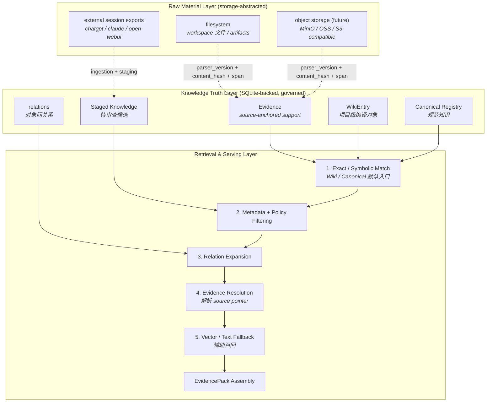

# Knowledge Truth & Retrieval

> **Design Statement**
> Swallow 的知识层是一个 **storage-abstracted, evidence-backed wiki retrieval** 系统。原始材料层的物理存储(filesystem / 未来 MinIO / OSS / S3-compatible)是可替换后端;Knowledge Truth Layer(SQLite 中受治理的 Evidence / Wiki / Canonical / Staged)是稳定语义边界;Retrieval & Serving Layer 以 Wiki / Canonical 为默认语义入口,由 Evidence 提供来源锚定,向量与全文检索仅作辅助召回与 fallback。**向量检索是辅助召回手段,不是知识真值本身**(P3)。

> 项目不变量见 → `INVARIANTS.md`(权威)。物理 schema 见 → `DATA_MODEL.md`。生态位讨论见 → `ARCHITECTURE.md §3.1`。

---

## 1. 设计动机

标准的"切块与嵌入"(Chunk & Embed)RAG 在长期知识工作中会碰到四个边界:

1. 能找到相似片段,但找不到**当前有效**的知识对象。
2. 召回了文本,但不清楚它的**阶段、来源和复用边界**。
3. 召回了相似语义,但无法稳定回答"哪个结论是**规范版本**"。
4. 回答层反复重新做知识编译,造成 token 浪费和结果漂移。

因此 Swallow 采用的不是 vector-first retrieval,而是 **truth-first knowledge system with retrieval augmentation**。

---

## 2. 三层架构



物理表见 → DATA_MODEL.md §3.3(`know_evidence` / `know_wiki` / `know_staged` / `know_canonical` / `know_change_log`)。

### 2.1 Raw Material Layer(原始材料层)

回答的核心问题:bytes 从哪里来。

包含:本地 filesystem(`workspace_root` 下文件、`.swl/artifacts/`、外部会话导出)、未来可能的 object storage(MinIO / OSS / S3-compatible)、ingestion 临时缓冲、外部输入载体(剪贴板)。

**关键边界**:Raw Material **不等于** Knowledge Truth。原始文件只是 bytes/source material,**可替换后端**;它们的物理位置不应绑定到 Knowledge 层语义。Knowledge 层只通过稳定的 reference 语义引用原始材料(见 §2.2 Evidence 定义),不直接持有物理路径或后端 client。

**Source URI scheme 示例**(后端无关命名约定;具体实装由后续 design phase 决定):

| Scheme | 物理后端 | 示例 |
|---|---|---|
| `file://` | filesystem | `file://workspace/docs/design/KNOWLEDGE.md` |
| `artifact://` | filesystem(`.swl/artifacts/`) | `artifact://task_abc123/report.md` |
| `s3://` | S3-compatible object storage(future) | `s3://swallow-raw/conversations/chatgpt/export-001.json` |
| `minio://` | MinIO(future) | `minio://local-swallow/raw/notes/abc.md` |
| `oss://` | Aliyun OSS(future) | `oss://bucket/project/raw/meeting-001.md` |

`source_ref` 字段使用上述 URI 形式;`RawMaterialStore` 后端解析 scheme 决定如何读 bytes。Knowledge Truth 持有的是 URI 字符串本身,而非物理路径或 backend client。

**Storage Backend Independence**:Raw Material Layer 的物理后端应通过 `RawMaterialStore` 接口边界访问。当前实现以 filesystem 为唯一后端,但 Knowledge / Retrieval 代码不应假设这一点。后续若引入 object storage 后端,只需新增 `RawMaterialStore` 适配,Knowledge Truth schema 与 Retrieval & Serving Layer 行为零变化。详见 §3.3。

### 2.2 Knowledge Truth Layer

回答的核心问题:这个知识对象是否有效、来自哪里、处于什么阶段、是否允许复用、是否已被 supersede、谁有写权限。

| 对象 | 职责 | 默认是否作为主检索目标 |
|---|---|---|
| **WikiEntry** | 项目级知识编译对象,稳定语义入口 | **是**(默认主入口) |
| **Canonical Registry** | 经 review/promotion 确认的长期规范知识 | **是**(默认主入口) |
| **Evidence** | source-anchored support,证据来源锚定 | **否**(supporting,不直接作为主回答语料) |
| **Staged Knowledge** | 尚未审查的候选知识对象 | **否**(默认排除主链;通过 review CLI 显式访问) |

#### Evidence 的强化定义

Evidence **不是**传统 RAG chunk,**不是**默认主检索对象,**不是**匿名文本片段集合。它是 **source-anchored support**,用途包括:

- 支撑 Wiki / Canonical / Staged 的来源追溯
- review / verification / conflict / supersede 判断
- 必要时作为 fallback retrieval 的精确锚定来源

Evidence 通过稳定的 reference 语义引用原始材料,**不持有物理路径或后端 client**:

| 字段 | 含义 |
|---|---|
| `source_ref` | 后端无关的稳定标识(filesystem 下是相对路径;object storage 下是 bucket-relative key) |
| `content_hash` | 锚定具体内容版本,用于检测原始材料变更 |
| `parser_version` | 锚定解析器版本,用于决定是否需要重新 parse |
| `span` | 字节偏移或行号范围,在原文件内定位 |
| `heading_path` | 文档结构路径(如 `["§3", "§3.1", "Bullet 2"]`),便于回溯 |

具体物理表的 `source_pointer` JSON 字段是上述语义的物化形式;详见 DATA_MODEL.md §3.3。

#### 治理机制

promote / reject / dedupe / supersede 决策、source traceability、Operator-controlled canonical write boundary。Canonical 写入仅经 `apply_proposal`(INVARIANTS §0 第 4 条)。

### 2.3 Retrieval & Serving Layer

回答的核心问题:对当前任务,把哪些受治理知识对象 + 必要证据 + 可选 fallback 命中,组装成 EvidencePack 交给上层。

围绕已治理知识对象提供召回服务,**不替代真值层**。

默认检索顺序(优先级从高到低):

| 优先级 | 检索方式 | 说明 |
|---|---|---|
| 1 | Exact / symbolic match | task-local、**Wiki / Canonical 精确命中**(默认主入口) |
| 2 | Metadata + policy filtering | 按阶段、来源、策略过滤候选集 |
| 3 | Relation expansion | 沿知识对象间关系扩展召回 |
| 4 | Evidence resolution | 为命中的 Wiki / Canonical / Staged 解析 supporting Evidence |
| 5 | Vector semantic recall | sqlite-vec 向量相似度补充召回(辅助,不反向定义知识真值) |
| 6 | Text fallback | 全文本匹配兜底(辅助) |

核心定位:**wiki-first retrieval, evidence-backed, vector-assisted**。Default 问答 / planning / review / synthesis **不应**直接从 raw chunk 开始;应先命中 Wiki / Canonical,再解析 supporting Evidence,vector / text 仅在前序未命中时补召回。

#### EvidencePack 的正式定义

EvidencePack **不是**匿名 chunk 列表,而是 Retrieval & Serving Layer 交付给 Orchestrator / Specialist / 上层调用者的**结构化结果对象**:

| 字段 | 含义 | 是否权威 |
|---|---|---|
| `primary_objects` | 主命中对象(默认是 WikiEntry / Canonical 的子集) | **权威**(default 主回答语料) |
| `canonical_objects` | 命中的 Canonical Registry 条目 | **权威** |
| `supporting_evidence` | 为 `primary_objects` / `canonical_objects` 解析的 Evidence,带 source pointer | **权威**(来源锚定) |
| `fallback_hits` | vector / text 召回的辅助命中 | **非权威**(显式标注 fallback) |
| `source_pointers` | 所有 Evidence 的 source_ref / content_hash / parser_version / span / heading_path | reference,后端无关 |
| `relation_metadata` | 命中对象间关系(supersede / refines / refers_to 等) | reference |
| `routing_hints` | 单独通道(见 §4 误路由保护),**不**进入 EvidencePack 主体,通过 `event_log` 传 |

**关系类型枚举**(`relation_metadata` 与 supporting_evidence 内 evidence-to-object 关系共用,authoritative):

| 关系 | 含义 |
|---|---|
| `supports` | Evidence 支撑 Wiki / Canonical / Staged 的论断 |
| `contradicts` | Evidence 与已有论断冲突,触发 review / supersede 评估 |
| `supersedes` | 新对象/Evidence 取代旧对象,旧对象进入 superseded 状态 |
| `refines` | 新对象在原对象基础上做精化,不取代而是补充 |
| `refers_to` | 对象间的引用关系,非真值依赖 |
| `context` | 提供背景信息,不直接支持或反驳 |
| `derived_from` | 标记 ingestion / extraction 来源链条 |

调用者契约:

- 默认问答 / planning / review / synthesis **应优先消费 `primary_objects` + `canonical_objects` + `supporting_evidence`**
- `fallback_hits` 是降级信号,调用者需感知"这是辅助召回,不是受治理知识"
- `source_pointers` 让调用者可以(在必要时)回溯到 Raw Material Layer,但 EvidencePack 本身不打开物理 byte stream
- EvidencePack 不内嵌 Raw Material 字节,仅承载 reference 语义

---

## 3. Retrieval Source Types 的语义边界

`RetrievalRequest.source_types` 是上下文来源的**语义选择**,不是简单的文件后缀过滤开关,**也不是物理存储后端开关**。每个 source type 的权威性、生命周期和默认适用路径不同:

| Source Type | 当前语义 | 典型来源 | 权威性 |
|---|---|---|---|
| `knowledge` | 已治理或可复用的知识对象召回 | verified knowledge / Wiki / Canonical / retrieval-candidate | 高 |
| `notes` | 工作区 Markdown / 文档现场召回 | `docs/`、phase plans、roadmap、active context、review notes | 中 |
| `repo` | 当前工作区代码 / 配置 / 非 Markdown 文本 chunk | 源码、配置、脚本、非 `.md` 文本 | 局部事实(chunk 视野有限) |
| `artifacts` | 任务产物上下文 | reports、summaries、review outputs、generated artifacts | 取决于产物类型 |

### 3.1 稳定边界

- **`knowledge` 不等于所有文本资料**。它指经过治理、可复用、可追踪的知识对象;未 review 的 staged raw 不应通过 `knowledge` 默认进入主链。
- **`notes` 不等于 staged knowledge raw**。它当前由 Markdown / document retrieval 提供,表示工作区文档现场,可能是 draft、phase-local 或历史材料。
- **`repo` 不等于完整代码库理解**。repo chunk 是局部片段召回,不能替代能自主读文件、跑命令、追踪调用链的 CLI tool-loop。
- **`artifacts` 应通过明确 task / artifact pointer 消费**;不应作为隐式全局记忆池。
- **source type 不绑定具体物理后端**。`notes` 可以来自 filesystem,也可以来自 object storage;`artifacts` 同理。`knowledge` 永远绑定到 SQLite 中受治理的对象,不依赖原始材料的存储后端。后端切换仅由 §3.3 RawMaterialStore 接口承担,不应通过新增 source type 表达。

### 3.2 默认使用规则

| 执行场景 | 默认 source_types | 理由 |
|---|---|---|
| Path B(autonomous CLI coding) | `["knowledge"]` | 长期约束由知识层提供;当前 repo / docs 由 CLI agent 自主读取或由显式文件路径提供 |
| Path A(planning / review / synthesis / extraction) | `["knowledge", "notes"]` | Path A 是无 tool-loop 的模型思考层,需要长期原则 + 当前文档现场 |
| Path A(codebase Q&A / source analysis) | 不作为默认路径 | 应优先路由到 Path B;若必须走 Path A,需 explicit override 请求 `repo` |
| Path C(specialist) | 由专项目标和 explicit input_context 决定 | Specialist 是窄工作流封装,默认不应泛扫 repo / notes |

显式 override:operator 可通过 `task_semantics["retrieval_source_types"]` 指定,例如 `["repo", "notes", "knowledge"]`。**显式 override 是能力出口,不是默认设计目标**。

### 3.3 Storage Backend Independence

Raw Material Layer(§2.1)的物理后端通过 `RawMaterialStore` 接口边界访问。当前实现以 filesystem 为唯一后端,后续可能新增 object storage(MinIO / OSS / S3-compatible)适配。**Knowledge Truth Layer 与 Retrieval & Serving Layer 不假设具体后端**。

接口 contract(后续实现的最小约束):

| 操作 | 后端无关语义 |
|---|---|
| `resolve(source_ref) -> bytes / stream` | 给定稳定的 `source_ref`,返回原始材料字节;filesystem 后端解析为绝对路径,object storage 后端解析为 bucket key + 对象读取 |
| `exists(source_ref) -> bool` | 用于 ingestion 验证 + Evidence 健康检查;不暴露后端类型 |
| `content_hash(source_ref) -> str` | 用于 Evidence 锚定内容版本;后端各自实现(filesystem 用 sha256,object storage 可用 ETag 或 sha256) |

切换或新增后端时:

- Knowledge Truth schema(`know_evidence` 等)零变化
- Retrieval & Serving Layer 行为零变化
- `source_ref` 字段语义不变(只是物理解析路径变化)
- `RetrievalRequest.source_types` 不新增枚举值
- 不新建对外 source type 来表达"来自 object storage 的 notes",`notes` 仍是同一语义来源

**Replaceable Components 边界**(authoritative):不仅 raw material 后端可替换,检索辅助层的多个组件同样属于"可重建/可替换",必须与 Knowledge Truth 严格区分:

| 类型 | 组件 | 切换/重建影响 |
|---|---|---|
| **Stable(不可丢)** | Knowledge object IDs(evidence_id / wiki_id / canonical_id / staged_id) | 永远稳定,跨 schema 演进保持不变 |
| **Stable** | source_ref / content_hash / parser_version / span / heading_path | reference 语义后端无关,丢失 = 知识真值丢失 |
| **Stable** | object lifecycle state(promote / reject / supersede / dedupe history) | governance 真值,记录在 `know_change_log` |
| **Replaceable** | RawMaterialStore backend(filesystem / MinIO / OSS / S3-compatible) | 切换后端零影响 truth schema |
| **Replaceable** | Vector Index backend(sqlite-vec / 外部 vector store) | 重建索引零影响 truth;向量索引重建后命中分布可能变化,这是 expected |
| **Replaceable** | Text Index backend(SQLite FTS / 外部全文索引) | 同上,重建影响 fallback 命中,不影响 Wiki / Canonical |
| **Replaceable** | Relation Index 实现(in-memory cache / persistent table / graph store) | 表达关系的物理形式可变,关系语义本身在 truth 层 |

工程核心原则:**Indexes are rebuildable. Knowledge truth is not.**(索引可以删了重建,知识真值不能丢。)

这一句话决定后续所有"是否要把 X 当成 truth"的设计决策方向:任何可以从 truth + parser 重建出来的对象都是 index / cache,不应进入 SQLite truth schema 写入路径(见 INVARIANTS P3)。

实装时机:Phase 66 audit_index `design-needed` 主题之一(见 audit 推荐"runtime provider / executor defaults" / "artifact-name registry");本文档先固化语义边界,具体接口实装由后续 design phase 决定。

---

## 4. 误路由保护机制

KNOWLEDGE 默认规则"Path A 不带 repo"是为了避免代码库阅读被错放到无 tool-loop 的路径。但有些任务在执行中才暴露出"需要看一眼源码"——直接报错或静默失败都不合适。

### 4.1 实现机制

```python
def serve_retrieval(req: RetrievalRequest) -> EvidencePack:
    sources = req.source_types or default_for(req.execution_path)

    pack = retrieve_from(sources, req)

    # 误路由探测:任务可能需要源码,但当前 sources 不含 repo
    if req.execution_path == "path_a" and "repo" not in sources:
        if likely_needs_source_code(req.task_semantics):
            # hint 直接 append 到 event_log,不进 EvidencePack
            event_log.append(
                kind = "routing_hint",
                payload = {
                    "subkind": "source_code_likely_needed",
                    "task_id": req.task_id,
                    "suggestion": "consider re-routing to Path B "
                                  "or explicit override with source_types=['repo', ...]",
                    "origin": "retrieval_service",
                }
            )

    return pack
```

### 4.2 关键约束

- `likely_needs_source_code` 是**轻量启发式**(关键词 + retrieval 命中分布),**不是 LLM 调用**,零成本
- **不自动降级**——只产出 hint,不替任务做决策
- Hint **直接进入 `event_log`**(`kind = "routing_hint"`),不通过 EvidencePack 传递给 executor
- 这避免 executor 看到 hint 后自作主张切换路径(违反 INVARIANTS §0 第 1 条)
- Orchestrator 是 hint 的**唯一消费者**;Strategy Router 读取后决定是否切路径
- Operator 在 Control Center 看到 hint 可以一键 override

这条机制的目的:**让误路由从"静默失败"变成"显式信号"**,避免任务在错的路径上反复 retry 浪费 token。

---

## 5. Wiki / Canonical 的定位:默认语义检索入口

Wiki **不是**"RAG 之上的摘要页",**也不是**飘在真值层之上的展示壳。Wiki 与 Canonical Registry 一起,是 Knowledge Truth Layer **默认的主检索入口**:

- **项目级知识编译对象**——把高价值、相对稳定、可复用的知识组织成可治理单元
- **稳定语义入口**——为 exact / symbolic match、canonical lookup、relation expansion 提供主锚点
- **减少重复编译成本**——避免每次回答都从底层文本重新拼装全局认知
- **EvidencePack 主回答语料**——`primary_objects` / `canonical_objects` 字段默认由 Wiki / Canonical 命中填充;Evidence 仅作为 supporting,vector / text 仅作为 fallback(详见 §2.3)

这一定位的反面是:**默认问答 / planning / review / synthesis 不应直接从 raw chunk 开始**。任何从 vector / text fallback 直接生成回答而未经过 Wiki / Canonical 检索的链路,都是降级行为,应在 EvidencePack 中显式标注 `fallback_hits`,而非伪装成主回答语料。

---

## 6. 知识写入原则

知识层是受治理的真值系统,不是随手写入的记忆池。

| 原则 | 说明 |
|---|---|
| 晋升有门槛 | 只有高价值、可复用、相对稳定的信息才有晋升资格 |
| 来源可追溯 | 所有高阶知识对象尽可能带 source pointer |
| 写权限受控 | 大多数执行器默认禁止 canonical 写入(INVARIANTS §5 / P8) |
| 显式晋升流程 | staged → review → promote / reject,不允许绕过 |
| 单一写入入口 | canonical 写入仅经 `apply_proposal`(INVARIANTS §0 第 4 条) |
| Librarian 收口 | 冲突合并、去重和污染控制由 Librarian 专项角色负责;Librarian 仍只能写 staged,不写 canonical |

---

## 7. 外部 AI 会话摄入

用户在 ChatGPT、Claude Web 等外部工具中完成的前期探索,可以作为原始输入进入系统,但**不能直接成为长期知识真值**。

正确路径:

```
外部会话 → ingestion / extraction / staging → knowledge review → promotion / rejection
```

摄入流程:导入对话记录 → 过滤无效发散 → 保留有效结论与被否决路径 → 转换为结构化候选对象 → 进入 staged knowledge。

### 7.1 外部输入格式边界

外部对话摄入必须区分三个维度,避免把输入来源、传输方式和内容语义混成一个概念:

| 维度 | 示例 | 设计含义 |
|---|---|---|
| **内容语义** | 完整对话、对话片段、已整理结论、知识文件 | 决定是否需要 conversation filtering,还是直接进入 staged candidate |
| **输入载体** | 本地文件、剪贴板、未来可能的受控 URL | 只决定 bytes 从哪里来,不决定知识真值语义 |
| **内容格式** | provider JSON、generic chat JSON、Markdown、text | 决定 parser 如何归一为 `ConversationTurn` 或 staged candidate |

### 7.2 稳定规则

- **完整官方/平台导出**优先走 provider-specific JSON parser:`chatgpt_json` / `claude_json` / `open_webui_json` 等。这类 parser 保留 provider 特有语义(例如 ChatGPT `mapping` 树、分支路径)。
- **其他 chatbot 的扁平消息列表 JSON**走 `generic_chat_json`,只覆盖 `[{...}]` 或 `{ "messages": [...] }` 这类 flat schema。它不恢复 provider-specific branch semantics。
- **非完整对话片段或复制出的 transcript**走 Markdown / document parser;输入载体可以是文件或剪贴板。
- **已整理成结论、决策或灵感的内容**不应伪装成外部会话;走 `swl note` 或本地文件 staged ingestion,绕过 conversation filtering。
- **本地文件路径仍是稳定核心载体**;clipboard 是低摩擦补充载体,不替代文件路径,也不改变 parser / staged review 语义。
- **URL / shared link 摄入不是默认知识能力**。抓取分享链接、需要登录态的 remote URL 会引入网络、权限、隐私、可重复性和 HTML schema 稳定性问题;必须作为独立设计 slice 引入,不能隐式并入 external session ingestion。

### 7.3 命令语义示例

```bash
# provider-specific 完整导出
swl ingest conversations.json --format chatgpt_json
swl ingest claude-export.json --format claude_json
swl ingest open-webui.json --format open_webui_json

# 其他 chatbot 的扁平消息列表 JSON
swl ingest chat.json --format generic_chat_json
swl ingest --from-clipboard --format generic_chat_json

# Markdown / transcript 片段
swl ingest transcript.md --format markdown
swl ingest --from-clipboard --format markdown

# 已整理结论或本地知识文件
swl note "retrieval policy 应按 execution family 分流" --tag retrieval
swl knowledge ingest-file notes.md
swl knowledge ingest-file notes.txt
```

核心边界:`swl ingest` 负责 conversation-like raw material 的解析、过滤和 staging;`swl note` / `swl knowledge ingest-file` 负责已经由 operator 整理过的知识输入;**所有路径最终都必须进入 staged → review → promote/reject 管线**,不允许外部材料绕过治理边界直接写入 canonical memory。

---

## 8. 原始材料与知识对象的关系

Raw Material Layer(§2.1)和 Knowledge Truth Layer(§2.2)是两个**职责完全不同**的层:

| 层次 | 内容 | 作用 | 物理后端 |
|---|---|---|---|
| **Raw Material Layer** | 代码、文档、日志、外部会话、artifacts | 帮助 ingest / parse / extract,提供 bytes 来源 | filesystem / object storage(可替换) |
| **Knowledge Truth Layer** | Evidence / Wiki / Canonical / Staged + relations | 受治理的可复用认知单元 | SQLite(P2,不可替换) |

底层材料**帮助形成**知识对象,**不直接等于**可复用知识对象。具体边界:

- 原始文件可以删除、重命名、迁移到 object storage——Knowledge Truth 通过 `source_ref` + `content_hash` 检测变更,不会因物理路径变化而失效
- Knowledge Truth 不持有原始材料的字节,只持有 reference 语义(`source_ref` / `span` / `heading_path` / `parser_version` / `content_hash`)
- 默认问答 / planning / review / synthesis **不**直接消费 Raw Material;消费的是 Knowledge Truth 的 Wiki / Canonical / Evidence

---

## 9. 远期方向

Graph RAG、社区发现、图结构摘要、agentic retrieval(动态工具选择 / 多跳推理 / 召回质量反思)等能力作为远期检索增强方向保留。若引入,它们**服务于已治理知识对象**,不反向取代知识真值层。

---

## 10. 与其他文档的接口

| 对接文档 | 接口关系 |
|---|---|
| `INVARIANTS.md` | 写权限矩阵、`apply_proposal` 边界的权威 |
| `DATA_MODEL.md` | 知识对象的物理 schema(`know_*` 表) |
| `ARCHITECTURE.md` | 生态位讨论(§3.1) |
| `STATE_AND_TRUTH.md` | Knowledge Truth 是真值面之一,共享 SQLite 存储,逻辑隔离;Raw Material Layer **不是** truth(它的物理后端可替换,见 §2.1 / §3.3) |
| `ORCHESTRATION.md` | Orchestrator 触发 retrieval 请求,消费 evidence pack;读取 routing_hint 触发动态切换 |
| `SELF_EVOLUTION.md` | Librarian 从 task artifacts 中提炼候选;canonical 写入仍归 Operator |
| `INTERACTION.md` | CLI 提供 knowledge-review / promote / reject 入口 |

---

## 附录 A:Anti-Patterns

| 反模式 | 说明 |
|---|---|
| **Raw material as truth** | 把原始 filesystem 文件 / object storage 对象当作 Knowledge Truth,绕过 Evidence / Wiki / Canonical / Staged 的治理边界。原始材料只是 bytes 来源,可替换后端;Knowledge Truth 只在 SQLite 中存在 |
| **Evidence as chunk store** | 把 Evidence 当成传统 RAG chunk 仓库或默认主检索对象。Evidence 是 source-anchored support,服务于 Wiki / Canonical 的来源追溯、review、verification、conflict / supersede 判断和必要时的 fallback,不是默认问答语料 |
| **Storage backend leakage** | Knowledge Truth schema 或 Retrieval & Serving Layer 假设特定物理后端(filesystem 路径、object storage client 类型)。物理后端切换应只触动 RawMaterialStore 适配,不影响 Knowledge / Retrieval 行为 |
| **Chunk-first RAG fallback** | 让默认问答 / planning / review / synthesis 直接从 raw chunks(vector / text 召回)开始生成,而不是先命中 Wiki / Canonical 再解析 supporting Evidence。fallback 必须在 EvidencePack 中显式标注 `fallback_hits`,不得伪装成主回答语料 |
| **Vector index as authoritative knowledge** | 把向量索引(sqlite-vec 或外部 vector store)当成知识 authoritative store,或允许向量召回结果反向定义 Knowledge Truth schema。向量索引是辅助召回手段,不是真值;Knowledge Truth 永远由 SQLite 中的 Evidence / Wiki / Canonical / Staged 决定 |
| **Unversioned Evidence Rebuild** | parser 改版后重建 Evidence,但不更新 `parser_version` / `content_hash` / `span` / `heading_path`,导致旧 Evidence 与新 Evidence 不可区分,supersede / verification 判断失效。任何 Evidence 重建必须显式记录 parser 版本与内容锚点;丢字段或省略版本 = 静默破坏证据真值 |
| **Wiki 浮层化** | 把 Wiki 写成飘在真值层之上的展示壳,而不是默认语义检索入口与 EvidencePack 主回答语料 |
| **外部会话直通** | 外部对话导入绕过 staged / review / promotion 边界 |
| **载体即语义** | 把 clipboard / 文件 / URL 当作不同知识语义,而不是不同 bytes 载体 |
| **通用 JSON 过度承诺** | 把 `generic_chat_json` 扩张成任意 chatbot / URL / HTML / 登录态抓取框架 |
| **repo chunk = 代码库理解** | 把局部源码 chunk 当成完整 workspace exploration,替代 CLI agent 自主读文件和验证 |
| **notes = raw knowledge** | 把 Markdown 文档检索误当成 staged raw 或 canonical knowledge,绕过 review / promotion 语义 |
| **source_type 表示后端** | 通过新增 `source_type` 枚举值表达"来自 object storage 的 notes / artifacts",把物理后端泄漏到 Retrieval API。后端切换应只走 §3.3 RawMaterialStore 适配 |
| **Path A 默认源码 RAG** | 让 Path A executor 默认携带 repo chunk 承担代码库问答,掩盖误路由和 partial context 风险 |
| **误路由静默失败** | 任务在错的路径上反复 retry,不产出 routing hint(违反 §4) |
| **Librarian 写 canonical** | Librarian 绕过 `apply_proposal` 直接写 canonical(违反 INVARIANTS §0 第 4 条) |
