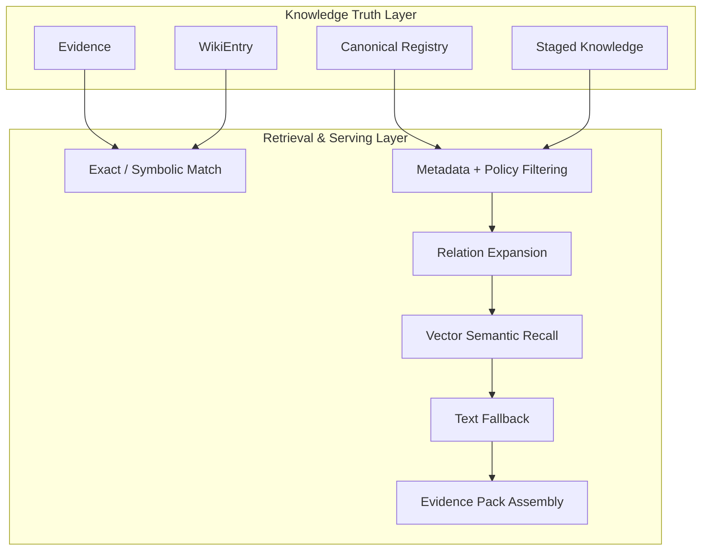

# 知识架构设计 (Knowledge Truth & Retrieval)

> **Design Statement**
> Swallow 的知识层是一个 truth-first 的知识治理系统：先将知识归一为受治理的 truth objects（Evidence / Wiki / Canonical），再通过精确检索、策略过滤、关系扩展、向量召回与文本回退提供证据服务。向量检索是辅助召回手段，不是知识真值本身。

> 全局原则见 → `ARCHITECTURE.md §1`。术语定义见 → `ARCHITECTURE.md §6`。

---

## 1. 设计动机

标准的"切块与嵌入"（Chunk & Embed）RAG 在长期知识工作中会碰到四个边界：

1. 能找到相似片段，但找不到**当前有效**的知识对象。
2. 召回了文本，但不清楚它的**阶段、来源和复用边界**。
3. 召回了相似语义，但无法稳定回答"哪个结论是**规范版本**"。
4. 回答层反复重新做知识编译，造成 token 浪费和结果漂移。

因此 Swallow 采用的不是 vector-first retrieval，而是 **truth-first knowledge system with retrieval augmentation**。

---

## 2. 双层架构



### 2.1 Knowledge Truth Layer

回答的核心问题：这个知识对象是否有效、来自哪里、处于什么阶段、是否允许复用、是否已被 supersede、谁有写权限。

核心对象：

| 对象 | 职责 |
|---|---|
| **Evidence** | 带来源的原始证据记录 |
| **WikiEntry** | 项目级知识编译对象，稳定语义入口 |
| **Canonical Registry** | 经 review/promotion 确认的长期规范知识 |
| **Staged Knowledge** | 尚未审查的候选知识对象 |

治理机制：promote / reject / dedupe / supersede 决策、source traceability、Librarian-controlled canonical write boundary。

权威存储：**SQLite-backed knowledge truth**。文件镜像与索引视图是辅助产物，不是真值。

### 2.2 Retrieval & Serving Layer

围绕已治理知识对象提供召回服务，不替代真值层。

默认检索顺序（优先级从高到低）：

| 优先级 | 检索方式 | 说明 |
|---|---|---|
| 1 | Exact / symbolic match | task-local、canonical、wiki 精确命中 |
| 2 | Metadata + policy filtering | 按阶段、来源、策略过滤候选集 |
| 3 | Relation expansion | 沿知识对象间关系扩展召回 |
| 4 | Vector semantic recall | sqlite-vec 向量相似度补充召回 |
| 5 | Text fallback | 全文本匹配兜底 |

核心定位：**object-first retrieval, vector-assisted recall**。

---

## 3. Wiki 的定位

Wiki 不是"RAG 之上的摘要页"，而是知识真值层内部的一类重要对象：

- **项目级知识编译对象**——把高价值、相对稳定、可复用的知识组织成可治理单元。
- **稳定语义入口**——为 exact match、canonical lookup、relation expansion 提供更稳定的检索锚点。
- **减少重复编译成本**——避免每次回答都从底层文本重新拼装全局认知。

---

## 4. 知识写入原则

知识层是受治理的真值系统，不是随手写入的记忆池。

| 原则 | 说明 |
|---|---|
| 晋升有门槛 | 只有高价值、可复用、相对稳定的信息才有晋升资格 |
| 来源可追溯 | 所有高阶知识对象尽可能带 source pointer |
| 写权限受控 | 大多数执行器默认 Canonical-Write-Forbidden（→ `AGENT_TAXONOMY.md §6`） |
| 显式晋升流程 | staged → review → promote/reject，不允许绕过 |
| Librarian 收口 | 冲突合并、去重和污染控制由 Librarian 专项角色负责 |

---

## 5. 外部 AI 会话摄入

用户在 ChatGPT、Claude Web 等外部工具中完成的前期探索，可以作为原始输入进入系统，但不能直接成为长期知识真值。

正确路径：

```
外部会话 → ingestion / extraction / staging → knowledge review → promotion / rejection
```

摄入流程负责：导入对话记录 → 过滤无效发散 → 保留有效结论与被否决路径 → 转换为结构化候选对象 → 进入 staged knowledge。

### Schema Alignment

handoff vocabulary 在代码层已统一到标准 schema。文档中的 `Context`、`Constraints`、`Goals` 等术语始终与实现的结构化字段对齐，而不是自由文本语义。

---

## 6. 原始材料与知识对象的关系

系统处理的底层材料（代码、Markdown、PDF、外部会话、日志等）与知识对象是两个不同层次：

| 层次 | 内容 | 作用 |
|---|---|---|
| 原始材料层 | 代码、文档、日志、外部会话 | 帮助 ingest / parse / extract |
| 知识对象层 | Evidence / Wiki / Canonical / Staged | 受治理的可复用认知单元 |
| 检索服务层 | 索引与召回机制 | 围绕知识对象 + 必要原始材料提供检索 |

底层材料帮助形成知识对象，但不直接等于可复用知识对象。

---

## 7. 与其他层的接口

| 对接层 | 接口关系 |
|---|---|
| **State & Truth** | 知识治理状态共享 SQLite 存储，逻辑隔离 |
| **Orchestrator** | 编排层触发 retrieval 请求，消费 evidence pack |
| **Execution & Harness** | Executor 产出的 artifacts 可成为知识候选来源 |
| **Self-Evolution** | Librarian 从 task artifacts 中提炼知识候选；Meta-Optimizer 不直接写入 |
| **Interaction** | CLI 提供 knowledge-review / promote / reject 入口 |

---

## 8. 远期方向

Graph RAG、社区发现、图结构摘要、agentic retrieval（动态工具选择 / 多跳推理 / 召回质量反思）等能力作为远期检索增强方向保留。若引入，它们服务于已治理知识对象，不反向取代知识真值层。

---

## 附录 A：Anti-Patterns

| 反模式 | 说明 |
|---|---|
| **Vector-first 叙事** | 把向量索引写成知识 authoritative store |
| **Wiki 浮层化** | 把 Wiki 写成飘在真值层之上的展示壳 |
| **外部会话直通** | 外部对话导入绕过 staged / review / promotion 边界 |
| **材料 = 知识** | 把"底层材料很重要"误解为"底层材料直接等于可复用知识对象" |
| **纯 RAG 回退** | 把系统重新拉回 chunk & embed 的单层叙事 |
