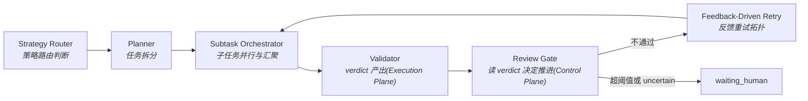

# Orchestration & Handoff

> **Design Statement**
> Swallow 的编排层是**唯一的任务推进协调层**。它通过 Strategy Router、Planner、Subtask Orchestrator、Review Gate 与结构化 handoff objects,围绕 task truth、artifacts 与 verdict reports 协调三条 LLM 调用路径(Path A / B / C)的异步协同。
>
> Agent 之间不直接对话——它们通过 task truth、artifacts 和 handoff objects 协作。

> 项目不变量见 → `INVARIANTS.md`(权威)。三条调用路径定义见 `INVARIANTS.md §4`。术语见 `ARCHITECTURE.md §5`。

---

## 1. 核心选择:基于状态的异步协同

传统多智能体系统常用群聊式协作或共享长对话上下文作为协作介质。在长周期工作中,这会导致上下文污染和边界被厂商绑死。

Swallow 的选择:

- 系统自建轻量编排中枢,厂商原生 agent 仅作为外部执行单元接入。
- Agent 之间**不直接对话**,通过 task truth、artifacts、verdict reports 和结构化 handoff objects 完成协作。
- 协同本质是 **state-based asynchronous collaboration**。

---

## 2. 编排层核心组件



注意 **Validator 与 Review Gate 是两个分离的组件**(见 §2.5):Validator 在 Execution Plane,只产出 verdict;Review Gate 在 Control Plane,读 verdict 后决定推进。

### 2.1 Strategy Router

在任务进入执行路径前完成**策略层面**的路由判断:

| 判断维度 | 说明 |
|---|---|
| 任务域 | 工程 / 研究 / 日常 / 批处理 |
| 复杂度评估 | 决定走 Path A / B / C 中的哪一条 |
| executor 选定 | 在 EXECUTOR_REGISTRY 注册的 executor 中匹配 |
| 能力下限断言 | 高风险任务不允许被下放给能力不足的路径 |
| 降级策略预判 | route 不可用时:缩小粒度 / 切换路径 / 增强 review / waiting_human |

**边界**:Strategy Router 只做策略判断,不负责 endpoint 健康探测、HTTP payload 方言适配或 provider 物理通道切换——这些属于 Provider Router(→ `PROVIDER_ROUTER.md`)。

### 2.2 任务执行中的动态路径切换

Strategy Router 的初始决策在 task 开始时做出,但任务执行中可能发现路径选错了(例如分配给 Path A 的任务实际需要读 repo)。Swallow 不允许 executor 在运行中静默切换路径,而是通过 **routing_hint** 机制处理:
```
两种合法 hint 来源:
   (a) Retrieval 服务召回时探测(KNOWLEDGE §4)
   (b) Executor 执行中发现路径不匹配信号
   ↓
   两者统一以 kind = "routing_hint" 写入 event_log
   ↓
   Review Gate 读取 hint
   ↓
   触发 Strategy Router 重新评估
   ↓
   产出新的执行计划(可能切换到不同 path / executor)
   ↓
   作为一次显式的"失败重路由"记录到 event_log
```

**关键边界**:

- 动态路径切换是 **Orchestrator** 的决策,不是 executor 的自主行为
- Executor 与 retrieval 服务都只能"产出 hint",不能自行切换
- Hint 写入 event_log,**不**写入 EvidencePack(避免 executor 看到后自作主张)
- Orchestrator 不区分 hint 来源,统一处理

这条规则保护 INVARIANTS §0 第 1 条。

### 2.3 Planner

把较大的用户意图拆成可操作的 task cards / execution slices:

- 定义子任务边界与输入/输出期望
- 明确约束条件
- 定义 review points 与 handoff points
- 判断哪些部分可交给 Path B(黑盒 agent),哪些必须保留给更强路径

### 2.4 Subtask Orchestrator

负责平台级子任务并行与汇聚。**必须与 executor-native subagents 区分**:

| 类型 | 控制方 | 边界 |
|---|---|---|
| **平台级 subtask orchestration** | Swallow 编排层 | 子任务创建、边界、汇总、review、waiting_human 均由系统统一管理 |
| **Executor-native subagents** | 执行器内部 | 不暴露为平台级能力。即使 executor 内部跑了 N 个 subagent,Swallow 视为单个黑盒 |

**实现选择**:Swallow 不依赖任何 executor 的内部并行能力。需要并行时,Swallow 自己 fan-out 多个独立 executor 进程(例如多个 git worktree + 多个 Codex CLI 实例),通过 `asyncio.gather` 协调。这条规则同时实现了 INVARIANTS §6 的接入边界——拒绝 sub-orchestrator 类系统接入。

### 2.5 Validator 与 Review Gate(分离设计)

Validator 与 Review Gate 是两个分离的组件,这是上一轮架构矫正的关键决策。

#### Validator(Execution Plane)

```python
class Validator:
    def evaluate(self, target_ref: ArtifactRef | ResultRef,
                 criteria: AcceptanceCriteria) -> VerdictReport:
        ...

class VerdictReport:
    verdict: Literal["pass", "fail", "uncertain"]
    reasons: list[str]
    severity: Literal["info", "warning", "error", "critical"]
    evidence_refs: list[ContextPointer]
```

- 输入:artifact / result reference + acceptance criteria
- 输出:VerdictReport
- 副作用:只 append event_log
- **不接触 task state**

#### Review Gate(Control Plane)

```python
# 在 Orchestrator 内部
def review_gate(verdicts: list[VerdictReport],
                task_context: TaskContext) -> ReviewDecision:
    """
    决策表(默认策略):
      所有 verdict == pass            → ReviewDecision.advance
      任一 verdict == fail, retry < N → ReviewDecision.feedback_retry
      任一 verdict == fail, retry ≥ N → ReviewDecision.waiting_human
      任一 verdict == uncertain       → ReviewDecision.waiting_human

    Policy 可配置 override(per task_family):
      uncertain_handling:
        - "block"   (默认):任一 uncertain → waiting_human
        - "warn"    :uncertain 不阻塞,记入 event_log 作为 warning,继续推进
      verdict_aggregation:
        - "all_pass"(默认):所有 validator 都 pass 才 advance
        - "any_pass":任一 pass 即 advance(慎用)
        - "weighted":按 policy 权重聚合
    """
```

- 输入:VerdictReport 列表 + 当前 task context
- 输出:ReviewDecision
- 副作用:写 task state、写 event_log

**这条边界把 INVARIANTS §0 第 1 条"Control 只在 Orchestrator 和 Operator 手里"在 Review 流程上落到实处**:Validator 不主导推进,Review Gate 才主导推进,而 Review Gate 是 Orchestrator 的内部组件。

**默认行为是保守的**(uncertain 阻塞、要求全过):宁可频繁打断 operator,不放过失败信号。Operator 在使用中发现某些 task family 默认过严时,可通过 `policy_records` 显式 override,需要走 `apply_proposal` 入口(见 INVARIANTS §0 第 4 条)。

### 2.6 Feedback-Driven Retry

```
Executor 产出 → Validator 产出 verdict → Review Gate 决策
   ├─ advance         → 推进到下一阶段
   ├─ feedback_retry  → 把 verdict.reasons 作为 retry context 传回 executor,重新执行
   └─ waiting_human   → 暂停自动推进,Operator 介入
```

retry 上限由 Policy 决定(`policy_records.kind = retry_limit`)。超阈值后强制进入 `waiting_human`,系统不自动放过任何失败信号。

---

## 3. 编排层的执行路径选择

编排层根据 task semantics 选择 Path A / B / C 中的哪一条。三条路径的定义见 INVARIANTS §4。具体 executor 绑定见 EXECUTOR_REGISTRY.md。

| 路径 | 控制重点 | 适用场景 |
|---|---|---|
| **Path A**(controlled HTTP) | prompt、dialect、route、fallback | 受控认知任务 |
| **Path B**(agent black-box) | 任务边界、skills、review、telemetry | workspace 行动任务 |
| **Path C**(specialist internal) | input contract、staged 写入边界 | 固定专精流程 |

升降级判据见 → `EXECUTOR_REGISTRY.md §3`。

---

## 4. 结构化交接 (Structured Handoff)

Swallow 不接受"把整段聊天记录交给下一个执行器"的粗放交接。

### 4.1 设计原则

Handoff 是任务推进链上的**结构化延续对象**——把已发生的工作压缩成可继续执行的 task semantics continuation,而不是聊天记录堆叠。

### 4.2 Handoff Object 字段

| 字段 | Schema 映射 | 含义 |
|---|---|---|
| Goal | `goal` | 总目标 |
| Done | `done` | 已完成的工作与踩过的坑 |
| Next Steps | `next_steps` | 下一步最应做什么 |
| Context Pointers | `context_pointers` | 最小必要上下文指针(artifact refs / task refs / file pointers),不是大段原文复制 |
| Constraints | `constraints` | 仍然生效的边界条件 |

物理 schema 见 → `DATA_MODEL.md §3.1` 的 `task_handoffs` 表。

### 4.3 Handoff 的性质

- 是 task truth 的显式延续对象
- 是 artifact surface 的一种结构化产物
- 被编排层与恢复机制真正消费,而不只是"存了一段文本"
- 不引用本机绝对路径(见 INVARIANTS §7)——跨设备 / 跨用户 resume 时仍可用

---

## 5. 多视角综合(Multi-Perspective Synthesis)

> 此前命名为 "Brainstorm Mode",已重命名为更中性的 Multi-Perspective Synthesis,并重写为基于 artifact pointer 的实现,以避免"群聊"反模式。

### 5.1 设计动机

某些任务需要在收口前做发散性探索:架构选型、技术方向取舍、红蓝对抗式审查、多模型交叉验证。这种任务不适合单 executor 直接产出最终方案,需要多个视角先各自表达,再由仲裁者收口。

### 5.2 核心机制:artifact 串联,不传递对话上下文

```
轮 n:
  for participant in participants:
    inputs = [
        role_prompt(participant),         # 角色定义
        task_semantics,                   # 任务输入
        *load_artifacts(prior_round_artifacts),  # 显式 artifact pointer
    ]
    out_artifact = path_a_call(inputs)    # 走 Path A,经 Provider Router
    persist_artifact(out_artifact, round=n, by=participant)

仲裁:
  inputs = [
      arbiter_prompt,
      task_semantics,
      *load_artifacts(all_round_artifacts),
  ]
  final_artifact = path_a_call(inputs)
```

**关键边界**:

- 轮内每个 participant 的发言**作为独立 artifact 持久化**,不是聊天消息流
- 下一轮 / 仲裁通过 **artifact pointer** 召回前轮内容,不是上下文累积
- 角色定义通过 **prompt prefix** 注入,不引入新的角色系统
- 最终产出是**仲裁后的综合 artifact**,进入 task truth

### 5.3 硬性约束(防止 token 成本失控)

| 约束 | 默认值 | 可配置位置 |
|---|---|---|
| 轮数上限 | 2 | `policy_records.kind = mps_round_limit` |
| 轮数最大值 | 3 | INVARIANTS,不可配置 |
| 参与者上限 | 4 | `policy_records.kind = mps_participant_limit` |
| 仲裁收口 | 必须存在 | INVARIANTS,不可配置 |
| 产出形态 | artifact | INVARIANTS,不可配置 |

成本量级参考:4 参与者 × 2 轮 + 1 仲裁 = 9 次 Path A 调用。Operator 应将 Multi-Perspective Synthesis 视为"小心使用"档位,而不是日常默认。

数字上限 Operator 可通过 `apply_proposal` 调整(在最大值范围内);超过最大值的需求需要先讨论是否走 fan-out 而非 synthesis。


### 5.4 与多模型竞争评估的区别

| 维度 | Multi-Perspective Synthesis | Multi-Model Evaluation |
|---|---|---|
| 目标 | 产生新的综合方案 | 选出最优单一产出 |
| 互看发言 | ✅ 通过 artifact pointer | ❌ 各自独立执行 |
| 收口形式 | 仲裁者综合 artifact | 人工或评分函数选择 |
| 适用场景 | 架构选型、技术方向、红蓝对抗 | 同任务多模型质量比较 |

---

## 6. 典型协同拓扑

### 6.1 工程链路接力(Path B 主导)

```
Strategy Router → Path B Executor(高层方案/复杂修改)
   → Path B Executor(局部高频施工)
   → Validator → Review Gate → Operator 收口
```

具体 executor 选择见 EXECUTOR_REGISTRY §3 升降级判据。

### 6.2 并行 fan-out 链路

```
Planner 拆出独立子问题
   → Subtask Orchestrator 并行 fan-out N 个 executor 实例
   → 各自产出 artifacts
   → 汇总成 summary artifact
   → Validator / Review Gate / Operator 收口
```

适用场景:无依赖关系的独立子任务批量执行(批量文件处理、多环境测试、并行调查)。

### 6.2.1 DAG 编排链路(显式依赖场景)

当子任务之间存在显式依赖(例如前后端契约同步:改 server → 测试 server → 改 client → 测试 client),Subtask Orchestrator 按 DAG 调度:

```
Planner 产出 DAG:
   nodes = [server_change, server_test, client_change, client_test]
   edges = [
       (server_change → server_test),
       (server_test   → client_change),
       (client_change → client_test),
   ]

Subtask Orchestrator:
   按拓扑序调度,每条边到达时:
     - 上游 node 必须 verdict == pass(经 Review Gate)
     - 才允许下游 node 入队
   任一 node 进入 waiting_human → 整个 DAG 暂停,保留已完成 node 的产出
```

| 字段 | 与 fan-out 的区别 |
|---|---|
| 拓扑 | DAG(显式依赖图) vs 无依赖集合 |
| 调度 | 拓扑序,边到达时检查 verdict | 完全并行,asyncio.gather |
| 失败处理 | 上游失败阻塞下游 | 各 node 独立成功/失败 |
| 物理 schema | 复用 `task_topology` 表(`relation_kind = sequential`) | 复用 `task_topology` 表(`relation_kind = parallel`) |

实现状态:**当前 phase 标记为下一阶段功能**。物理 schema(`task_topology` 表)已存在,Planner 与 Subtask Orchestrator 的 DAG 调度逻辑尚未实现。本节的设计意图是确保 fan-out 实现时不要写死"所有子任务无依赖"的假设,为 DAG 留好接口。


### 6.3 受控认知链路(Path A 主导)

```
任务 → Path A → Provider Router 指定 model hint / dialect
   → HTTP API → 结果进入 Validator → Review Gate → artifact / handoff
```

### 6.4 Specialist 链路(Path C)

```
任务 → Specialist 内部 pipeline
   → N × Path A 调用(穿透 Provider Router)
   → 产出 staged candidates / structured artifact / proposal
   → Operator 通过 CLI review / promote / reject
```

### 6.5 Feedback-driven retry 链路

```
Executor 产出 → Validator 产出 verdict
   → Review Gate(fail, retry < N)
   → Executor 重试(带 verdict reasons 作为 retry context)
   → Validator 再次产出 verdict
   → Review Gate(超阈值)→ waiting_human
```

### 6.6 Multi-Perspective Synthesis 链路

```
N 参与者(各带角色 prompt)
   → 每轮顺序发言,每个发言独立 artifact
   → 下一轮通过 artifact pointer 引用前轮
   → 仲裁者读取所有 artifacts → 综合 artifact
   → Review Gate / Operator 收口
```

---

## 7. 与其他层的接口

| 对接层 | 接口关系 |
|---|---|
| `INVARIANTS.md` | 三条路径、写权限矩阵、推进权限边界的权威 |
| `AGENT_TAXONOMY.md` | Validator / Specialist / General Executor 的语义 |
| `EXECUTOR_REGISTRY.md` | 具体 executor 绑定与升降级判据 |
| `PROVIDER_ROUTER.md` | 编排层做策略判断后传入逻辑需求;Provider Router 处理物理路由细节 |
| `KNOWLEDGE.md` | 编排层触发 retrieval 请求,知识层返回 evidence pack |
| `STATE_AND_TRUTH.md` | 编排层读写 task truth、event truth;artifacts 由执行层产出 |
| `HARNESS.md` | 编排层决定"做什么",Harness 提供"在什么受控环境下做" |
| `INTERACTION.md` | 交互层形成 task object、展示状态、提供 control surface;编排层负责真正推进 |

---

## 附录 A:Anti-Patterns

| 反模式 | 说明 |
|---|---|
| **群聊协同** | 多 agent 直接对话、互相转发长上下文。Multi-Perspective Synthesis 通过 artifact pointer 协作,不是群聊 |
| **黑盒冒充编排** | executor-native subagents 冒充平台级编排能力 |
| **Validator 推进** | Validator 直接改 task state 或决定 waiting_human(应交给 Review Gate) |
| **Review Gate 施工** | Review Gate 替 executor 做修改 |
| **聊天记录堆叠** | handoff 退化为原始聊天历史的无损传递 |
| **品牌定义职责** | 用品牌名直接定义系统角色 |
| **Surface 越权** | 聊天面板或 Control Center 绕过编排层直接推进任务 |
| **Executor 自主切路径** | executor 在运行中自己决定切换 Path A/B/C(应产出 hint,由 Orchestrator 决定) |
