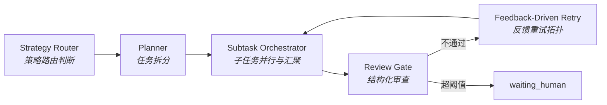

# 编排与交接设计 (Orchestration & Handoff)

> **Design Statement**
> Swallow 的编排层是唯一的任务推进协调层。它通过 Strategy Router、Planner、Subtask Orchestrator、Review Gate 与结构化 handoff objects，围绕 task truth、artifacts 与 review feedback 协调受控 HTTP 路径和黑盒执行器路径的异步协同。Agent 之间不直接对话——它们通过 task truth、artifacts 和 handoff objects 协作。

> 全局原则见 → `ARCHITECTURE.md §1`。术语定义见 → `ARCHITECTURE.md §6`。

---

## 1. 核心选择：基于状态的异步协同

传统多智能体系统常用群聊式协作或共享长对话上下文作为协作介质。在长周期工作中，这会导致上下文污染和边界被厂商绑死。

Swallow 的选择：

- 系统自建轻量编排中枢，厂商原生 agent 仅作为外部执行单元接入。
- Agent 之间**不直接对话**，通过 task truth、artifacts、review feedback 和结构化 handoff objects 完成协作。
- 协同本质是 **state-based asynchronous collaboration**。

---

## 2. 编排层核心组件



### 2.1 Strategy Router

在任务进入执行路径前完成**策略层面**的路由判断：

| 判断维度 | 说明 |
|---|---|
| 任务域 | 工程 / 研究 / 日常 / 批处理 |
| 复杂度评估 | 决定走 Claude Code / Aider / Warp-Oz / HTTP path |
| 能力级别选定 | 强推理 / 长上下文 / 实现导向 / 并行调查 |
| 能力下限断言 | 高风险任务不允许被下放给能力不足的路径 |
| 降级策略预判 | route 不可用时：缩小粒度 / 切换路径 / 增强 review / waiting_human |

**边界**：Strategy Router 只做策略判断，不负责 endpoint 健康探测、HTTP payload 方言适配或 provider 物理通道切换——这些属于 Provider Router（→ `PROVIDER_ROUTER.md`）。

### 2.2 Planner

把较大的用户意图拆成可操作的 task cards / execution slices：

- 定义子任务边界与输入/输出期望
- 明确约束条件
- 定义 review points 与 handoff points
- 判断哪些部分可交给黑盒 agent，哪些必须保留给更强路径

### 2.3 Subtask Orchestrator

负责平台级子任务并行与汇聚。必须与 executor-native subagents 区分：

| 类型 | 控制方 | 边界 |
|---|---|---|
| **平台级 subtask orchestration** | Swallow 编排层 | 子任务创建、边界、汇总、review、waiting_human 均由系统统一管理 |
| **Executor-native subagents** | 执行器内部 | 可利用，但不可依赖其承担系统级协同主线；视为黑盒增强 |

### 2.4 Review Gate

在结果进入下一阶段前执行结构化审查：

- schema / structure 校验
- 基本质量断言与一致性检查
- 决定通过 / 反馈重试 / 转入 `waiting_human`
- 为后续 audit 和风险追溯提供结构化痕迹

Review Gate **不**直接改写 executor 产出，也不静默接管主链路施工。

### 2.5 Feedback-Driven Retry 与 Debate 模式

编排层支持两种基于反馈的执行拓扑，共享 `DebateConfig` 配置结构：

**收敛模式（默认）**：目标是把已有产出改好。

```
Executor 产出 → Review Gate 审查 → ReviewFeedback → 重试 → 超阈值 → waiting_human
```

**发散→收敛模式（Brainstorm）**：目标是在开放式探索阶段产生多视角方案，再收口。适用于架构选型、技术方向讨论、红蓝对抗式审查。

```
N 个参与者并行发言（每轮累积上下文）→ 仲裁者收口 → 综合方案 artifact → waiting_human 或 auto-approve
```

Brainstorm 模式的核心机制是**发言上下文累积传递**——每个参与者调用时，前面所有人的发言作为 context 传入。角色定义通过 prompt prefix 注入，不引入新的角色系统。

Brainstorm 硬性约束（防止 token 成本失控）：
- 轮数上限：默认 2 轮，最大 3 轮
- 参与者上限：最多 4 个
- 仲裁收口必须存在：最后一轮由仲裁者产出结构化综合 artifact
- 产出是 artifact，不是聊天记录——进入 task truth，不作为长对话历史存在

两种模式的关键边界：Reviewer / 仲裁者不替 executor 直接修复；这不是无边界争论，而是编排层控制的反馈机制。

---

## 3. 编排层的两条执行路径选择

编排层的重要职责之一是决定某个任务该走哪条路径：

| 路径 | 控制重点 | 适用场景 |
|---|---|---|
| **Executor governance path**（黑盒 agent） | 任务边界、skills、review、telemetry | 偏"agent 施工"的场景 |
| **HTTP controlled path** | prompt、dialect、route、fallback | 偏"受控模型调用"的场景 |

默认执行器分工见 → `ARCHITECTURE.md §3`。

---

## 4. 结构化交接 (Structured Handoff)

Swallow 不接受"把整段聊天记录交给下一个执行器"的粗放交接。

### 4.1 设计原则

Handoff 是任务推进链上的**结构化延续对象**——把已发生的工作压缩成可继续执行的 task semantics continuation，而不是聊天记录堆叠。

### 4.2 Handoff Object 核心字段

| 字段 | Schema 映射 | 含义 |
|---|---|---|
| Goal | `goal` | 总目标 |
| Done | `done` | 已完成的工作与踩过的坑 |
| Next Steps | `next_steps` | 下一步最应做什么 |
| Context Pointers | `context_pointers` | 最小必要上下文指针（artifact refs / task refs / file pointers），而不是大段原文复制 |
| Constraints | `constraints` | 仍然生效的边界条件 |

Schema alignment：以上字段以统一 schema 为权威定义，不应被任何 surface 随意改写为不兼容私有格式。

### 4.3 Handoff 的性质

- 是 task truth 的显式延续对象
- 是 artifact surface 的一种结构化产物
- 被编排层与恢复机制真正消费，而不只是"存了一段文本"
- 可被持久化为 artifact

---

## 5. 典型协同拓扑

### 5.1 工程链路接力

```
Strategy Router → Claude Code（高层方案/复杂修改）→ Aider（局部高频施工）→ Review Gate → Human 收口
```

### 5.2 并行调查链路

```
Planner 拆出独立子问题 → Subtask Orchestrator 分发给 Warp/Oz → 汇总中间结果 → 更强执行者或 Human 收口
```

### 5.3 受控模型调用链路

```
任务 → HTTP controlled path → Router 指定 model hint / dialect → HTTPExecutor → 结果进入 review / artifact / handoff
```

### 5.4 Feedback-driven retry 链路

```
Executor 产出 → Review Gate 失败 → ReviewFeedback → 重试 → 超阈值 → waiting_human
```

### 5.5 Brainstorm 链路

```
N 参与者（各带角色 prompt）→ 轮次内顺序发言（累积上下文）→ 仲裁者收口 → 综合方案 artifact
```

适用场景：架构选型、技术方向讨论、红蓝对抗式审查（proposer + attacker + arbitrator）、多模型交叉验证。

与"多模型竞争评估"的区别：竞争评估是各自独立执行、人工比较结果；Brainstorm 是参与者互相看到对方发言后再补充，目标是产生新方案而非选出最优产出。

### 5.6 Fan-out / Fan-in 并行链路

```
Planner 拆出独立任务 → asyncio.gather 并发执行 → 汇总 summary artifact → Human 或 Review Gate 收口
```

适用场景：无依赖关系的独立子任务批量执行（批量文件处理、多环境测试、并行调查）。

与 DAG 编排的区别：fan-out 无中间同步点、无依赖图；DAG 编排用于子任务间存在显式依赖的场景，由 Planner 判断后触发，标记为高级功能。

---

## 6. 与其他层的接口

| 对接层 | 接口关系 |
|---|---|
| **Interaction** | 交互层形成 task object、展示状态、提供 control surface；编排层负责真正推进任务。聊天面板和 Control Center 不替代编排层 |
| **Knowledge** | 编排层触发 retrieval 请求；知识层返回 evidence pack |
| **State & Truth** | 编排层读写 task truth、event truth；artifacts 由执行层产出 |
| **Provider Router** | 编排层做策略判断后传入逻辑需求；Provider Router 处理物理路由细节 |
| **Harness** | 编排层决定"做什么"，Harness 提供"在什么受控环境下做" |

---

## 附录 A：Anti-Patterns

| 反模式 | 说明 |
|---|---|
| **群聊协同** | 多 agent 直接对话、互相转发长上下文 |
| **黑盒冒充编排** | executor-native subagents 冒充平台级编排能力 |
| **Review Gate 施工** | Review Gate 变成偷偷替 executor 做修改的第二执行器 |
| **聊天记录堆叠** | handoff 退化为原始聊天历史的无损传递 |
| **品牌定义职责** | 用品牌名直接定义系统角色 |
| **Surface 越权** | 聊天面板或 Control Center 绕过编排层直接推进任务 |
