# Self-Evolution & Memory Consolidation

> **Design Statement**
> Swallow 的自我改进不是黑盒自动学习,而是两条显式工作流:**Librarian 主线**负责项目级知识沉淀(staged → review → promote);**Meta-Optimizer 主线**负责系统级优化提案(scan → propose → human gate)。所有改进必须经过治理边界,不允许静默突变运行时策略或长期知识(P7)。

> 项目不变量见 → `INVARIANTS.md`(权威)。`apply_proposal` 是 canonical / route / policy 的唯一写入入口(INVARIANTS §0 第 4 条)。

---

## 1. 设计动机

隐式记忆在多执行器系统中是高风险设计:

- 不同执行器无法共享一致的隐式状态
- 记忆污染无法被可靠审计
- 黑盒 agent 的内部缓存不等于项目长期知识
- 无法显式检查的"自动学习"会破坏系统稳定性

因此 Swallow 的哲学是:**把记忆沉淀、自我改进与系统反思显式化、对象化、工作流化**。

---

## 2. 两条主线概览

```mermaid
graph TD
    subgraph "Librarian 主线 — 项目级知识沉淀"
        TA["Task artifacts / Event truth / Handoffs"]
        LB["Librarian<br/><i>提炼 · 去重 · 冲突检测</i>"]
        SK["Staged Knowledge"]
        RV["Review (Operator)"]
        AP1["apply_proposal<br/><i>(canonical 写入唯一入口)</i>"]
        CK["Canonical Knowledge"]
    end

    subgraph "Meta-Optimizer 主线 — 系统级优化提案"
        ET["Event truth / Route telemetry"]
        MO["Meta-Optimizer<br/><i>只读扫描 · 模式识别</i>"]
        PR["Proposal Artifacts"]
        RV2["Review (Operator)"]
        AP2["apply_proposal<br/><i>(route / policy 写入唯一入口)</i>"]
        SYS["Route metadata / Policy"]
    end

    TA --> LB --> SK --> RV --> AP1 --> CK
    ET --> MO --> PR --> RV2 --> AP2 --> SYS
```



| 主线 | 输入 | 处理者 | 输出 | 写入路径 |
|---|---|---|---|---|
| **Librarian** | task artifacts、event truth、handoffs | Librarian(specialist) | staged candidates | Librarian 写 staged;canonical 写入仅经 `apply_proposal` |
| **Meta-Optimizer** | event truth、route telemetry | Meta-Optimizer(specialist,只读) | proposal artifacts | route / policy 写入仅经 `apply_proposal` |

---

## 3. apply_proposal:唯一写入入口

### 3.1 接口定义

```python
# swallow.governance
def apply_proposal(
    proposal_id: str,
    operator_token: OperatorToken,
    target: ProposalTarget,
) -> ApplyResult:
    """
    canonical knowledge / route metadata / policy 的唯一写入函数。

    target ∈ {canonical_knowledge, route_metadata, policy}

    内部调用对应 Repository 的私有方法:
      - KnowledgeRepo._promote_canonical
      - RouteRepo._apply_metadata_change
      - PolicyRepo._apply_policy_change

    其他模块禁止直接调用上述私有方法。
    """
```

`proposal_id` 通常指向单条 proposal artifact。对于 Meta-Optimizer 这类批量提案流,`proposal_id` 也可以指向 operator 已审阅的 review record,即"批量 proposal 容器"。此时一次 `apply_proposal(target=route_metadata)` 负责应用该 review record 中全部 approved entries,避免拆成 N 次 apply 后产生部分应用状态。

### 3.1.1 OperatorToken 定义

```python
class OperatorToken:
    """
    apply_proposal 调用的来源标记。

    当前 phase 不携带 authn 信息(single-user),仅用 source / reason 区分调用来源。
    远期 multi-actor 扩展时,此类将装载 actor identity 与 authn 凭证。
    """
    source: Literal["cli", "system_auto", "librarian_side_effect"]
    reason: str | None = None
```

| `source` 值 | 触发场景 | 备注 |
|---|---|---|
| `"cli"` | Operator 通过 `swl proposal apply` 等 CLI 命令显式触发 | 默认场景,reason 可为空 |
| `"system_auto"` | `staged_review_mode = auto_low_risk` 满足条件后自动触发 | reason 必填,记录自动触发的判定依据 |
| `"librarian_side_effect"` | Librarian specialist 在 task 执行过程中产出 canonical side effect,由 Orchestrator 代为进入 governance boundary | 仅用于受控 Librarian side effect,不代表 Librarian 可绕过 review/governance 直接写 canonical |

**所有 `source = "system_auto"` 的调用必须在 `event_log` 留痕**,operator 可在 Control Center 看到全部自动决策记录,事后 reject 错误的(reject 也走 `apply_proposal`)。

`grep 'source="system_auto"'` 在代码库的命中数等于"自动 promote 路径定义本身 + 测试代码"。


### 3.2 守卫

`test_canonical_write_only_via_apply_proposal`、`test_only_apply_proposal_calls_private_writers`、`test_route_metadata_writes_only_via_apply_proposal` 三个守卫从代码层验证:

- 私有写方法的调用方只有 `apply_proposal` 与该方法本身的定义 + 测试
- grep `_promote_canonical | _apply_metadata_change | _apply_policy_change` 命中数严格受控

任何 PR 引入新调用都会被 CI 拒绝。

### 3.3 操作流程

```
1. Librarian / Meta-Optimizer 产出 staged candidate / proposal artifact
2. Operator 通过 CLI 审阅(swl knowledge review / swl proposal review)
3. Operator 决定 promote / apply / reject
4. 决定 apply 时,CLI 调用 apply_proposal(proposal_id, operator_token, target)
5. apply_proposal 内部调用对应 Repository 的私有方法,完成写入
6. 写入完成后,append 一条 know_change_log 或 policy_change_log 留痕
```

`OperatorToken` 不是登录凭证(当前 single-user),而是"通过 CLI 入口"的标记。它确保 `apply_proposal` 不会被 executor 通过普通函数调用绕开。

---

## 4. Librarian 主线:项目级知识沉淀

### 4.1 Librarian 的定位

Librarian 是 **knowledge governance specialist**——记忆提纯者与知识边界守门人,**不是**"自动全权写长期记忆"的角色。

| 职责 | 说明 |
|---|---|
| 降噪提炼 | 从 event log、artifacts、handoffs、已有知识对象中提取高价值结论 |
| 冲突检测与合并仲裁 | 发现矛盾或过期知识对象,**标记**而非静默覆盖 |
| 结构化变更生成 | 形成 `KnowledgeChangeLog` / `KnowledgeChangeEntry` 等变更痕迹 |
| 受控写入 staged knowledge | 把候选结果送入 staged → review → apply 流程 |

权限边界(见 EXECUTOR_REGISTRY Librarian 条目):

- `truth_writes = {task_artifacts, event_log, staged_knowledge}`
- **不写 canonical**(canonical 写入由 `apply_proposal` 触发,操作主体是 Operator)
- Librarian 代码路径中不存在对 `KnowledgeRepo._promote_canonical` 的调用

### 4.2 沉淀工作流

```
任务执行 → 产生 task truth / event truth / artifacts / handoffs
   → Librarian 读取显式材料
   → 提炼出:reusable evidence / staged candidates / dedupe-supersede signals
   → 生成结构化变更记录(写入 know_change_log)
   → 写入 know_staged(待 review)
   → Operator 通过 CLI review
   → apply_proposal 写入 know_canonical(若 promote)
```

触发条件(无需所有任务都触发,高价值任务优先):

- 复杂任务收口后
- 明显有可复用经验产生时
- 重要失败模式被识别时
- 关键任务进入 review / closeout 阶段时

### 4.3 记忆的结果形态

记忆结果不是抽象大脑,而是一组明确对象:

- Evidence(原始证据)
- WikiEntry(编译对象)
- staged candidates(待 review)
- canonical records(经 apply_proposal 应用)
- change logs(变更痕迹)
- conflict / supersede markers
- task closeout summaries

关键要求:**记忆结果必须以可见对象存在,不藏在某个 agent 的上下文缓存里**。

---

## 5. Staged Knowledge 的 Review 模式开关

### 5.1 默认模式:纯人工 review

默认是 P7 / P8 的核心体现——所有 staged candidates 必须 operator 显式 promote,通过 CLI 逐条审阅。

### 5.2 可配置模式

通过 `policy_records.kind = staged_review_mode` 配置:

| 模式 | 行为 | 适用 |
|---|---|---|
| `manual`(默认) | 所有 staged 候选必须 operator 显式 promote | 设计阶段、staged 量小、对知识质量敏感 |
| `batch` | Operator 可通过 CLI 批量操作(`swl knowledge review --batch`),仍是人工决策但 UI 加速 | staged 量大、需要快速过滤 |
| `auto_low_risk` | 满足 low_risk 条件的 staged 自动 promote;其余仍 manual | staged 量大、low_risk 类目稳定 |

### 5.3 `low_risk` 条件的边界

`low_risk` 条件**不能由系统自行扩张**——必须由 operator 通过 `apply_proposal` 显式定义。可选条件:

- 来源是已知 trusted source(operator 提前白名单)
- 与现有 canonical 无冲突(Librarian 检查通过)
- 仅追加新内容,不修改已有 canonical
- 字段长度 / 结构在预设范围内

### 5.4 关键边界

即使在 `auto_low_risk` 模式下,**canonical 写入仍然只走 `apply_proposal`**——只是触发方从"operator 显式调用"变成"自动满足条件后调用"。

不允许绕过这个入口,避免出现第二条 canonical 写路径。具体实现:

```python
# auto_low_risk 模式的 promotion 路径
def auto_promote_if_low_risk(staged_id: str) -> None:
    if not satisfies_low_risk(staged_id):
        return
    # 仍然走 apply_proposal,只是 token 由系统自动签发
    apply_proposal(
        proposal_id = staged_id,
        operator_token = OperatorToken(
            source = "system_auto",
            reason = "staged_review_mode=auto_low_risk",
        ),
        target = ProposalTarget.canonical_knowledge,
    )
```

所有 `source = "system_auto"` 的调用在 `event_log` 留痕,Operator 可在 Control Center 看到所有自动 promote 记录,事后 reject 错误的自动决策(reject 也走 `apply_proposal`,语义是"撤回上一次自动 promote")。

### 5.5 切换模式本身需要 apply_proposal

切换模式从 `manual` 改到 `auto_low_risk` 必须 operator 通过 `apply_proposal` 显式确认(target = `policy`)。这条规则保护 INVARIANTS §0 第 4 条不被"模式开关"绕过。

`test_review_mode_switch_via_apply_proposal_only` 守卫验证模式切换路径的唯一性。

---

## 6. Meta-Optimizer 主线:系统级优化提案

### 6.1 Meta-Optimizer 的定位

Meta-Optimizer 是**只读、提案型**的系统反思角色。

| 约束 | 说明 |
|---|---|
| 只读 | 不直接改 task truth / knowledge truth / 系统配置 |
| 提案型 | 输出为 proposal artifacts(写入 `.swl/artifacts/proposals/`),进入 operator review |
| 非编排器 | 不决定任务下一步怎么走 |

权限(见 EXECUTOR_REGISTRY):

- `truth_writes = {event_log, proposal_artifact}`
- `advancement_right = propose_only`

### 6.2 核心能力

| 能力 | 说明 |
|---|---|
| 任务模式识别 | 识别反复出现的任务模式,提议新的 workflow / slice 模板 |
| 失败环节识别 | 识别频繁失败环节,提议 skills / validators / review 策略优化 |
| 路由退化识别 | 识别 route 表现退化,提议 route preference / fallback / capability floor 调整 |
| 人工热点识别 | 识别人工介入高频点,提议更明确的 handoff、control surface 或 audit 入口 |

### 6.3 数据接口

Meta-Optimizer 依赖结构化遥测数据(见 DATA_MODEL §3.2 `event_telemetry` 表):

| 字段 | 说明 |
|---|---|
| `task_family` | 任务族标签 |
| `executor_id` | 执行器标识 |
| `logical_path` | A / B / C |
| `physical_route` | 实际使用的物理通道 |
| `latency_ms` | 端到端延迟 |
| `cost_usd` | 本次调用成本 |
| `degraded` | 是否经历执行级降级 |
| `error_code` | 错误码 |

这些数据属于 event truth / telemetry truth,Meta-Optimizer **只读**消费。

### 6.4 提案产出形式

```json
{
  "proposal_id": "01HZQ...",
  "kind": "route_metadata_update",
  "produced_by": "meta_optimizer",
  "produced_at": "2026-04-27T10:00:00Z",
  "rationale": "route_X 在 task_family_Y 上 degraded 率 35%,建议降权",
  "evidence_refs": ["telemetry:01HZQ...", "telemetry:01HZQ..."],
  "proposed_change": {
    "target": "route_registry",
    "route_id": "route_X",
    "field": "quality_weight",
    "from": 1.0,
    "to": 0.5
  },
  "affected_scope": {
    "task_families": ["task_family_Y"],
    "estimated_task_count_per_month": 120,
    "note": "仅描述客观影响范围,不做主观 impact 评估;由 operator 判断"
  }
}
```

Operator 审阅后通过 CLI `swl proposal apply <proposal_id>` 触发 `apply_proposal`,完成实际写入。

---

## 7. 核心设计决策:Proposal, Not Mutation

Swallow 采用 **proposal-driven self-evolution**:

| 系统可以做 | 系统不可以在没有 review / `apply_proposal` 的情况下做 |
|---|---|
| 自我观察 | 自行突变路由策略 |
| 自我总结 | 自行突变验证阈值 |
| 生成优化建议 | 自行突变 canonical knowledge truth |
| 准备知识候选对象 | 自行突变执行规则或工作流主线 |

这条边界决定了系统是"可靠的可演进系统"还是"不可预测的黑盒自变系统"。

---

## 8. 与黑盒 Agent 的关系

| 黑盒 agent 的内部产物 | 在 Swallow 系统中的地位 |
|---|---|
| 内部记忆 | ≠ Swallow 长期记忆 |
| 内部反思 | ≠ 系统级自我进化 |
| 局部上下文总结 | 只有进入显式 artifact / staged knowledge / proposal 流程后,才属于系统可复用资产 |

黑盒 agent 可贡献中间结果、候选经验和 reviewable outputs,但**不能直接成为系统长期记忆的最终写入者**。

---

## 9. 与其他文档的接口

| 对接文档 | 接口关系 |
|---|---|
| `INVARIANTS.md` | `apply_proposal` 唯一入口、写权限矩阵的权威 |
| `DATA_MODEL.md` | `know_*` / `route_*` / `policy_*` 表的物理 schema;Repository 私有方法的命名 |
| `KNOWLEDGE.md` | Librarian 写入 staged knowledge;canonical promotion 由 `apply_proposal` 完成 |
| `STATE_AND_TRUTH.md` | Event truth 是 Meta-Optimizer 的输入源;Librarian 读取 task artifacts |
| `EXECUTOR_REGISTRY.md` | Librarian / Meta-Optimizer 的五元组与边界 |
| `ORCHESTRATION.md` | 编排层触发沉淀时机与边界控制 |
| `INTERACTION.md` | CLI 提供 review / promote / reject 入口 |

---

## 附录 A:Anti-Patterns

| 反模式 | 说明 |
|---|---|
| **隐式自动学习** | 系统在黑盒内部自动累积经验并改写行为 |
| **聊天 = 记忆** | 把聊天记录、上下文缓存或向量召回误当成长久记忆本体 |
| **Librarian 越权** | Librarian 绕过 `apply_proposal` 成为自动 canonical writer |
| **Meta-Optimizer 突变** | Meta-Optimizer 从 proposal 角色滑向自动 mutation 角色 |
| **Agent 经验直通** | 黑盒 agent 的内部经验直接等同于项目长期知识 |
| **第二条 canonical 写路径** | 在 `auto_low_risk` 模式下绕过 `apply_proposal` 直接写 canonical |
| **模式开关绕过 governance** | 切换 staged_review_mode 不经 `apply_proposal`,在 policy 层留下隐式后门 |
| **system_auto token 滥用** | 把 `OperatorToken(source="system_auto")` 用于 `auto_low_risk` 之外的场景,变成"系统自己拿到的 operator token" |
