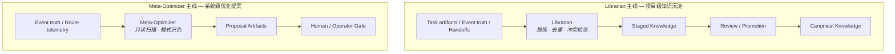

# 自我进化与记忆沉淀 (Self-Evolution & Memory Consolidation)

> **Design Statement**
> Swallow 的自我改进不是黑盒自动学习，而是两条显式工作流：Librarian 主线负责项目级知识沉淀（staged → review → promote），Meta-Optimizer 主线负责系统级优化提案（scan → propose → human gate）。所有改进必须经过治理边界，不允许静默突变运行时策略或长期知识。

> 全局原则见 → `ARCHITECTURE.md §1`。术语定义见 → `ARCHITECTURE.md §6`。

---

## 1. 设计动机

隐式记忆在多执行器系统中是高风险设计：

- 不同执行器无法共享一致的隐式状态。
- 记忆污染无法被可靠审计。
- 黑盒 agent 的内部缓存不等于项目长期知识。
- 无法显式检查的"自动学习"会破坏系统稳定性。

因此 Swallow 的哲学是：**把记忆沉淀、自我改进与系统反思显式化、对象化、工作流化。**

---

## 2. 两条主线概览



| 主线 | 输入 | 处理者 | 输出 | 约束 |
|---|---|---|---|---|
| **Librarian** | task artifacts、event truth、handoffs | Librarian（specialist / staged-knowledge） | staged candidates → canonical updates | 受 review / promotion / authority guard 约束 |
| **Meta-Optimizer** | event truth、route telemetry | Meta-Optimizer（specialist / read-only） | proposal artifacts | 只读、提案型、不直接改系统配置 |

---

## 3. Librarian 主线：项目级知识沉淀

### 3.1 Librarian 的定位

Librarian 是 **knowledge governance specialist**——记忆提纯者与知识边界守门人，不是"自动全权写长期记忆"的角色。

核心职责：

| 职责 | 说明 |
|---|---|
| 降噪提炼 | 从 Event Log、artifacts、handoff、已有知识对象中提取高价值结论 |
| 冲突检测与合并仲裁 | 发现矛盾或过期知识对象，标记而非静默覆盖 |
| 结构化变更生成 | 形成 `KnowledgeChangeLog` / `KnowledgeChangeEntry` 等变更痕迹 |
| 受控写入 staged knowledge | 把候选结果送入 staged → review → promote 流程 |

权限边界：Librarian 拥有受控 knowledge write surface，但仍受 canonical boundary、review 与 authority guard 约束。

### 3.2 沉淀工作流

```
任务执行 → 产生 task truth / event truth / artifacts / handoffs
    → Librarian 读取显式材料
    → 提炼出：reusable evidence / staged candidates / dedupe-supersede signals
    → 生成结构化变更记录
    → 进入 review / promotion / rejection 路径
    → 通过治理边界的对象进入 canonical knowledge
```

触发条件（无需所有任务都触发，高价值任务优先）：

- 复杂任务收口后
- 明显有可复用经验产生时
- 重要失败模式被识别时
- 关键任务进入 review / closeout 阶段时

### 3.3 记忆的结果形态

记忆结果不是抽象大脑，而是一组明确对象：Evidence、WikiEntry、staged candidates、canonical records、change logs、conflict/supersede markers、task closeout summaries。

关键要求：**记忆结果必须以可见对象存在，不藏在某个 agent 的上下文缓存里。**

---

## 4. Meta-Optimizer 主线：系统级优化提案

### 4.1 Meta-Optimizer 的定位

Meta-Optimizer 是**只读、提案型**的系统反思角色。

| 约束 | 说明 |
|---|---|
| 只读 | 不直接改 task truth / knowledge truth / 系统配置 |
| 提案型 | 输出为 proposal artifacts，进入 operator review |
| 非编排器 | 不决定任务下一步怎么走 |

### 4.2 核心能力

| 能力 | 说明 |
|---|---|
| 任务模式识别 | 识别反复出现的任务模式，提议新的 workflow / slice 模板 |
| 失败环节识别 | 识别频繁失败环节，提议 skills / validators / review 策略优化 |
| 路由退化识别 | 识别 route 表现退化，提议 route preference / fallback / capability floor 调整 |
| 人工热点识别 | 识别人工介入高频点，提议更明确的 handoff、control surface 或 audit 入口 |

### 4.3 数据接口

Meta-Optimizer 依赖结构化遥测数据：

| 字段 | 类型 | 说明 |
|---|---|---|
| `task_family` | string | 任务族标签 |
| `logical_model` | string | 编排层选定的逻辑模型标识 |
| `physical_route` | string | 实际使用的物理通道标识 |
| `latency_ms` | int | 端到端延迟 |
| `token_cost` | float | 本次调用成本 |
| `degraded` | bool | 是否经历执行级降级 |
| `error_code` | string? | 错误码 |

这些数据属于 event truth / telemetry truth，Meta-Optimizer 只读消费。

---

## 5. 核心设计决策：Proposal, Not Mutation

Swallow 采用 **proposal-driven self-evolution**。

| 系统可以做 | 系统不可以在没有 review / authority / human gate 的情况下做 |
|---|---|
| 自我观察 | 自行突变路由策略 |
| 自我总结 | 自行突变验证阈值 |
| 生成优化建议 | 自行突变 canonical knowledge truth |
| 准备知识候选对象 | 自行突变执行规则或工作流主线 |

这条边界决定了系统是"可靠的可演进系统"还是"不可预测的黑盒自变系统"。

---

## 6. 与黑盒 Agent 的关系

| 黑盒 agent 的内部产物 | 在 Swallow 系统中的地位 |
|---|---|
| 内部记忆 | ≠ Swallow 长期记忆 |
| 内部反思 | ≠ 系统级自我进化 |
| 局部上下文总结 | 只有进入显式 artifact / staged knowledge / proposal 流程后，才属于系统可复用资产 |

黑盒 agent 可贡献中间结果、候选经验和 reviewable outputs，但不能直接成为系统长期记忆的最终写入者。

---

## 7. 与其他层的接口

| 对接层 | 接口关系 |
|---|---|
| **Knowledge** | Librarian 写入 staged knowledge；canonical promotion 由知识层治理 |
| **State & Truth** | Event truth 是 Meta-Optimizer 的输入源；Librarian 读取 task artifacts |
| **Orchestrator** | 编排层触发沉淀时机与边界控制 |
| **Harness** | 执行结果（artifacts / handoffs）是沉淀的原始素材 |

---

## 附录 A：Anti-Patterns

| 反模式 | 说明 |
|---|---|
| **隐式自动学习** | 系统在黑盒内部自动累积经验并改写行为 |
| **聊天 = 记忆** | 把聊天记录、上下文缓存或向量召回误当成长久记忆本体 |
| **Librarian 越权** | Librarian 绕过 review/promotion 成为自动 canonical writer |
| **Meta-Optimizer 突变** | Meta-Optimizer 从 proposal 角色滑向自动 mutation 角色 |
| **Agent 经验直通** | 黑盒 agent 的内部经验直接等同于项目长期知识 |
