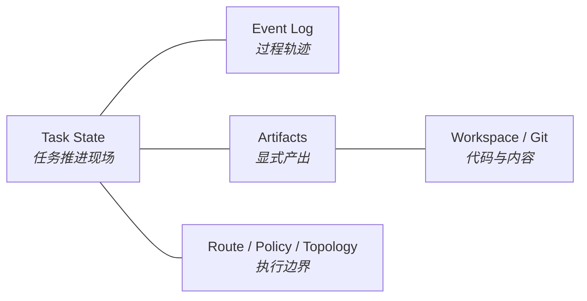
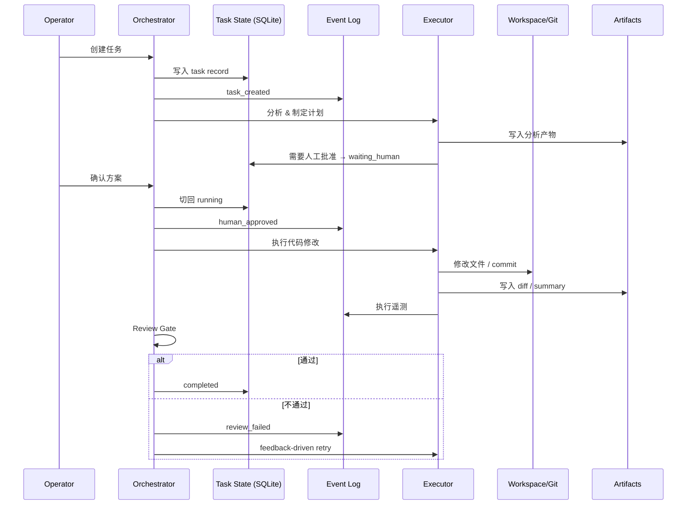

# 状态与真值层设计 (State & Truth Layer)

> **Design Statement**
> 状态与真值层是 Swallow 全系统的持久化底座。它用 SQLite 管理任务推进现场，用 EventLog 记录过程轨迹，用 Artifact 承载显式产出，用 Route/Policy/Topology 记录执行边界——让任务的推进、恢复、审计和安全兜底都建立在外部可验证的结构化事实之上，而不是依赖模型的对话记忆。

> 全局原则（local-first、SQLite-primary、taxonomy before brand 等）见 → `ARCHITECTURE.md §Principles`。本文档不再重复这些原则，仅聚焦于真值层自身的设计规范。

---

## 1. 设计动机

传统 AI Agent 依赖对话历史维持上下文。当任务复杂度上升时，这种模式会暴露三个问题：

1. **淹没**——对话线性增长，关键事实被冗余信息掩盖。
2. **混杂**——意图、过程、结果混在同一条文本流中，无法独立恢复或审计。
3. **漂移**——模型上下文偏移后，会基于错误记忆继续推进。

Swallow 的选择是：**把事实托管到外部可验证存储中**，让模型退回到"读取事实 → 做判断 → 产出动作"的角色，而不是"靠记忆推进流程"。

---

## 2. 真值域总览

系统中存在五个真值域，各自有明确的权威存储和职责边界：

| 真值域 | 权威存储 | 核心职责 |
|---|---|---|
| **Task State** | SQLite（`.swl/swallow.db`） | 任务推进位置、阶段、review/retry/resume/waiting_human 语义 |
| **Event Log** | SQLite | 过程事件、executor 遥测、降级与 fallback 痕迹、审计线索 |
| **Artifacts** | 文件系统 | 报告、diff、summary、grounding outputs 等面向人的显式产物 |
| **Route / Policy / Topology** | SQLite + 结构化记录 | 路由选择、执行位点、拓扑、handoff contract、策略边界 |
| **Workspace / Git** | 文件系统 + Git | 代码与文本内容的外部真值约束 |

**关键区分**：结构化真值记录（task state、events、policy）以 SQLite 为主；面向查看、比较、导出的文件产物以 artifact 文件为主。两者互补，但角色不同。

---

## 3. 各真值域详述

### 3.1 Task State

Task State 是一个持久化的**任务现场对象**，受显式状态迁移规则约束。

它回答的核心问题是：

- 任务推进到了哪里？
- 系统应如何恢复？
- 是否已进入 `waiting_human`？
- budget 是否已耗尽？
- 当前 review / retry / rerun 语义是什么？

Task State 与 checkpoint / resume / rerun / waiting_human 直接联动——它不仅是状态展示，更是控制流的驱动依据。

### 3.2 Event Log

Event Log 以 append-oriented 方式记录系统中发生过的事件。它同时服务于四个消费场景：

| 消费者 | 消费方式 |
|---|---|
| 审计 | 完整还原任务推进过程 |
| 遥测 | executor latency / token_cost / degraded / error_code |
| 诊断 | retry / review / fallback 过程追踪 |
| Meta-Optimizer | 行为模式识别与优化提案输入 |

### 3.3 Artifacts

Artifacts 是系统显式产出的文件产物——报告、diff、摘要、对比结果、grounding outputs 等。

它们面向人类查看和比较，但不自动等于权威真值。结构化治理状态（如任务阶段、知识晋升决策）以 SQLite 记录为准，artifact 文件是辅助查看视图。

### 3.4 Route / Policy / Topology Truth

除了任务状态本身，系统还需要显式持久化以下执行边界信息：

- 路由选择与执行位点记录
- 任务拓扑（DAG / subtask tree）
- handoff / remote-handoff contract
- grounding refs
- policy 与 capability 边界

这些信息不是"运行时偶然存在的附属数据"，而是可恢复、可审计的正式真值面。

### 3.5 Workspace / Git Truth

对代码与文本材料而言，文件系统和 Git 仍然是内容层的权威约束。SQLite 管理的是任务与知识的治理状态，workspace/Git 管理的是内容本身——两者协同，互不替代。

---

## 4. "单一事实源"的正确含义

Swallow 的 Single Source of Truth 不是"只有一个物理存储"，而是：

> **每个真值域有明确的权威存储，由 orchestrator/runtime 统一解释。**

具体映射：

| 真值域 | 权威存储 |
|---|---|
| 任务推进与知识治理状态 | SQLite |
| 代码与工作区内容 | Workspace / Git |
| 面向查看的文件产物 | Artifact files |

---

## 5. 状态迁移的系统意义

Swallow 把任务视为具有生命周期的运行实体。状态流转直接控制以下行为：

- 是否允许执行下一步
- 是否需要人类介入
- 是否允许 retry / rerun / resume
- 是否触发 review gate
- 是否应停止自动推进

因此，状态迁移的价值不止于展示，它是系统安全性和可预测性的核心支撑。

---

## 6. 典型数据流示例

**场景：修复一个 Bug 并留下可恢复轨迹**

这个流程说明：任务推进依赖的是"结构化 truth + artifact surfaces + external workspace truth"的组合，而不是"模型记住了前面做过什么"。

---

## 7. 与模型方言 / 执行后端的解耦

真值层必须与底层模型品牌和协议保持解耦：

- 状态层不硬编码任何厂商的 prompt 协议。
- route、dialect、executor family 作为显式元数据存在于 Route/Policy 真值域中。
- 具体方言适配下沉到 Provider Routing 层（→ 参见 `PROVIDER_ROUTER.md`）。

状态层记录的是**任务意图、执行边界与策略约束**，而不是某一家的原生协议格式。

---

## 8. 安全兜底语义

当出现以下情况时，真值层承担最终安全兜底：

| 触发条件 | 真值层响应 |
|---|---|
| 模型输出不可靠 | 拦截非法状态突变 |
| Route degraded | 记录 degraded 事件，标记信任度降低 |
| Review 不通过 | 阻止推进，进入 feedback-driven retry |
| Fallback 触发 | 记录 fallback 路径，保留原始 route 信息 |
| 参数不符 schema | 拒绝写入 |
| 自动推进不再可信 | 停止推进，转入 `waiting_human` |

核心原则：**宁可显式停止并移交人类，也不让模型在事实不完整时继续假装推进。**

---

## 9. 与其他层的接口

| 对接层 | 接口关系 |
|---|---|
| **Orchestrator** | 读取 Task State 决定下一步；写入状态迁移与 review 结果 |
| **Execution & Harness** | 写入 executor 遥测到 Event Log；产出 Artifacts |
| **Knowledge Truth** | 知识治理状态同样以 SQLite 为主，共享存储但逻辑隔离 |
| **Provider Routing** | Route/dialect/fallback 元数据记录在 Route Truth 中 |
| **Interaction Layer** | 各 surface 读取真值做展示，但不直接改写真值 |

---

## 附录 A：Anti-Patterns

| 反模式 | 说明 |
|---|---|
| **Prompt Memory 依赖** | 把对话历史当作状态层的替代品，导致恢复和审计不可行 |
| **Artifact File = 唯一真值** | 忽略 SQLite 中的结构化治理状态，只看文件产物 |
| **忽略执行边界真值** | 不持久化 route / policy / topology，导致降级和 fallback 不可追溯 |
| **方言渗透** | 把特定厂商的 prompt 协议结构硬编码进状态层 schema |
| **退回纯 JSON 文件** | 放弃 SQLite-primary 基线，回到散落的 JSON 文件式状态管理 |
